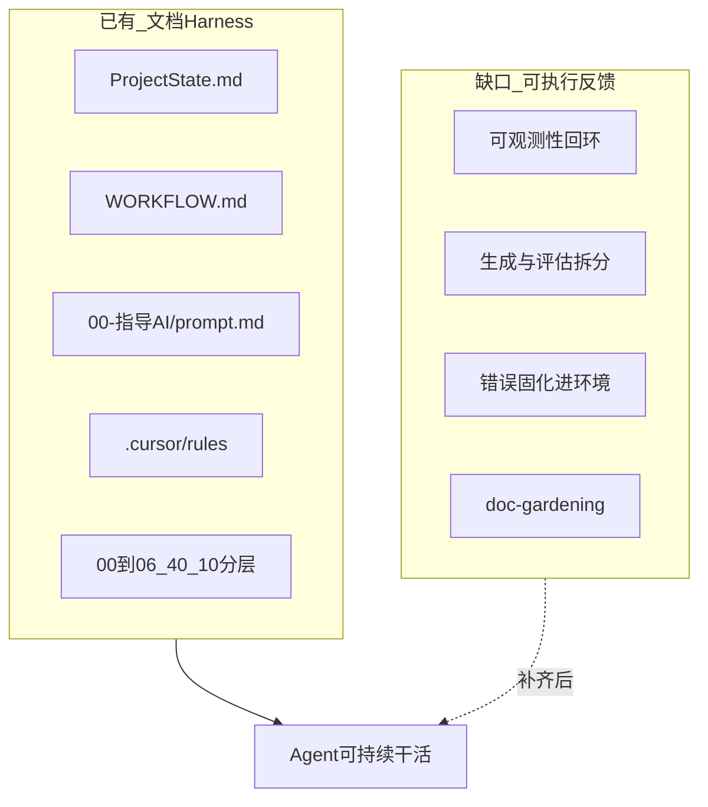

# motion Harness 缺口清单

> 对照 OpenAI / Anthropic Harness 实践与本仓现状。  
> 证据路径须可打开；不能确认处标【待补充】。  
> 笔记：`04-文献阅读/notes/90-行业报告-趋势/2026-OpenAI-Anthropic-Harness-Engineering-阅读笔记.md`  
> 实践：`00-指导AI/Harness三周实践-文献闭环.md`

## 原则摘要（Agent = Model + Harness）

1. **工作台**：短目录 + 分层文档；需要时再读，不一次塞满上下文。
2. **验收单**：完成定义可勾选、可核对；禁止只靠 AI 自评。
3. **返工机制**：生成与评估拆分；出错则改环境（rule/模板/清单），使同类错误不再发生。

---

## 1. 三问对照表

| 维度               | 现状【事实】                                                   | 缺口                                                  | 建议动作                                               | 优先级 | 证据路径                                                         |
| ---------------- | -------------------------------------------------------- | --------------------------------------------------- | -------------------------------------------------- | --- | ------------------------------------------------------------ |
| 在哪干活：短目录         | `ProjectState.md` 含阶段看板 + §5 目录导航；AI 开工先读 State + prompt | §5 未显式标注「AGENTS 式短目录」角色；无独立 `AGENTS.md`（计划内不新建巨型文件） | 在 `ProjectState` §5 加一句：本表即短目录入口，细节按路径下钻           | P0  | `ProjectState.md` §5；`motion-core.mdc`                       |
| 在哪干活：分层工作台       | `00`–`06`、`40`、`10` 按 WORKFLOW 流动；笔记按领域分子目录              | 偶发「一次 @ 过多」无硬约束                                     | 任务开场只强制 `@ProjectState` + `@prompt` + 当前阶段 1–2 份材料 | P1  | `WORKFLOW.md`；`04-文献阅读/README.md`                            |
| 用什么：规则与铁律        | `prompt.md` 六条铁律；`.cursor/rules/*` 分场景                   | 规则与失败案例未形成「错→改 rule」台账                              | 用下文「失败固化日志」；每类错补 1 条 rule/prompt                   | P0  | `00-指导AI/prompt.md`；`.cursor/rules/`                         |
| 用什么：流水线          | input→analysis→design→validation→knowledge→output 已定义    | 阶段间「未达标则返工」指令分散，缺统一检查点文                             | 三周实践把文献闭环 6 步写成勾选门                                 | P0  | `WORKFLOW.md`「闭环验收」                                          |
| 用什么：实现栈工具        | 代码在 `motion_ws/`；本仓仅文档                                   | Agent 对 bag/日志/指标/UI 的可观测性【待补充实测】                   | P0 验证时把复现命令、bag 路径、evo 输出写进 `40-验证/` 并允许 AI 读取     | P0  | `01-工作计划/技术栈索引.md`；`40-验证/P0-Benchmark-模板.md`                |
| 对不对：自检           | 产出前 Checklist；【事实】/【推断】/【待补充】；`evidence_level`；宪章已定义生成轮 + 核校轮 | 各阶段核校记录尚未普遍落地 | 设计/验证按 `WORKFLOW.md`「独立核校」执行；验证继续保持实测列纪律 | P0 | `项目宪章-无人协同系统工程.md` §6；`WORKFLOW.md`；`benchmark-validation.mdc` |
| 对不对：专利门禁         | 铁律六 + `patent-disclosure.mdc` + confidentiality 字段       | 无「公开前自动扫描」脚本（本阶段不做自动化）                              | 人工/对话硬门：`patent.stage < filed` 禁止完整方法进论文           | P0  | `prompt.md` 铁律六；`06-产出/专利/`                                  |
| 对不对：机读 pass-fail | P0 模板有最低验收勾选；WeakNet 有提纲级验收                              | 多数任务仍是叙述式「写完」                                       | 每条重复任务写 3–7 条布尔验收（见三周实践附录）                         | P0  | `40-验证/P0-Benchmark-模板.md`；`benchmark-validation.mdc`        |
| 错误固化             | OpenAI：缺能力就编码进仓；社区 Hashimoto 定义【转述】                      | 本仓无固定「失败日志」落点                                       | 使用本文 §3 模板；固化后勾选 P0 缺口项                            | P0  | 本文 §3                                                        |
| 知识保鲜             | `prompt.md` §5 要求变更后重扫                                   | 无定期 doc-gardening 任务/负责人/节奏                         | `ProjectState` 增加季度或双周「过时文档扫描」任务；先人工清单             | P1  | `prompt.md` §5；OpenAI doc-gardening【事实】                      |
| 上下文外置            | 知识在 markdown 仓内，符合「仓即事实源」                                | 长对话仍可能堆上下文                                          | 长任务分段；结论写回文件再开新会话                                  | P1  | OpenAI progressive disclosure【事实】                            |

---

## 2. P0 十条缺口（可勾选）

- [x] **G1** 明确 `ProjectState.md` §5 = 短目录入口（不新建巨型 AGENTS.md）
- [x] **G2** 文献闭环验收单（WORKFLOW 6 步 + 质量门）落盘并至少跑通 1 篇（2026-07-17：Swarm-SLAM）
- [x] **G3** 默认「生成轮 / 核校轮」拆分（宪章 + 工作流已定义；后续设计/验证须留核校记录）
- [x] **G4** 建立失败固化日志（本文 §3），并完成 ≥1 条「错→改环境」（2026-07-21：venue/LICENSE 硬门 → `文献阅读prompt.md`）
- [ ] **G5** P0 Benchmark：环境表关键字段 + `stack`/`commit` + ≥1 定位指标 + ≥1 场景 bag 回链
- [ ] **G6** 将 SSR/CR 等尺子与实测列纪律保持（禁参考值冒充实测）
- [ ] **G7** `motion_ws` 复现命令/日志路径对 Agent 可读（写入验证文档）
- [ ] **G8** 专利交底：章节齐全 + `confidentiality` + 族谱对齐；申请前不公开完整方法
- [ ] **G9** doc-gardening：在 `ProjectState` 登记定期扫描任务（节奏【待拍板】）
- [x] **G10** 更新 `04-文献阅读/README` 与任务队列，使 Harness 三件套可发现

---

## 3. 失败固化日志（模板）

> 每当 Agent 犯一类可复现错误：记录 → 改环境 → 用同任务回归一次。

| 日期         | 任务     | 错误现象     | 根因（缺什么环境）    | 固化动作（改了哪个文件）            | 回归结果      |
| ---------- | ------ | -------- | ------------ | ----------------------- | --------- |
| YYYY-MM-DD | 例：文献笔记 | 编造 venue | 缺「不能编」强调或核校轮 | 补 `文献阅读prompt.md` / 核校表 | pass/fail |

**已登记条目**：

| 日期         | 任务            | 错误现象 | 根因 | 固化动作 | 回归结果 |
| ---------- | ------------- | ---- | --- | ---- | ---- |
| 2026-07-21 | Swarm-SLAM 笔记 / Super-LIO 核校 | 易把规划文档「MIT」或 arXiv preprint 写成已确认正式 venue/LICENSE；易把 Fig.1 CPU% 当 ms | 缺 venue/LICENSE/图轴硬门 | 补 `04-文献阅读/文献阅读prompt.md`「硬门：venue 与 LICENSE」；Super-LIO 笔记附录 A 按硬门核校 | pass：Super-LIO venue=RA-L preprint+arXiv；LICENSE/卷期标【待查证】；ARM 耗时用 Table III 10.47 ms |

---

## 4. 与交付物回链

| 交付物   | 路径                                                                           |
| ----- | ---------------------------------------------------------------------------- |
| L4 笔记 | `04-文献阅读/notes/90-行业报告-趋势/2026-OpenAI-Anthropic-Harness-Engineering-阅读笔记.md` |
| 三周实践  | `00-指导AI/Harness三周实践-文献闭环.md`                                                |
| 能力卡   | `05-知识沉淀/process/CAP-PROCESS-HARNESS-001.md`                                 |

---

## 文档元数据

| 字段              | 值                                                                      |
| --------------- | ---------------------------------------------------------------------- |
| id              | GUIDE-HARNESS-GAP-001                                                  |
| type            | plan                                                                   |
| stage           | design                                                                 |
| status          | in-progress                                                            |
| canonical       | true                                                                   |
| evidence_level  | proposal                                                               |
| confidentiality | internal                                                               |
| related         | NOTE-2026-OpenAI-Anthropic-Harness-Engineering；CAP-PROCESS-HARNESS-001 |
| updated         | 2026-07-21                                                             |
| next            | G5–G9（P0 Benchmark / 可观测性 / 专利交底 / doc-gardening）；文献下一篇 Kimera-Multi |

