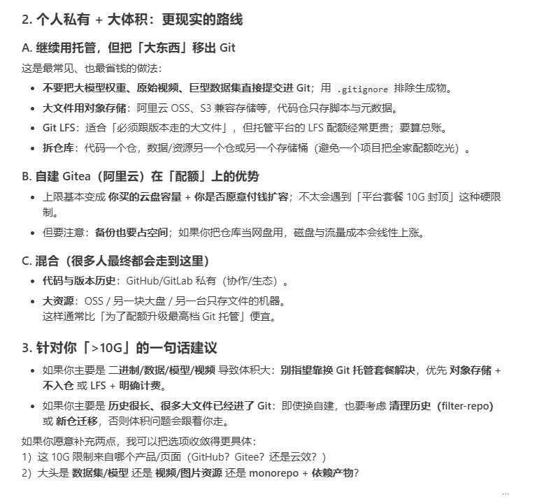

# 项目开发规范准则

1. Rules

2. TDD 测试驱动开发

3. 输入，输出 ，生成开发测试用例

git graph

Todo tree

```JSON
{
    "todo-tree.general.tags": [
        "BUG",
        "HACK",
        "FIXME",
        "TODO",
        "NOTE",
        "TAG",
        "DONE",
        "TEST",
        "UPDATE",
        "[ ]",
        "[x]",
    ],
    "todo-tree.regex.regexCaseSensitive": false, //设置为false允许匹配不考虑大小写
    "todo-tree.highlights.defaultHighlight": { //如果相应变量没赋值就会使用这里的默认值
        "foreground": "#000000", //字体颜色
        "background": "#ffff00", //背景色
        "icon": "check", //标签样式 check 是一个对号的样式
        "rulerColour": "#ffff00", //边框颜色
        "type": "tag", //填充色类型  可在TODO TREE 细节页面找到允许的值 在编辑器中突出显示多少  tag、text
        "iconColour": "#b3ff00", //标签颜色
        "opacity": 0.6, //设置透明度
        "gutterIcon": true //是否显示图标
    },
    "todo-tree.highlights.customHighlight": {
        //todo         需要做的功能
        "TODO": {
            "icon": "alert", //标签样式
            "background": "#c9c552", //背景色
            "rulerColour": "#c9c552", //外框颜色
            "iconColour": "#c9c552", //标签颜色
        },
        //bug        必须要修复的BUG  
        "BUG": {
            "background": "#eb5c5c",
            "icon": "bug",
            "rulerColour": "#eb5c5c",
            "iconColour": "#eb5c5c",
        },
        //tag        标签
        "TAG": {
            "background": "#38b2f4",
            "icon": "tag",
            "rulerColour": "#38b2f4",
            "iconColour": "#38b2f4",
            "rulerLane": "full"
        },
        //done        已完成
        "DONE": {
            "background": "#5eec95",
            "icon": "goal",
            "rulerColour": "#5eec95",
            "iconColour": "#5eec95",
        },
        //mark         标记一下
        "NOTE": {
            "background": "#f90",
            "icon": "note",
            "rulerColour": "#f90",
            "iconColour": "#f90",
        },
        //test        测试代码
        "TEST": {
            "background": "#df7be6",
            "icon": "flame",
            "rulerColour": "#df7be6",
            "iconColour": "#df7be6",
        },
        //update      优化升级点
        "UPDATE": {
            "background": "#d65d8e",
            "icon": "versions",
            "rulerColour": "#d65d8e",
            "iconColour": "#d65d8e",
        }
    }
}
```

> 每一次注意查看别人都修改了什么，如果有什么建议，注意对应着去修复，建议相关开发人员在代码中使用** \# TODO，\# NOTE等标签提醒相关问题**
> 
> 

## ***项目文档***

python项目推荐使用mkdocs\+material主题编写项目文档

C\+\+项目推荐使用Doxygen编写项目文档

## ***代码规范***

1. 重要函数等需要有注释，说明参数，返回值，函数功能，示例

2. 注释规范一律采用[google style](https://zh-google-styleguide.readthedocs.io/en/latest/contents.html)

3. 接口名字段一律采用大驼峰/小驼峰

```Markdown
xxx (项目名称文件夹)
├─ assets
├─ cmake
├─ docs
├─ examples
│  ├─ cpp // c++示例
│  │  ├─ test_json.cpp
│  │  ├─ test_logging.cpp
│  │  └─ CMakeLists.txt
│  ├─ python // python示例
│  │  ├─ test_gui.py
│  │  └─ test_oublis.py
├─ pyxxx // c++项目基于pybind11的python接口
│  ├─ utility
│  ├─ core
│  └─ CMakeLists.txt
├─ src
│  ├─ exe // 可执行程序
│  │  ├─ gui.h
│  │  ├─ gui.cpp
│  │  ├─ main.cpp
│  │  └─ CMakeLists.txt
│  ├─ utility // 库
│  │  ├─ base.h
│  │  ├─ base.cpp
│  │  └─ CMakeLists.txt
│  ├─ tools // 库
│  │  ├─ logging.h
│  │  ├─ logging.cpp
│  │  └─ CMakeLists.txt
├─ thirdparty
├─ .env.dev
├─ .env.prod
├─ .gitignore
├─ .dockerignore
├─ CMakeLists.txt
├─ CMakePresets.json
├─ CMakeUserPresets.json
├─ LICESE
└─ readme.md
```

```Markdown
xxx (项目名称文件夹)
├─ docs
├─ docker
├─ xxx (项目名称文件夹)
│  ├─ core
│  │  │ foo.py
│  │  └─ __init__.py
│  ├─ utility
│  │  └─ __init__.py
│  ├─ tools
│  │  └─ __init__.py
│  └─ __init__.py
├─ test
├─ .env.dev
├─ .env.prod
├─ .gitignore
├─ .dockerignore
├─ LICESE
├─ readme.md
└─ mkdocs.yml
```

## Git工作流



1. 面向Jetson本地开发，外网Gitee远端同步，无人机代码安全回退，多次实验迭代，避免飞控系统被误覆盖！

2. 不要随便git push \-force

3. 永远不要版本控制build/ 和 devel/  

4. 不要在master上直接开发

5. ROS\-overlay机制

6. GitHub 凭据：使用环境变量或凭据管理工具保存，**禁止**将令牌明文写入文档或提交到版本库。示例：`export GITHUB_TOKEN=your_token_here`

```Bash
git checkout -b dev_test
#每次开发前
git pull --rebase
#每完成一个功能就提交，不要一次提交很多改动
git add scripts/
git commit -m "fix: adjust multipoint mission logic"
```

```Plain Text
feat: 新功能
fix: 修复
refactor: 重构
docs: 文档
```

```Bash
git checkout master
git merge dev_test
git push 
```

```Bash
git tag flight_time
git push origin --tags
```

---

```Bash
#查看历史
git log --oneline # 查看历史版本号
#回退一个版本
git reset --hard HEAD~1
#回退到指定版本
git reset --hard 版本号
#查看文件历史
git log scripts/start.sh
#恢复单个文件
git checkout 版本号 -- scripts/start.sh
```

### **Jetson 无人机开发Git 使用规范**

```Plain Text
uav_project/
|
|————src/        
|————scripts/
|————config/
|————launch/
|————docs/
|————.gitignore
```

```Bash
master   #稳定可飞版本
dev      #测试版本
feature/ #新功能

#开发新功能#
git checkout -b feature/multipoint
git checkout master
git merge feature/multipoint
git push
```

initial commit 是安全原始版本

master 永远可以飞

feature 随便改

出问题永远能回退

---

## 算法软件开发规范

有哪些参数，每个参数设定的方法；不同模式对参数处理方法会不一样

1. 寻找参数

2. 了解参数定义

3. 对参数做数学建模转换，数据预处理

4. 针对需求将参数数据与算子相结合形成逻辑算法

现在最大的问题还是对参数不敏感
