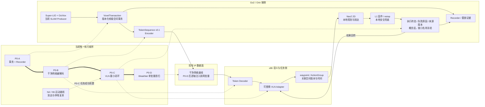
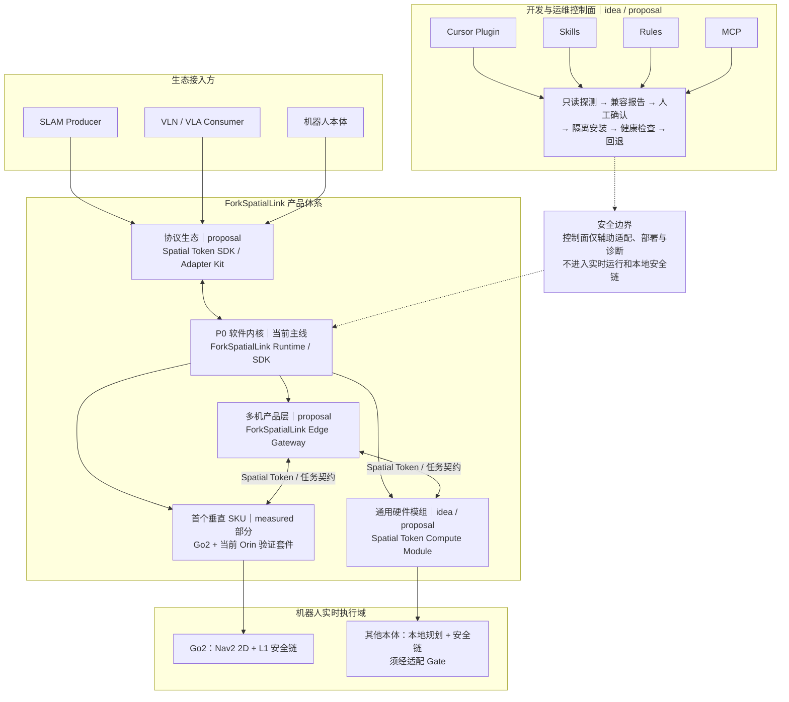

# ForkSpatialLink 实现方向与工程优先级

> **定位**：ForkSpatialLink 产品定位、背景调整依据与当前唯一工程排序；上层输入必须沉淀为实现/验证工件。  
> **证据等级**：多为 proposal / 推断；真机数字以 `40-验证/` 为准。  
> **保密**：不写 SLAM-Token 双触发伪码与未 filed 独权细节；AsyncShield 的 CMDP/RL 标为**他人方法**。

---

## 0. 文档结构说明

| 章节 | 来源 |
|------|------|
| §1 原始四项输入 | 历史需求来源，保留但不作为当前排序 |
| §2 产品定位与工程切入点 | 当前统一口径 |
| §3 AsyncShield 对标 | 后续插件位与边界 |
| §4 主链 / Gate / 优先级 | 当前执行口径 |
| §5 拍板摘要 | 项目级决策 |

---

## 1. 原始四项输入（非当前执行顺序）

前期讨论形成以下四项。它们保留为需求来源；当前执行顺序以 §4.3 的 P0-A～P0-D 为准，不能据本列表并行开四条主线：

1. **测试网络链路开销**  
2. **边端协同地图构建、位姿重定位匹配**（边侧全局，端侧 Super-LIO 局部）  
3. **3D 规划器的适配**  
4. **引入 Fork 任务执行链**：异步任务执行；VLN 语义推理形成带 `point` / `prefer-yaw` 的 ActionGroup，下发端侧执行；执行过程由端侧自主完成，返回任务结果。

---

## 2. ForkSpatialLink 产品定位与当前切入点

**ForkSpatialLink**  
面向具身智能机器人的「通感算智一体化空间数据流中间件」。

1. 工信部提出推动「人工智能 + 信息通信」融合，重点发展边缘推理、网络智能体、通感算智一体化与高价值典型场景。  
2. 机器人具身智能的关键瓶颈之一，正是 **SLAM 几何世界无法在有/弱网下高效接入边缘智能体**。  
3. 本项目从 **增量空间 Token、x86 侧 VLN Adapter、现有 IP 网络传输和本地安全执行**切入，逐步形成面向机器人场景的空间数据流中间件。

**【事实】** 仓内技术主称多为 **SLAM-Token**（见 `02-架构设计/Go2-VLA-SLAM-Token技术方案.md`、汇报材料）。  
**【设计决策】** 名称关系冻结为：`motion` 是上位系统工程，ForkSpatialLink 是产品/中间件，Spatial Token 是当前核心契约，OctVox/Super-LIO 是当前 Producer，Go2 是验证载体，x86 VLN 是当前消费者。

### 2.1 当前工程切入点

> **面向 VLN 的增量空间 Token 端边链路**：先把 OctVox 增量哈希体素形成版本化事务，序列化为 `TokenSequence v0.1` 送至 x86，经可替换 VLN Adapter 产生 waypoint/ActionGroup，再由 Go2 当前 Nav2 2D 与固件安全链执行；无损链路通过后才进入弱网优化。

- `Token` 指稳定语义契约；序列化封包只是其传输表示，二者不能混称。
- 当前承诺范围为 `OctVox/HashVoxel 增量 → x86 VLN → Go2 执行反馈`。
- 通用多模态 Trans-Framework、异构机体互操作、完整 Harness、3D 规划与 6G 适配属于后续演进，不写成现有能力。

### 2.2 为什么这样排序

**【事实】** 已有基础包括 Go2 + Super-LIO + OctVox、版本化增量事务草案、x86 语义侧设想、Nav2 2D 与固件安全链、WeakNet 指标提纲；但 OctVox 增量事件、Token 编解码、Go2→x86 实际传输、x86 VLN 消费、完整上下行闭环和弱网实测尚未完成。

**【设计决策】** 当前主要矛盾是“增量空间状态能否稳定进入 x86 VLN 并形成可验证任务闭环”，而不是一次解决所有机体的通用语言。排序依据：

1. 距离现有代码、硬件与能力最近，依赖最少；
2. 支持“增量正确 → 编解码正确 → 干净链路正确 → VLN 闭环 → 弱网单变量优化”的因果归因；
3. 避免同时引入 schema、压缩、网络栈、模型、异构机体与 3D 规划后无法定位成败；
4. Token 是可替换实现路线，不取代 motion 的系统目标；
5. 6G 只作为未来承载层，当前先在现有 IP 网络上证明语义契约、时效与恢复机制。

### 2.3 产品体系矩阵【设计决策】

> 产品体系按“当前可验证切片 → 可交付垂直 SKU → 通用模组 → 多机网关”演进。矩阵中的后续形态均为 proposal，不因写入矩阵而自动进入 active WIP 或形成可交付承诺。

| 产品层 | 暂定形态 | 核心组成 | 用户接入方式 | 当前证据 / 阶段 | 准入与边界 |
|---|---|---|---|---|---|
| **P0 软件内核** | ForkSpatialLink Runtime / SDK | Producer Adapter、版本化空间状态、Spatial Token 编解码、Recorder、VLN/任务 Adapter | 集成到现有机器人计算平台 | **proposal / implementation 入口**：P0-A～P0-D | 当前唯一主线；先证明无损闭环，再验证弱网 |
| **首个垂直 SKU** | Go2 + 当前 Orin 载体的验证套件 | 当前 SLAM Producer、Token Runtime、Nav2 2D/L1 安全链、诊断与复现包 | 适配 Go2 既有传感器、运动与网络接口 | **【measured 部分】**：单机链路有部分证据，完整闭环未通过 | 通过 N4/N5、P0-A～P0-D、连续运行与故障恢复后，才可称 Design Partner 交付件；当前不能称 production |
| **通用硬件模组** | Spatial Token Compute Module | 算力硬件、SLAM Runtime、Token Service、设备适配器；内置 IMU / 时间基准为候选配置 | 外部接电源、网络、LiDAR/相机/里程计及本体接口 | **idea / proposal** | 自动探测先只读；安装须用户确认、版本锁定、隔离部署和可回退；不得直接改写客户宿主环境 |
| **开发与运维控制面** | SLAM Developer Assistant | Cursor Plugin / Skills / Rules / MCP、兼容矩阵、部署向导、日志与 Benchmark 工具 | 开发者在 IDE 或受控运维端调用 | **idea / proposal** | 仅辅助适配、部署、诊断和知识更新；不是实时运行依赖，不得越过本地安全链或持有无限制 root 权限 |
| **协议与生态层** | Spatial Token SDK / Adapter Kit | 稳定契约、Producer/Consumer Adapter、兼容性测试、示例与认证 Gate | SLAM 厂、VLA 厂和本体厂按 SDK 接入 | **proposal** | schema、许可证、专利和兼容策略冻结后再对外；申请前不得公开 patent-sensitive 完整 Spec |
| **多机产品层** | ForkSpatialLink Edge Gateway | 多机状态汇聚、版本化 merge、重定位/索引、任务编排、弱网恢复 | 多机器人通过同一 Token / 任务契约接入 | **proposal；并行证据线** | Swarm-SLAM Gate、单机闭环和多机时序/故障验证通过后再升级，不阻塞 P0 |

#### 2.3.1 产品分层关系

```text
开发与运维控制面（Plugin / Skills / Rules / MCP）
                 ↓ 辅助部署、适配、诊断；不进入实时安全链
协议与生态层（Spatial Token SDK / Adapter Kit）
                 ↓
P0 软件内核（ForkSpatialLink Runtime）
        ├─ 首个垂直 SKU：Go2 + 当前 Orin 载体
        ├─ 通用硬件模组：Spatial Token Compute Module
        └─ 多机产品层：ForkSpatialLink Edge Gateway
```

#### 2.3.2 “自动识别与安装”的产品边界

**【设计决策】** 自动化采用“只读探测 → 兼容性报告 → 人工确认 → 隔离安装 → 健康检查 → 失败回退”，不采用发现目标机后直接修改宿主系统的无人值守安装。理由是 ROS、驱动、CUDA/JetPack、内核和本体 SDK 可能存在 ABI、权限与安全冲突。

**【待补充】** 通用模组的硬件型号、内置 IMU 等级、同步方式、外部接口、容器/离线包形态、OTA 与供应链方案；这些须经硬件选型、许可证审查和至少第二种本体适配验证后冻结。

#### 2.3.3 产品愿景与工程口径

> 通过标准化感知、空间状态和任务接口，使既有机器人获得可接入现代具身智能系统的空间认知能力，并使新平台以统一契约接入边缘与云端智能体。

该愿景对应“改造旧事物、参与新世界”，但对外只能按实际证据等级分别表述为验证套件、Design Partner 交付件或 production，不得用单次 Go2 Demo 代替通用产品证明。

### 2.4 全仓统一口径（唯一七句话）

> 其他规划、分析、汇报和对外材料若与本节冲突，以 `ProjectState.md`、`40-验证/` 和本节为准；旧表述不得反向覆盖当前状态。

1. **【事实·状态】** 当前 P0 唯一工程主链为 P0-A～P0-D：OctVox 帧级事务 → TokenSequence v0.1 → x86 VLN 最小闭环 → WeakNet 单变量首扫；实际进度和缺口只看 `ProjectState.md` 与 `40-验证/`。
2. **【设计决策·命名】** `motion` 是上位无人协同系统工程；ForkSpatialLink 是空间状态与任务执行中间件产品方向；Spatial Token 是当前核心契约；Go2、Super-LIO/OctVox 和 x86 VLN 分别是当前验证载体、首个 Producer 和当前消费者。
3. **【设计决策·冻结边界】** 已冻结的是产品切入点和 P0-A～P0-D 排序；`VoxelTransaction`、`TokenSequence v0.1`、`KeyFrame/SpatialChunk/VoxelDiff` 等 schema 仍为草案，不是已冻结的公开 Spec。
4. **【设计决策·执行安全】** P0 下行路径是 waypoint/ActionGroup → Nav2 2D → L1 固件安全链；VLN/VLA 不直接发送 `/cmd_vel`；AsyncShield 白盒对齐为 P0.5 插件位，RL shield、ego/3D 规划替换须另过 Gate。
5. **【设计决策·并行边界】** GrAco/Swarm-SLAM 是 bag 驱动的并行证据线，不阻塞单机 Token→VLN；多机网关、异构混编、通用模组和开发运维控制面均为后续产品层，不进入当前 active WIP。
6. **【愿景·表述边界】** “免预先建图、模组+网关、共享空间信念、Physical AI 基础设施”只描述演进方向；不得用单次 Go2 Demo、规划表或产品矩阵暗示通用产品、World Model 或 production 已成立。
7. **【保密·专利】** `patent.stage < filed` 时不公开完整 Spec、触发阈值/伪码和未申请独权细节；对外材料只使用允许公开且与证据等级匹配的架构概念。

### 2.5 现在与未来的项目规划架构图

#### 2.5.1 当前 P0：唯一工程主链



**图示边界：**结果反馈表示终态、失败原因与来源版本回传，不代表已经冻结名为 `ExecutionResult` 的接口；字段、错误码和传输实现均以 T-003 及后续实现 Gate 为准。

#### 2.5.2 未来：产品与生态演进



**图示边界：**除 P0 软件内核和 Go2 已有部分 measured 证据外，其余均为 proposal/idea；通用模组硬件、接口、OTA、同步方式以及多机时序/故障语义仍【待补充】。

---

## 3. AsyncShield 对标与用法（原稿整理）

### 3.1 文献身份

AsyncShield 是一篇与 motion 主线高度相关的 arXiv 预印本。

| 项 | 值 |
|----|-----|
| arXiv | **2604.24086**【事实】 |
| 英文全名 | AsyncShield: A Plug-and-Play Edge Adapter for Asynchronous Cloud-based VLA Navigation |
| 中文副标题（概括） | 「让云端大模型安全走进真实机器人」 |
| 本仓收录 | 【事实】落盘本文件前未进 `10-收集箱` / `04-文献阅读`；现已建笔记指针（PDF 仍【待补充】） |

### 3.2 它解决什么问题【事实·论文主张】

核心矛盾：

- VLA 大模型适合放云端（参数量大、零样本泛化强）  
- 移动导航里机器人一直在动；云端推理 + 网络抖动 → 指令基于**过去的 ego 帧**，到边端执行时已时空错位，容易撞障  

AsyncShield 不做「黑盒预测未来」，而是：

- **白盒时空对齐**：边端维护位姿时间缓冲，用 SE(2) 运动学变换，把「延迟造成的时滞」转成「当前帧下的空间偏移」，恢复 VLA 的几何意图  
- **安全执行闭环**：把边端适配建模为 CMDP，用 PPO-Lagrangian 的 RL adapter，在「跟踪 VLA 子目标」与「高频 LiDAR 硬约束避障」之间动态权衡  
- **即插即用**：输出统一的 Universal Local Sub-goal 接口；不微调云端 VLA；仿真 + 真机报告约 80–90% SR（【待查证】复现条件）

### 3.3 与 motion 方案的关系

motion 在 `02-架构设计/Go2-VLA-SLAM-Token技术方案.md` 里已有相近分层【事实】：

| motion 已有 | AsyncShield 侧重 |
|-------------|------------------|
| VLA 在 PC/云端，不上狗 | 同样假设云端 VLA |
| coarse waypoint → 当前 Nav2 2D → 固件/estop 安全链 | 子目标 + RL 边端适配 + LiDAR 硬约束 |
| SLAM-Token 解决几何→轻量 Token、弱网带宽 | 解决异步延迟下的意图对齐 + 执行安全 |
| WeakNet Bench / 弱网指标（规划中） | 直接针对 network jitter + inference latency |

**【推断】两者正交互补：**

- **SLAM-Token**：传什么（几何上下文怎么到网关/VLA）  
- **AsyncShield**：收到旧指令后怎么安全执行（延迟补偿 + 边端 shield）  

不是替代 Swarm-SLAM 或 SLAM-Token 独权方向，更像 **L4 执行层 / 弱网 VLA 网关侧** 的可借鉴模块。

### 3.4 建议用法（原稿）

| 动作 | 建议 |
|------|------|
| 归档 | `10-收集箱/papers/01-具身智能-VLA-VLN/` 或 `07-规划-控制-RL/` |
| 优先级 | P0.5 插件位：先完成 P0-C 无损闭环；其白盒时滞对齐再进入 WeakNet 对照 |
| 专利 | CMDP/RL adapter 是他人方法；motion 差异仍在 Token/多机协同/网关调度——笔记写「关系与边界」，勿把未 filed 的 SLAM-Token 细节写进对外材料 |
| 验证 | 与 `40-验证/P1-WeakNet-Collab-指标提纲.md` 对齐：延迟/jitter 下 SR、碰撞率、意图恢复误差 |

一句话（原稿）：AsyncShield 针对「云端 VLA + 边端移动 + 网络延迟」的安全执行层；与 motion 的边云 VLA + coarse waypoint + 弱网高度同向，和 SLAM-Token 是上下游互补，值得进阅读队列并纳入 WeakNet / 网关执行层对标。

---

## 4. 当前架构与执行口径

> 以下为已冻结的当前口径：原始四项保留为需求来源；P0 按 Token 主链向下沉淀，AsyncShield 嵌入 P0.5 下行层而不是平行产品线。

### 4.1 对外「五支柱」（由四项扩展）

| # | 支柱 | 与你原稿的映射 |
|---|------|----------------|
| ① | **空间 Token 契约**（双触发关键帧 + VoxelDiff + Adapter） | §2 第 3 点；原稿隐含在 1/2 |
| ② | **弱网可测链路**（带宽/丢包/断连 + **延迟/jitter**） | 原稿「1. 测网络开销」扩维 |
| ③ | **边全局 / 端局部协同**（建图 + 位姿锚定 + 增量 merge） | 原稿「2」 |
| ④ | **本地执行与安全兜底**（时滞对齐 → 规划 → L1 固件） | 原稿「3」+ AsyncShield 白盒层；3D 规划标为演进 |
| ⑤ | **异步 Fork 任务链**（VLN → ActionGroup → 端侧自主 → 结果回传） | 原稿「4」 |

### 4.2 分层数据流（实现视角）

```text
上行：端侧 Super-LIO/OctVox → VoxelTransaction
      → TokenSequence Encoder → 现有 IP 数据面 → x86 Decoder/VLN Adapter

下行：x86 VLN/BT → waypoint/ActionGroup(point, prefer-yaw)
      → 【AsyncShield 位：白盒时滞对齐 +（P1）安全 shield】
      → 本地规划（现 Nav2 2D / 演进 3D）
      → L1 固件兜底
```

| 层 | motion | AsyncShield 补的洞 |
|----|--------|-------------------|
| 传什么 | SLAM-Token | — |
| 协同什么 | Swarm + 边全局/端局部 | — |
| 下什么任务 | Fork / ActionGroup | — |
| **旧指令怎么安全落** | waypoint → 当前 Nav2 2D + 固件（偏静态假设） | SE(2) 时滞对齐 + CMDP shield（借鉴） |
| 怎么量 | WeakNet Bench | 显式 **latency / jitter** 轴 |

### 4.3 唯一工程优先级（P0-A～P0-D）

| Gate | 下层工件 | 通过条件 |
|---|---|---|
| **P0-A 增量数据可用** | OctVox 帧级 `VoxelTransaction` + Recorder | `ADD/UPDATE/EVICT/RESET` 可区分；版本连续、可记录、可重放；不明显破坏 SLAM 实时性 |
| **P0-B TokenSequence v0.1 + 干净网络上行** | Go2 Encoder/发送 + x86 Decoder | 会话、位姿、时间戳、增量载荷与校验边界可解码；编解码成功率、吞吐、延迟、CPU/内存有证据 |
| **P0-C x86 VLN 最小闭环** | 可替换 VLN Adapter + waypoint/ActionGroup 下行 + 结果回传 | 固定场景完成“上行—推理—下行—Nav2 2D/L1 执行—终态回传”；N4/N5 在任务成功结论前通过 |
| **P0-D WeakNet 单变量首扫** | 网络注入配置 + WeakNet 报告 | 无损闭环先通过；带宽、延迟、jitter、丢包、断连逐轴注入；通信失败与运动失败分列 |

**并行但不阻塞主链：**

- N4/N5 运动基线与 P0-A/B 可并行，P0-C 的任务成功结论必须依赖其通过；
- GrAco / Swarm Gate 在 bag 到位后继续，作为多机证据线，不阻塞单机 Token→VLN；
- 主专利证据映射随 P0-A/B 同步维护；`patent.stage < filed` 时论文不展开完整方法。

**P0.5 / P1 后置：**

1. 白盒时滞对齐 MVP 与 ActionGroup 失败恢复；
2. 保留 Go2 本地 Nav2 完整栈，先完成地图快照上送、x86 MapStateStore、回放/查询与地图质量 Gate；
3. 地图底座通过后，再以本地完整 Nav2 为 A/B 对照，验证边侧 Global Planner + 端侧 Controller/BT 解耦；
4. 同构多机与增量 merge；
5. 3D 规划器适配；
6. 规则/约束不足时再评估 RL shield（CMDP/PPO 为他人方法）；
7. 动态行人痛点经实测确认后，再旁路验证 POMDP 形式化下的社交元控制；ESN 仅作为可替换时序编码器，与常速度、MLP、LSTM/GRU 同场景对照，不改变显式空间状态与安全链；
8. 异构机体能力契约、通用多模态 Token、Harness 与 6G 适配。

两阶段边界与回退 Gate 见 `02-架构设计/Nav2端边解耦与地图任务契约_两阶段演进.md`。

**【设计决策】当前演示闭环：**

`OctVox 增量 → TokenSequence → x86 VLN Adapter → waypoint/ActionGroup → Nav2 2D + L1 → 结果回传`。无损闭环后再添加弱网和时滞变量。

### 4.4 产品句补强（在 §2 之上加半句）

> ForkSpatialLink：把端侧增量空间状态变成可版本化、可序列化的 Spatial Token，经现有 IP 网络送至 x86 侧 VLN，再把语义结果以 waypoint/ActionGroup 交给本地安全执行；在无损闭环成立后，以可测方式优化弱网时效、恢复与单位任务通信成本。

**边界（专利/对外）：**

- **我们主张**：空间流契约、多机网关、弱网评测、任务编排  
- **我们借鉴**：延迟下的几何意图恢复与「子目标接口」  
- **我们不宣称**：CMDP / PPO-Lagrangian shield 为自有独权  

### 4.5 对「3D 规划器适配」的排序说明

**【事实】** 当前 Go2 基线为 Super-LIO + **Nav2 2D**（`BENCH-P0-Go2-MotionSLAM-基线.md`）。  
**【设计决策】** 3D 规划适配仍属原始第 3 项，但已降序：先保证 2D 到达 + Token/VLN 闭环，再演进时滞对齐与 3D，避免与 P0 抢路径。

---

## 5. 拍板摘要（合并口径）

1. **主产品**仍是空间数据流中间件；当前产品切入点冻结为“面向 VLN 的增量空间 Token 端边链路”。  
2. 原始四项保留为需求来源，不再作为并行工作包；执行只按 P0-A～P0-D。  
3. AsyncShield 是 P0.5 下行插件位；RL shield、3D 规划、异构与 6G 不进入当前关键路径。  
4. GrAco/Swarm 是并行证据线，不阻塞单机 Token→VLN 主链。  
5. 产品体系新增“P0 软件内核—Go2 垂直 SKU—通用硬件模组—开发运维控制面—协议生态—多机网关”矩阵；除 P0 软件内核外均不自动进入 active WIP。  
6. Plugin / Skills / Rules / MCP 属于开发与运维控制面，不是 SLAM Runtime 或本地安全链的运行依赖。  
7. 每项上层规划必须回链实现/验证工件；证据经 Benchmark → CAP → 专利优先 → 论文/影响力回流。

---

## 6. 回链


| 项 | 路径 |
|----|------|
| 技术方案 | `02-架构设计/Go2-VLA-SLAM-Token技术方案.md` |
| 汇报材料 | `02-架构设计/SLAM-Token弱网中间件-汇报材料.md` |
| ActionGroup | `02-架构设计/大疆上云API参考-ActionGroup与Folder分层.md` |
| AsyncShield 笔记 | `04-文献阅读/notes/01-具身智能-VLA-VLN/2026-arXiv-AsyncShield-阅读笔记.md` |
| CAP | `05-知识沉淀/slam/CAP-EXEC-ASYNC-SHIELD-ALIGN-001.md` |
| WeakNet Bench | `40-验证/P1-WeakNet-Collab-指标提纲.md` |
| Go2 基线 | `40-验证/BENCH-P0-Go2-MotionSLAM-基线.md` |
| 状态看板 | `ProjectState.md` |
| 工作流 / 沉淀 Gate | `WORKFLOW.md` |
| 数据飞轮 | `02-架构设计/数据飞轮-实施清单与架构.md` |
| 报告概念图 FSLP→FST | `06-产出/影响力/figures/ForkSpatialLink-FSLP-FST-概念图.png` |

---

## 文档元数据

| 字段 | 值 |
|------|-----|
| id | PLAN-FORKSPATIALLINK-DIR-001 |
| type | plan |
| stage | design |
| status | active |
| canonical | true |
| evidence_level | proposal |
| confidentiality | internal |
| updated | 2026-07-23 |
| next | P0-A 接出 OctVox 帧级事务与 Recorder；P0-B 在干净网络完成 Go2→x86 TokenSequence 首测 |
