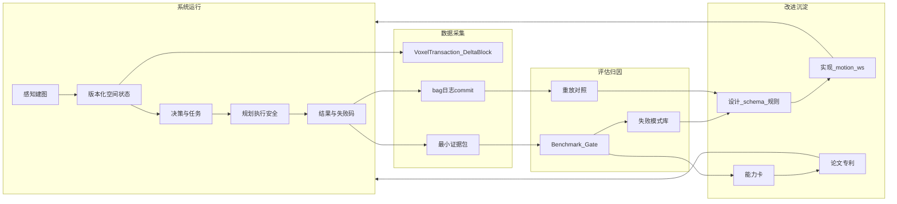

# motion 数据飞轮：架构与实施清单

> **定位**：定义本项目“数据飞轮”的含义、总结构、分层启动路径、模块级实施清单，以及与论文逻辑/相关工作的联动方式。  
> **阅读优先级**：高。涉及数据采集、Benchmark、失败归因、知识沉淀、论文/专利素材时，与 `00-指导AI/项目宪章-无人协同系统工程.md`、`02-架构设计/Go2端侧-可闭环易解释系统工程.md` 一并阅读。  
> **保密**：`internal`。本文不含申请日前的 Token schema、事务字段级细节或权利要求级实现；具体字段见 T-003 与 `patent-sensitive` 文档。

---

## 1. 本项目如何定义“数据飞轮”

**【设计决策】** 本项目的“数据飞轮”不是“先攒大量数据再训练大模型”，而是：

> **系统每次运行都产出可版本化、可重放、可归因的数据；这些数据驱动下一轮设计、验证和对外论证，形成自我增强的工程闭环。**

飞轮成功的判据不是“数据量变大”，而是每一圈都能回答：

1. 输入是什么（版本、会话、场景）？
2. 为什么成功或失败（失败码、证据链）？
3. 下一圈改什么（单变量变更）？
4. 改进是否被同场景复测证明？

**【事实】** 当前飞轮处于“框架已建、燃料不足”阶段：治理文档、Gate 表、端侧约束已落盘；纯 Nav2 N4/N5/N6 已有狗端通过记录，但 bag 回传、ATE/RPE、增量事务、NAV-2/NAV-4 与弱网场景尚未补齐。来源：`ProjectState.md`；`40-验证/BENCH-P0-Go2-MotionSLAM-基线.md` §5。

---

## 2. 三类闭环如何组成飞轮

仓内已有三类闭环，组合后构成完整飞轮：

| 闭环 | 定义 | 主要载体 |
|---|---|---|
| 任务执行闭环 | 感知/状态 → 决策 → 执行 → 结果 → 反馈 | Go2 真机/仿真、端边云链路 |
| 证据验证闭环 | 主张 → 可复现实验 → 原始证据 → 指标/结论 → 回写状态 | `40-验证/`、系统工程 Gate |
| 研发知识闭环 | input → analysis → design → implementation → validation → knowledge → output | `WORKFLOW.md` 全流水线 |

三者关系：

```text
任务执行闭环  → 产生原始运行数据
证据验证闭环  → 判定数据能否支撑结论
研发知识闭环  → 把通过 Gate 的结论沉淀并放大
```

任一环缺失，飞轮空转或反向污染事实层。

### 2.1 上层输入也必须进入飞轮

**【设计决策】** 数据飞轮不只接收真机运行数据，也接收新的需求、论文、技术趋势和架构建议。上层输入必须被转换成可检验假设和下层工件，不能长期停留在规划层横向复制：

```text
新输入 / 外部技术 / 需求
  → 问题与反证
  → 可检验假设
  → canonical 设计与验收条件
  → motion_ws 实现任务
  → Benchmark / Gate / 原始证据
  → CAP / 失败模式 / 规则
  → 专利分流
  → 论文与影响力产出
  → 新问题回流
```

“向下沉淀”是工件转换，不是复制正文。每条进入 `ProjectState.md` 的 active/todo 项，应能回链 `problem`、`downstream_artifact`、`acceptance`、`evidence_target`、`output_route` 与 `expiry/review`；字段定义见 `WORKFLOW.md`。

缺少下层工件与验收条件的内容只能停留在 `10-收集箱` 或 analysis。连续一个复盘周期没有产生实现/验证工件时，降为 `parking`，防止上层 WIP 持续膨胀。

---

## 3. 飞轮总结构



**【设计决策】** 飞轮发动机是 Benchmark/Gate + 单变量改进；运行侧燃料是版本化增量事务与最小证据包，研发侧燃料是带来源和反证的新输入；传动轴是“假设—设计—实现—验证—沉淀—产出”的工件转换。

---

## 4. 数据底座：版本化增量空间事务

飞轮第一层不是原始点云堆叠，而是统一、可增量、可版本化的数据契约。

```text
SLAM Producer（当前：Super-LIO）
  ├─ PoseStream
  └─ VoxelTransaction
       ADD / UPDATE / EVICT / RESET
            ↓
     不可变 DeltaBlock
            ├─ Token/FST 编码
            ├─ Nav 投影
            ├─ Recorder
            └─ Benchmark 重放
```

| 属性 | 对飞轮的价值 |
|---|---|
| 增量 | 只记录变化，带宽与存储可控 |
| 版本化 | 每次任务可关联 `session_id` / `commit_version` |
| 多消费者 | Token、导航、记录、评测共享同一事务，不重复体素化 |
| 可重放 | 失败场景可按版本回放，不靠口头复盘 |

**【事实】** 当前增量事件闭环**未开始**；Token 未接入。  
**【设计决策】** 不把 LRU `EVICT` 解释成现实空间 `REMOVE`；未实现射线清除/时间衰减前，不得生成带“空间已清空”语义的 `REMOVE`。

细节见 `02-架构设计/Go2端侧-可闭环易解释系统工程.md` §3–§4。

---

## 5. 四类关键数据

### 5.1 空间增量数据

- 内容：体素事务、位姿、会话版本、事件摘要
- 用途：协同同步、Token 编码、地图演化分析、重放
- 最低证据：DeltaBlock 或等价事务记录 + 关联位姿

### 5.2 任务执行数据

- 内容：ActionGroup/waypoint、时滞对齐结果、规划状态、轨迹、`cmd_vel`、L1/L2 触发
- 用途：解释“为何执行/拒绝/降级”
- 最低证据：结构化事件 + 关联空间版本与时间戳

### 5.3 结果与失败数据

- 内容：终态、到达误差、碰撞、任务时间、稳定错误码
- 用途：失败归因，而非只统计成功率
- 最低证据：Benchmark 表 + 失败状态统计 + bag/日志回链

### 5.4 证据元数据

- 内容：commit、配置、网络条件、复现命令、bag 路径、测试日期
- 用途：把 measured 结论钉死在具体版本
- 最低证据：`stack` + `commit` + 复现命令 + 原始附件路径

四类数据共同支撑宪章 §3 的“事实数据 + 链路闭环”。

---

## 6. 飞轮四圈如何转动

### 6.1 第 1 圈：运行产生数据

每次 Go2 真机/仿真测试强制产出**最小证据包**：

| 层 | 必采项 |
|---|---|
| 感知/建图 | 时间戳、位姿、事务版本、事件摘要 |
| 通信 | payload 版本、发送/接收时间、延迟、丢包/重传 |
| 决策 | 目标来源、空间版本、时滞修正或拒绝理由 |
| 规划 | 规划器状态、约束摘要、轨迹或不可行原因 |
| 安全 | L1/L2/estop、降级状态 |
| 结果 | 终态、到达误差、任务时间、碰撞 |

**【事实】** 当前仅部分满足：Go2 最新 stack/commit 与 N4/N5/N6 通过记录已登记；bag 回传、ATE/RPE 仍【待补充】；NAV-2/NAV-4、增量事务和弱网场景仍未完成。

### 6.2 第 2 圈：评估与归因

```text
同场景复测
  → 单变量对照
  → 指标变化
  → 失败码归类
  → Gate 通过/阻塞
```

当前优先归因项：

- N4 为何差 0.16 m 未进圈？
- N5 停栈修复是否有效？
- 问题在规划、到达判定还是控制链路？

登记位置：`40-验证/BENCH-P0-Go2-MotionSLAM-基线.md` §5 系统工程证据 Gate。

### 6.3 第 3 圈：改进系统

仅 Gate 暴露的问题进入 design/implementation；遵循：

```text
保留旧基线 → 单变量变更 → 同场景复测 → 准入或回退
```

示例：

| 改动 | 允许范围 |
|---|---|
| 改 Nav2 参数 | 只动规划，不动 SLAM |
| 接增量事务 | 只加 Recorder/Token，不动到达逻辑 |
| 加弱网延迟 | 只动通信/时滞对齐，不动地图前端 |

### 6.4 第 4 圈：沉淀与对外放大

**只有通过 Gate 的结论**才进入：

- `05-知识沉淀/` CAP 卡
- `06-产出/` 专利、论文、ONEPAGER
- WeakNet Bench、Swarm Gate、相关工作矩阵

对外材料从真实样本长出，而非从愿景直接包装。

---

## 7. 三层飞轮：按阶段启动

### 7.1 P0：单机证据飞轮（当前必做）

**目标**：让“跑一次测试 → 留下可重放证据 → 改一处 → 再测”转起来。

```text
Go2 测试
  → bag/日志/commit
  → BENCH 更新
  → 失败码/Gate
  → 单变量修复
  → 再测
```

| Gate | 当前状态【事实】 | 退出条件 |
|---|---|---|
| 运动闭环 N4 | 未通过 | 2 m 到达进 0.3 m 阈值 |
| 安全闭环 N5 | 待复测 | estop 后静止有复测证据 |
| 证据闭环 | 部分通过 | bag + ATE/RPE + 完整复现 |
| 增量事件 | 未开始 | 帧级事务可记录并重放 |
| 弱网安全 | 未开始 | 延迟/断网下 L1/L2 独立 |

**【设计决策】** N4/N5 补证可与 P0-A/B 的事务和编解码开发并行；但在运动基线与无损链路未通过前，不得宣称 Token 已提升任务成功，也不得启动 WeakNet 收益归因、异构扩展或论文方法结论。

### 7.2 P0.5：空间增量飞轮

**目标**：让空间状态本身成为可积累资产。

```text
Super-LIO 更新
  → VoxelTransaction
  → DeltaBlock
  → Recorder
  → Token / Nav / Replay 共用
```

价值：

- 同场景多次运行可比较地图演化、带宽、版本连续性
- 失败场景按 `commit_version` 重放
- 为多机同步与 WeakNet Bench 提供统一输入

### 7.3 P1：协同与评测飞轮

**目标**：从单机样本扩展到多机 + 弱网 + 对外 benchmark。

```text
GrAco / 双机 / 弱网场景
  → WeakNet Bench
  → SR/CR/延迟/恢复时间
  → 网关/协议/时滞对齐改进
  → 新场景复测
  → 论文/专利/对外 benchmark
```

**【事实】** Swarm Gate 仍阻塞于 GrAco bag 0/3。  
**【推断】** P1 飞轮依赖 P0 + M1 Gate 通过，不宜与 N4/N5 修复并行抢主线。

---

## 8. 与论文逻辑、相关工作的联动

最终交付需同时建立四类证据（宪章 §3）：

| 交付维度 | 必需内容 | 最低证据形式 |
|---|---|---|
| 事实数据 | 指标、资源、网络、成功/失败、版本 | 日志、bag、配置、commit、Benchmark |
| 链路闭环 | 输入到结果的可执行链，含安全降级 | 复现步骤、端到端场景、错误码 |
| 论文逻辑 | 问题、缺口、假设、实验、结论限制 | meta/outline、“主张—证据”映射 |
| 相关工作 | 可核验对比、差异、不能主张之处 | 原始论文/官方资料、阅读笔记、矩阵 |

学术论证飞轮：

```text
真实问题
  → 阅读笔记 / 相关工作矩阵
  → 可检验假设
  → 系统设计
  → 闭环实验
  → 原始数据
  → 受限结论
  → 论文 / 专利 / benchmark
  → 新场景 / 新数据
```

| 环 | 仓内路径 |
|---|---|
| 问题与相关工作 | `04-文献阅读/`、`03-技术分析/` |
| 假设与设计 | `02-架构设计/`、`01-工作计划/` |
| 实验与数据 | `40-验证/`、`motion_ws` bag/logs |
| 结论沉淀 | `05-知识沉淀/CAP-*` |
| 对外产出 | `06-产出/论文/`、`06-产出/专利/` |

**【设计决策】** 论文是飞轮某一圈稳定后的放大器，不是飞轮起点。`patent.stage < filed` 时不得把完整方法写入待投稿论文。

---

## 9. 什么不是数据飞轮（反模式）

| 反模式 | 后果 |
|---|---|
| 只存 bag，无版本/失败码/复现回链 | 有数据，不能转 |
| 只写 Benchmark 模板，无 measured 填入 | 有框架，无燃料 |
| 先训练 VLA/RL，再补闭环 | 黑盒变大，解释与可靠性更差 |
| 把 EVICT 当 REMOVE | 空间语义污染，评测不可信 |
| 同时换 SLAM+规划+协议后宣称改进 | 无法归因，评估层断裂 |
| 未过 Gate 就写 CAP/论文/one-pager | 知识飞轮空转，污染事实层 |
| 把 proposal 或参考值写成 measured | 对外与对内结论失真 |

---

## 10. 模块级实施清单

> 下表为执行清单【设计决策】；存储路径与工具名以 `motion_ws` 实际实现为准，未实现处标【待补充】。

### 10.1 运行采集层（Go2 / 仿真）

| 模块 | 采什么 | 存哪 | 谁消费 | Gate | 回写 |
|---|---|---|---|---|---|
| SLAM Producer | PoseStream、帧级体素变更 | Go2 本地 + Recorder【待补充】 | Token、Nav、Bench | 不影响 SLAM 实时性；版本连续 | BENCH 定位指标 |
| 最小证据包 | session、版本、各层事件 | 结构化日志 + bag | Gate、Replay、CAP | 每次测试必填 | BENCH §5、失败模式库 |
| Nav2 执行链 | 规划状态、轨迹、到达结果 | bag + 测试记录 | 运动闭环 Gate | N4/N5 阈值 | BENCH、CAP |
| 安全链 | L1/L2/estop、降级 | 事件日志 | 安全/弱网 Gate | 断网仍独立 | BENCH、设计约束 |

### 10.1A 上层输入沉淀层

| 输入 | 必须转换成 | Gate | 未通过处置 |
|---|---|---|---|
| 新需求 / 愿景 | 已证实问题 + 可检验假设 | 有反证、边界和基线 | 留在 input/analysis |
| 新论文 / 技术 | 差异矩阵 + 适配 Gate | 明确补强/替代/正交/后续 | 仅归档或旁路原型 |
| 新架构建议 | canonical 差异 + 下层任务 | 有 acceptance 与回退 | 不新增平行主线 |
| 新产品叙事 | 主张—证据—output route | 不超 evidence level；专利审查 | 内部保留，不对外 |

### 10.2 增量与编码层

| 模块 | 采什么 | 存哪 | 谁消费 | Gate | 回写 |
|---|---|---|---|---|---|
| VoxelTransaction | ADD/UPDATE/EVICT/RESET | DeltaBlock 队列/落盘【待补充】 | Token、Recorder、Replay | 同帧去重；语义正确 | T-003 schema、BENCH 带宽列 |
| Token/FST Encoder | 量化 payload、字节数 | FSLP Buffer / 发送记录 | 网关、WeakNet | 单次编码；不影响 SLAM | WeakNet Bench |
| Recorder | 事务+位姿+任务绑定 | 数据集目录【待补充】 | Replay、论文实验 | 与 commit 对齐 | `40-验证/reports/` |

### 10.3 评估与归因层

| 模块 | 采什么 | 存哪 | 谁消费 | Gate | 回写 |
|---|---|---|---|---|---|
| P0 Benchmark | ATE/RPE、SR、到达、碰撞 | `40-验证/BENCH-*` | ProjectState、CAP、论文 | 实测列禁填参考值 | evidence_level 升级 |
| 系统工程 Gate | 五类闭环通过/阻塞 | BENCH §5 | 排期、宪章复核 | 未通过项保持可见 | T-019、T-004 next |
| 失败模式库 | 错误码、触发条件、修复、回归场景 | Harness §3 或专用表【待补充】 | 设计、实现 | 每类失败可复现 | rule/CAP 固化 |
| Replay | 同 bag/同版本重跑 | evo/脚本输出 | 单变量对照 | 与原始结论一致或可解释差异 | BENCH 更新 |

### 10.4 知识沉淀与产出层

| 模块 | 采什么 | 存哪 | 谁消费 | Gate | 回写 |
|---|---|---|---|---|---|
| CAP 能力卡 | 可复用结论+边界+证据等级 | `05-知识沉淀/` | 设计、论文 | 仅 Gate 通过结论 | meta.benchmark_refs |
| 相关工作矩阵 | 对比对象、差异、不可主张点 | L3/L4 笔记 | 论文 Related Work | 原始来源可核验 | 论文 outline |
| 专利/论文 | 主张—证据映射 | `06-产出/` | 对外 | 专利先于论文；保密审查 | 影响力材料 |

### 10.5 AI 独立核校（Harness）

| 动作 | 检查什么 | 产出 |
|---|---|---|
| 生成轮 | 方案/实现/文档 | 草稿 |
| 核校轮 | 来源、反证、证据等级、范围、保密、Gate | 冲突报告或通过记录 |
| 失败固化 | 可复现错误 | Harness §3 日志 → rule/prompt 补丁 |

---

## 11. 最短落地路径（执行顺序）

1. **运动基线（可与上行开发并行）**：回链 N4/N5/N6 → 回传 bag → 填 ATE/RPE → 补 NAV-2/NAV-4 → 更新 BENCH Gate。
2. **P0-A 增量数据可用**：从真实 OctVox 更新路径形成帧级事务与 Recorder；区分 `ADD/UPDATE/EVICT/RESET`，验证版本连续与可重放。
3. **P0-B TokenSequence v0.1**：冻结最小会话、位姿、时间戳、增量载荷与校验边界；先在干净网络完成 Go2→x86 编解码。
4. **P0-C x86 VLN 最小闭环**：Decoder → 可替换 VLN Adapter → waypoint/ActionGroup → 当前 Nav2 2D 与 L1 安全链 → 结果回传。
5. **P0-D WeakNet 首扫**：无损闭环通过后，逐轴注入带宽、延迟、jitter、丢包与断连，禁止同时更换编码器、VLN 和网络栈。
6. **失败与知识沉淀**：失败码/回归场景 → CAP/规则；通过 Gate 的主张进入专利证据映射。
7. **产出门**：`patent.stage < filed` 时只进入专利交底与 internal CAP；申请后再展开论文方法和影响力材料。
8. **并行证据线**：GrAco / Swarm Gate 在 bag 到位后继续，但不阻塞单机 Token→VLN 主链。

---

## 12. 与现有文档的关系

| 文档 | 关系 |
|---|---|
| `00-指导AI/项目宪章-无人协同系统工程.md` | 上位目标、交付定义、证据法、AI 核校 |
| `02-架构设计/Go2端侧-可闭环易解释系统工程.md` | P0 端侧事务、证据包、三层验收 |
| `40-验证/BENCH-P0-Go2-MotionSLAM-基线.md` | 首个系统工程 Gate 样板 |
| `WORKFLOW.md` | 研发阶段 Gate 与产出论证链 |
| `01-工作计划/ForkSpatialLink-实现方向_含AsyncShield对齐.md` | 五支柱与 P0/P1 排期 |

---

## 13. 一句话定义

> **以版本化增量空间事务和最小证据包为燃料，以 Benchmark/Gate 为发动机，以单变量改进和知识沉淀为传动轴，让“运行—评估—修复—论证—再运行”持续加速；任一环缺证据，飞轮必须停转，不得靠叙事硬推。**

---

## 文档元数据

| 字段 | 值 |
|---|---|
| id | ARCH-DATA-FLYWHEEL-001 |
| type | architecture |
| stage | design |
| status | in-progress |
| canonical | true |
| evidence_level | proposal |
| confidentiality | internal |
| updated | 2026-07-22 |
| next | 按 P0-A～P0-D 向下沉淀：OctVox 事务 → TokenSequence → x86 VLN 闭环 → WeakNet 单变量首扫 |
