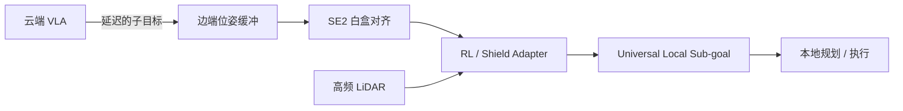

# 2026-arXiv-AsyncShield 阅读笔记

> PDF：【待补充】放入 `10-收集箱/papers/01-具身智能-VLA-VLN/` 后回填路径  
> arXiv：https://arxiv.org/abs/2604.24086  
> 对照：`02-架构设计/Go2-VLA-SLAM-Token技术方案.md`  
> 实现方向合并稿：`01-工作计划/ForkSpatialLink-实现方向_含AsyncShield对齐.md`

---

## 1. 该文献是什么？

| 项 | 内容 |
|----|------|
| 标题 | AsyncShield: A Plug-and-Play Edge Adapter for Asynchronous Cloud-based VLA Navigation |
| 标识 | arXiv:2604.24086【事实】 |
| 中文概括 | 「让云端大模型安全走进真实机器人」（对论文主张的概括，非官方译名） |
| 问题 | 云端 VLA + 边端持续运动 + 网络/推理延迟 → 指令相对当前 ego 时空错位 |
| 技术线 | 边云协同 VLA 导航 / 弱网执行安全 / 边端 adapter（非 SLAM 前端） |

**核心贡献（论文主张·待 PDF 核校）：**

1. 白盒 SE(2) 时空对齐：用位姿时间缓冲把时滞转为当前帧空间偏移  
2. CMDP + PPO-Lagrangian RL adapter：跟踪子目标 vs LiDAR 硬约束避障  
3. Universal Local Sub-goal 即插接口；不微调云端 VLA；报告约 80–90% SR【待查证】

**方法概览：**

**实验声称验证了：** 异步云端 VLA 下的安全导航（仿真+真机）。  
**未替代 motion 的：** 几何 Token 化、多机 C-SLAM、弱网带宽契约。

---

## 2. 作者 / 课题组【待查证】

- 单位、通讯作者、资助号：待 PDF 与作者主页核校  
- 开源仓库：【待查证】

---

## 3. 与本项目的关系分析

### 3.1 借鉴矩阵

| 维度 | AsyncShield | motion | 关系 |
|------|-------------|--------|------|
| VLA 部署 | 云端 | PC/云端，不上狗【事实·技术方案】 | 同向 |
| 上行几何 | 非核心 | SLAM-Token / KeyFrame+VoxelDiff | **互补（上游）** |
| 下行执行 | 时滞对齐 + RL shield | waypoint → ego/Nav2 + 固件 L1 | **互补（下游插件位）** |
| 多机 | 非主轴 | Swarm-SLAM + 网关金字塔 | 正交 |
| 评测 | latency / jitter | WeakNet Bench（扩维对齐） | 可合并尺子 |

### 3.2 优先级建议

- **接近立即跟进**（调研级）：与 P0 网关 + 弱网 VLA 直接相关  
- **工程：先白盒 SE(2) MVP，后 RL shield（P1 可选）** — 见实现方向 §4.3  
- **专利边界**：不把 CMDP/PPO-Lagrangian 写入自有独权；不在对外材料展开未 filed 的 Token 细节  

### 3.3 验证对齐

→ `40-验证/P1-WeakNet-Collab-指标提纲.md` 轴 A 增加推理延迟 / RTT jitter；轴 B 保留 SR/CR；可选「意图恢复误差」（对齐前后子目标偏移）。

---

## 4. 可沉淀能力

- CAP：`05-知识沉淀/slam/CAP-EXEC-ASYNC-SHIELD-ALIGN-001.md`  
- 规划：`01-工作计划/ForkSpatialLink-实现方向_含AsyncShield对齐.md`

---

## 核校表

| 声明 | 状态 |
|------|------|
| arXiv 号 2604.24086 | 【事实】用户提供；PDF 入仓后二次核校 |
| SE(2) / CMDP / PPO-Lagrangian / Universal Local Sub-goal | 【待查证】对照 PDF 正文 |
| 80–90% SR | 【待查证】场景与基线 |

---

## 文档元数据

| 字段 | 值 |
|------|-----|
| id | NOTE-2026-ARXIV-ASYNCSHIELD |
| type | literature-note |
| stage | analysis |
| status | draft |
| priority | 接近立即跟进 |
| evidence_level | proposal |
| updated | 2026-07-20 |
| next | 下载 PDF → 按文献阅读prompt 四章节精读补全作者信息与实验表 |
