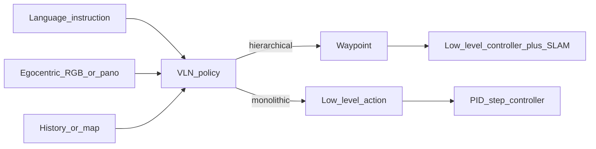

# 2026-arXiv-EmbodiedVLN-Survey 阅读笔记

> 原文：`[10-收集箱/papers/01-具身智能-VLA-VLN/2607.09792.pdf](../../../10-收集箱/papers/01-具身智能-VLA-VLN/2607.09792.pdf)`  
> arXiv：[2607.09792](https://arxiv.org/abs/2607.09792)

## 1. 该文献是什么？

- **标题**：A Comprehensive Survey and Systematic Real-World Evaluation of Embodied Vision-and-Language Navigation
- **作者**：Liuyi Wang, Kai Sheng, Zongtao He, Jinlong Li, Yongrui Qin, Haojie Dai, Xiangyi Wang, Jingwei Yang, Qingqing Yan；通讯：Chengju Liu†, Qijun Chen†
- **Venue**：arXiv preprint（2026）；**【待查证】** 是否已投/录用期刊或会议
- **问题**：具身 VLN 方法分类不清、真机验证不足；导航目标从坐标点变为自然语言语义目标
- **核心贡献**：
  1. 二维 taxonomy：动作范式（hierarchical waypoint / monolithic action）× 模型范式（discriminative / generative）
  2. 梳理数据集、仿真器、指标与代表方法
  3. 真机系统级评测（10 场景、200 episodes），揭示 sim-to-real、语义停、碰撞与开放指令缺口
- **方法概览**：综述 + 代表配置对比（非新算法）

- **验证了什么**：在其测试配置下，层级+全景+LiDAR/SLAM 真机更稳；RGB-only 单体 sim→real 掉点大、碰撞高
- **未验证什么**：公平消融「仅架构 vs 传感器栈」；多机/弱网；Go2 等足式平台

## 2. 作者课题组信息

- **单位**【事实】：同济大学 电子与信息工程学院（College of Electronic and Information Engineering, Tongji University）
- **通讯作者**【事实】：Chengju Liu、Qijun Chen（邮件见论文：[wly@tongji.edu.cn](mailto:wly@tongji.edu.cn), [qjchen@tongji.edu.cn](mailto:qjchen@tongji.edu.cn)）
- **资助**【事实】：国家自然科学基金 62233013、62473295、62333017、624B2105
- **方向**【推断】：具身导航 / VLN / 机器人视觉语言；与 CLASH 等连续环境 VLN 工作同脉络
- **【待查证】**：课题组主页、开源仓库、CLASH/JanusVLN 与作者组关系、后续真机数据集是否公开

## 3. 与本项目的关系分析

| 文献内容                            | 本项目模块                            | 可借鉴？ | 优先级      | 备注                    |
| ------------------------------- | -------------------------------- | ---- | -------- | --------------------- |
| 真机需几何底座 + waypoint，RGB-only 碰撞高 | SLAM 底座 → coarse waypoint → 本地规划 | 是    | **立即跟进** | 与现有分层口径同向             |
| SSR（距离∧语义停）、CR                  | `40-验证/` P0/P1 指标                | 是    | **立即跟进** | 已写入模板/提纲              |
| OSR 与 SR 落差 → 不会停               | Arrival / 语义确认                   | 是    | 立即跟进     | 对齐「可选语义确认」            |
| 终身空间记忆 / 可检索语义地图                | Graph 检索 + SpatialChunk 子图       | 间接   | 列入调研     | 对接 SuperMap 对标线       |
| 意图/回溯指令失败                       | 任务设计与评测指令集                       | 间接   | 列入调研     | WeakNet Bench 可复用指令分型 |
| 远程 GPU 推理延迟                     | 边云/网关部署                          | 间接   | 列入调研     | 强化边缘轻量与弱网重要性          |
| 再训一套端到端 VLN 模型                  | L3 大脑                            | 否    | 仅存档      | 不抢眸深/L3；本线 L4         |
| 协议伪码 / VoxelDiff 细节             | 中间件独权                            | 否    | —        | 笔记不展开未 filed 细节       |

**一句话结论**：综述用真机数据证明「语言导航离不开几何安全栈」；motion 应立即把 **SSR+CR** 纳入尺子，并继续做 **弱网下几何–语义上下文如何送达**，而非另卷 VLN 模型。

## 4. 主要设计参考参数指标

| 参数/指标                       | 数值（论文）                            | 对标意义              |
| --------------------------- | --------------------------------- | ----------------- |
| 真机基线                        | CLASH（层级）/ JanusVLN（单体）           | P0 VLN 选用时注明配置栈差异 |
| 单体 sim → real SR            | 61% → 22%                         | sim-to-real 量级参考  |
| 层级 real SR / SSR / OSR / CR | 51% / 37% / 67% / 7%              | 几何栈目标带            |
| 单体 real SR / SSR / OSR / CR | 22% / 17% / 27% / 51%             | RGB-only 风险上界     |
| 场景与规模                       | 10 场景 × 10 指令 × 2 系统 = 200 ep     | 评测规模参考            |
| 指令构成                        | 70% R2R 逐步 / 20% 意图模糊 / 10% 回溯    | 指令集设计             |
| 意图 / 回溯 SR                  | 层级 35%/0%；单体 25%/20%              | 回溯与停点仍难           |
| 边端                          | Orin Nano；LiDAR Mid-360；相机高 1.5 m | 平台对照（本项目 Go2 不同）  |
| 视觉                          | 层级：Insta360 X4 全景；单体：D435i RGB    | 传感器不公平需写进结论       |
| 云端推理                        | 远程 NVIDIA L40 + Wi-Fi             | 与网关 VLA 部署类似      |
| SSR 阈值                      | 距离 ≤ 3 m ∧ `sem_i=1`              | 写入 P0 备注          |
| CR                          | episode 级；碰撞即终止                   | 写入 P0/P1          |

## 附：next actions

- [x] 能力卡 `05-知识沉淀/eval/CAP-EVAL-VLN-REAL-001.md`
- [x] P0 指标扩展 + `40-验证/P1-WeakNet-Collab-指标提纲.md`
- [x] 脱敏一页 `06-产出/影响力/ONEPAGER-2026-EmbodiedVLN-Survey.md`
- [ ] Reading Group 第二期讨论（T-014）；不替代 Swarm 首轮 T-012
- [ ] **不**将未 filed 协议细节写入公开分享

---

## 附录 A：粘贴解读核校表

| 核项             | 粘贴解读                           | 原文             | 判定           |
| -------------- | ------------------------------ | -------------- | ------------ |
| 二维分类           | 动作×模型两正交维                      | §I / Fig.4     | 【事实】一致       |
| 真机基线           | CLASH vs JanusVLN              | §V-A2          | 【事实】一致       |
| 单体 sim→real SR | 61%→22%                        | Abstract / §V  | 【事实】一致       |
| 层级 real SR     | 51%                            | §V-B1          | 【事实】一致       |
| 单体 SSR/OSR/CR  | 17%/27%/51%                    | §V-B1          | 【事实】一致       |
| 层级 SSR/OSR/CR  | 37%/67%/7%                     | §V-B1          | 【事实】一致       |
| 200 episodes   | 10×10×2                        | §V-A3          | 【事实】一致       |
| 指令 70/20/10    | R2R/意图/回溯                      | §V-A3          | 【事实】一致       |
| 硬件栈            | Orin Nano、Mid-360、X4/D435i、L40 | §V-A1          | 【事实】一致       |
| 「层级一定优于单体」     | 解读有提醒配置混杂                      | §V-B1 明确多因素    | 【事实】解读正确     |
| 作者单位           | 粘贴未写                           | 同济电信学院         | 【待补充→已补】     |
| venue          | 粘贴称「综述」                        | arXiv preprint | 【事实】未声称已录用会议 |

---

## 文档元数据

| 字段                 | 值                                                                                                      |
| ------------------ | ------------------------------------------------------------------------------------------------------ |
| id                 | NOTE-2026-arXiv-EmbodiedVLN-Survey                                                                     |
| type               | paper-analysis                                                                                         |
| stage              | analysis                                                                                               |
| status             | done                                                                                                   |
| paper              | A Comprehensive Survey and Systematic Real-World Evaluation of Embodied Vision-and-Language Navigation |
| venue              | arXiv:2607.09792                                                                                       |
| priority           | 立即跟进                                                                                                   |
| reader_model       | Cursor Grok 4.5                                                                                        |
| related_capability | CAP-EVAL-VLN-REAL-001                                                                                  |
| updated            | 2026-07-16                                                                                             |

