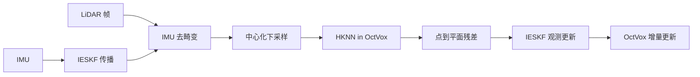

# 2025-RAL-Super-LIO 阅读笔记

> PDF：`10-收集箱/papers/02-SLAM-定位-建图/2509.05723v2-Super-LIO.pdf`  
> 对照：`02-架构设计/Go2端侧-可闭环易解释系统工程.md`、`02-架构设计/Go2-VLA-SLAM-Token技术方案.md` §3.1  
> 保密：本笔记只谈公开 LIO/OctVox 事实与工程边界；**不写**未 filed 的双触发伪码、Token schema 独权细节。

---

## 1. 该文献是什么？

- **标题**：Super-LIO: A Robust and Efficient LiDAR-Inertial Odometry System with a Compact Mapping Strategy
- **作者**：Liansheng Wang, Xinke Zhang, Chenhui Li, Dongjiao He, Yihan Pan, Jianjun Yi
- **Venue**【事实】：IEEE Robotics and Automation Letters **preprint**（页眉 DECEMBER, 2025）；arXiv:2509.05723v2 [cs.RO]（2025-12-26）。Received 2025-09-01；Accepted 2025-12-19；Associate Editor Sven Behnke。正式卷期页码【待查证】
- **问题**：资源受限平台上，LIO 的地图结构与最近邻搜索成本随点密度波动，难同时保证实时性与精度
- **技术线**：LiDAR-Inertial Odometry（滤波系 IESKF）/ 紧凑哈希体素地图 / 对应点搜索加速
- **核心贡献**【事实·摘要】：
  1. **OctVox**：哈希体素 + 每体素固定 8 个子体素代表点（增量均值），显式密度上界与在线去噪
  2. **HKNN**：利用子体素几何对称预计算遍历序，带提前终止的精确 Top-K 邻域搜索
  3. **统一滤波 LIO（Super-LIO）** + 开源：跨 x86 / ARM（含 Orin NX）对比 FAST-LIO2 / Faster-LIO / iG-LIO
- **方法概览**：

- **验证了什么**【事实】：公开集 M2DGR / NCLT / MCD / NTU VIRAL + ≥10 条自采 Mid-360 序列；指标含 evo RMSE、帧均耗时、CPU、相对效率 η、长序列内存；平台 AMD 5800H（5× 回放）与 NVIDIA Orin NX（1×）
- **没有验证什么**【事实/推断】：无 Unitree Go2 平台报告；无多机/回环/全局位姿图；无弱网传输；无与 Nav2 / VLA 联动；结论段定位为 LIO 而非完整 SLAM

---

## 2. 作者相关课题组信息

- **单位**【事实】：
  - 华东理工大学 机械工程学院（Wang / Zhang / Pan / Yi）
  - 上海人工智能实验室（Chenhui Li）
  - 香港大学（Dongjiao He）
- **通讯作者**【事实】：Jianjun Yi（jjyi@ecust.edu.cn）
- **方向**【推断】：边端 LIO/导航、轻量地图表示；同组相关作含 MGM-LIO（多尺度高斯地图 LIO，参考文献 [24]）
- **脉络**【推断】：自 MGM-LIO 等重表示 → Super-LIO 转向 **更紧凑、可嵌入现有滤波 LIO 的 OctVox + HKNN**
- **资助**【事实】：上海市专项 HCXBCY-2023-046；浙江省「尖兵」「领雁」研发计划 2025C02G5061814
- **代码**【事实】：https://github.com/Liansheng-Wang/Super-LIO.git（Abstract / 文末均声明开源）
- **待查证**：正式 RA-L 卷期 DOI；仓库 LICENSE；Go2/Mid-360 官方 launch 是否与仓内子模块 commit 一致

---

## 3. 与本项目的关系分析

本项目口径：Go2 端侧以 **版本化增量哈希体素契约** 为状态底座；**当前 Super-LIO 是首个 Producer**（输出 PoseStream + VoxelTransaction 方向），不得被 Token/导航/Recorder 直接耦合；P0 真机基线已接 Super-LIO，但 2 m 到达未达标（见 `40-验证/BENCH-P0-Go2-MotionSLAM-基线.md`）。

| 维度 | 分析 |
|------|------|
| **直接相关** | OctVox 地图、IESKF 位姿流、Orin 级延迟/CPU 量级、Mid-360 兼容 → 直接对应 Producer 层与 P0 Benchmark 定位/耗时列 |
| **间接启发** | HKNN / 子体素密度上界 → 可迁移到「MatchVox 局部查询预算」；LRU 与内存曲线 → 对照端侧 `EVICT≠REMOVE` 语义；改造代价：**低–中**（工程适配，非换算法栈） |
| **正交无关** | 论文不涉及 VLA/VLN、多机 merge、弱网 Token、ActionGroup |
| **冲突/风险** | ① 滤波 LIO **无原生回环** → 长走廊漂移需外挂（架构 §3.1 已写）；② 论文 LRU/容量淘汰 ≠ 现实障碍消失（端侧约束已禁混用）；③ 历史架构曾把 Fig.1 **CPU≈9.4%** 误写成「~9.4ms」，2026-07-22 已从 L2 当前口径移除；论文 Table III ARM **均值 10.47 ms** 仍只作论文参考，本仓实测【待补充】；④ 引擎开源 → 专利勿绑死 OctVox/IESKF 内部结构 |
| **优先级** | **立即跟进**（已是 P0 Producer；缺口在契约解耦、TF、实测回链，而非再选型） |

### 借鉴矩阵

| 文献内容 | 本项目对应模块 | 可借鉴？ | 优先级 | 备注 |
|----------|---------------|----------|--------|------|
| OctVox：8 子体素 + 增量均值 + 哈希 | SLAM Producer / MatchVox | 是 | **立即跟进** | 公开地图结构；契约层勿写死其容器 |
| HKNN 精确 Top-K | 局部几何查询加速 | 是 | 列入调研 | 主要服务 LIO 内部；外挂查询可参考预算思想 |
| IESKF 紧耦合流水线 | PoseStream | 是 | **立即跟进** | 外置里程计对接 Swarm-SLAM |
| Orin NX 帧耗时 / CPU | P0 Benchmark | 是 | **立即跟进** | 论文均值作参考列；实测列禁填 |
| Mid-360 自采序列与平台 | Go2 传感栈 | 是 | 立即跟进 | 与仓内 Mid-360 对齐；TF 仍须本机锁 |
| LRU / 内存封顶 | EVICT 语义 | 部分 | 列入调研 | **禁止**把淘汰当 `REMOVE` |
| 无回环滤波 LIO | 长程一致性 | 风险 | 立即跟进 | 外挂回环或 Swarm 后端；>200 m 走廊风险已记 |
| 双触发 / VoxelDiff / Token | 中间件独权 | 否 | — | 本笔记不展开未 filed 细节 |
| 换用 FAST-LIO2 作 P0 默认 | Producer 选型 | 否 | 仅存档 | 基线已定 Super-LIO；替换须过适配 Gate |

**一句话结论**：Super-LIO 是 motion **当前 Go2 边端 LIO Producer 的公开事实源**；文献价值在于钉死 OctVox/延迟边界与「无回环」风险，下一步应把 **位姿+体素事务契约** 与 P0 实测回链做实，而不是继续在 01 目录扫 VLA。

---

## 4. 主要设计参考参数指标

### 4.1 方法设计参数

| 参数名 | 数值/配置 | 含义 | 是否适用于 Go2 边端 |
|--------|-----------|------|---------------------|
| 状态估计 | IESKF（同系 FAST-LIO） | 紧耦合滤波 | 是（已部署） |
| 地图 | OctVox 哈希体素 | 每体素 ≤8 子体素代表点 | 是 |
| 体素边长 \(r_v\) | 实验统一 **0.5 m**（与 Faster-LIO/iG-LIO 公平对比） | 地图分辨率 | 是；本仓可另标定 |
| 子体素 | \(2\times2\times2\)，\(r_s = r_v/2\) | 密度正则 | 是 |
| HKNN | \(R_{\max}=0.875\) m；\(7\times7\times7\) 子体素邻域 | 对应搜索半径 | 内部超参 |
| 迭代 / 下采样 | max iter=4；random downsample rate=3；voxel-filter 0.5 m | 公平对比配置 | 参考 |
| 哈希 | Robin Hood hashing（robin-map） | 常数时间体素访问 | 工程细节 |
| 传感 | 多雷达（Velodyne / Livox MID-70 / Ouster / Mid-360） | 通用 LIO | Go2：Mid-360 |
| 部署平台 | x86 laptop；**NVIDIA Orin NX** | 边端对标 | Go2 Orin 类比，须实测 |
| 回环 / 位姿图 | **无**【推断：全文为 odometry，对比系亦为轻量 LIO】 | 全局一致性 | 否 → 外挂 |
| 通信/带宽 | 未涉及 | — | 正交 |
| 许可 | 声称开源 | 产品集成 | 【待查证】仓库 LICENSE |

### 4.2 实验指标（摘录）

| 任务 | 数据集/场景 | 指标 | Baseline（对照） | 本文 | 备注 |
|------|-------------|------|------------------|------|------|
| 精度 | 多公开序列 Table I | RMSE (m, evo) | FAST-LIO2 / Faster-LIO / iG-LIO | 作者称 **平均最优**；单序列有赢有输 | 勿把单序列当 Go2 验收 |
| 例：m2s1 | M2DGR | RMSE | FAST-LIO2 0.381 | Super-LIO **0.384** | 非最优行示例 |
| 例：m2s3 | M2DGR | RMSE | FAST-LIO2 0.198 | Super-LIO **0.139** | 更优行示例 |
| 耗时 | 全场景均值 Table II | ms/帧 (x86, 5×) | FAST-LIO2 Avg **10.90** | Super-LIO Avg **2.99** | ~3.7× vs FAST-LIO2（Fig.1） |
| 耗时 | 全场景均值 Table III | ms/帧 (Orin NX, 1×) | FAST-LIO2 Avg **41.34** | Super-LIO Avg **10.47** | ~4.2×；自采 se Avg **7.17** |
| 效率 | Table IV | 相对效率 η↑ | FAST-LIO2 ARM 0.39 | Super-LIO ARM **1.71** | 综合时延与 CPU |
| 资源 | Fig.1 | CPU% | FAST-LIO2 等更高 | Super-LIO ARM 约 **9.4%**（图示） | **勿与 ms 混淆** |
| 内存 | NCLT-1 长序列 Fig.8 | 地图内存曲线 | iVox 波动 | OctVox 更平滑；LRU 后封顶 | 对照 EVICT 语义 |
| 摘要主张 | Abstract | vs SOTA | — | 约 **73% faster** + 更低 CPU | 营销口径；以表为准 |

### 4.3 对本项目的对标建议

- **应跟踪**：ATE/RPE 或 evo RMSE、帧均耗时、CPU%、地图内存、TF 是否稳定、`PoseStream` 频率
- **论文未测但本项目必须测**：Go2 真机 2 m 到达 / SSR；Nav2 联动；长走廊漂移；Producer→契约事务正确性；弱网无关本篇但属 P0 飞轮
- **验证环境**：以 `40-验证/BENCH-P0-Go2-MotionSLAM-基线.md` + `motion_ws` commit 为准；论文 Orin 数字只进「目标/参考」列

---

## 附：next actions

- [x] 能力卡 `05-知识沉淀/slam/CAP-SLAM-SUPER-LIO-PRODUCER-001.md`
- [ ] 回链本仓 Super-LIO 子模块 commit 与论文版本是否一致
- [ ] P0：回链 N4/N5/N6 + bag/evo；实测列填本机数字
- [ ] 下一篇文献：Kimera-Multi（`2106.14386v2`）→ 多机 merge 对标
- [ ] **不**把 OctVox 内部结构写成自有专利独权

---

## 附录 A：粘贴解读核校表

| 核项 | 初稿说法 | 原文位置 | 判定 |
|------|----------|----------|------|
| 标题 / 开源 URL | Super-LIO；github.com/Liansheng-Wang/Super-LIO.git | Abstract | 【事实】一致 |
| Venue | RA-L preprint Dec 2025；Accepted 2025-12-19 | 页眉 + 脚注 | 【事实】preprint；卷期【待查证】 |
| 通讯 / 单位 | Jianjun Yi；ECUST ME | 作者脚注 | 【事实】一致 |
| 资助号 | HCXBCY-2023-046；2025C02G5061814 | 脚注 | 【事实】一致 |
| OctVox | 每体素 8 子体素代表 + 增量均值 | §III-C | 【事实】一致 |
| ARM 均值耗时 | 10.47 ms | Table III Avg | 【事实】一致 |
| vs FAST-LIO2 ARM | 4.2× | Fig.1 / §IV-C | 【事实】一致 |
| 历史架构「~9.4ms」 | 与 Fig.1 CPU 9.4% 混淆 | Fig.1 右；Table III | 2026-07-22 已从当前 L2 口径移除；本仓帧耗时仍【待补充实测】 |
| 无回环 | 正文未宣称 loop closure | 全文为 LIO | 【推断】与架构 §3.1 一致；外挂回环仍必要 |
| LICENSE | 开源 | Abstract | 【待查证】以仓库 LICENSE 文件为准 |

---

## 文档元数据

| 字段 | 值 |
|------|-----|
| id | NOTE-2025-RAL-Super-LIO |
| type | paper-analysis |
| stage | analysis |
| status | done |
| paper | Super-LIO: A Robust and Efficient LiDAR-Inertial Odometry System with a Compact Mapping Strategy |
| venue | IEEE RA-L preprint (Dec 2025) / arXiv:2509.05723v2 |
| priority | 立即跟进 |
| reader_model | Cursor Grok 4.5 |
| related_capability | CAP-SLAM-SUPER-LIO-PRODUCER-001 |
| related_docs | `02-架构设计/Go2端侧-可闭环易解释系统工程.md`；`02-架构设计/Go2-VLA-SLAM-Token技术方案.md` |
| updated | 2026-07-21 |
