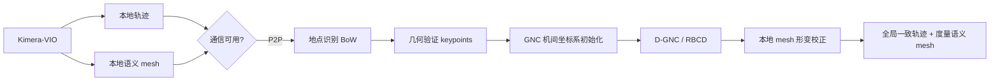

# 2022-TRO-Kimera-Multi 阅读笔记

> PDF：`10-收集箱/papers/03-多机协同-Swarm/2106.14386v2-Kimera-Multi.pdf`  
> 对照：`04-文献阅读/notes/03-多机协同-Swarm/2024-arXiv-Swarm-SLAM-阅读笔记.md`、`02-架构设计/Go2-VLA-SLAM-Token技术方案.md`、`01-工作计划/多机器人协同_详细技术与科研规划.md` §3  
> 保密：不写未 filed 的 Token/双触发独权细节。

---

## 1. 该文献是什么？

- **标题**：Kimera-Multi: Robust, Distributed, Dense Metric-Semantic SLAM for Multi-Robot Systems
- **作者**：Yulun Tian, Yun Chang, Fernando Herrera Arias, Carlos Nieto-Granda, Jonathan P. How, Luca Carlone
- **Venue**【事实】：PDF 页眉声明 *accepted for publication in* **IEEE Transactions on Robotics (T-RO), 2022**；arXiv:2106.14386v2 [cs.RO]（2021-12-17）。正式卷期/页码【待查证】
- **问题**：多机在**有限带宽 + 感知混淆（错误机间回环）**下，如何做**全分布式**、且输出**稠密度量-语义 mesh** 的协同 SLAM
- **技术线**：多机 C-SLAM / 分布式鲁棒位姿图（D-GNC）/ 度量-语义稠密建图（Kimera 系）
- **核心贡献**【事实·摘要】：
  1. **完整多机系统**：每机 Kimera 本地轨迹 + 本地 mesh；通信可用时做分布式地点识别与鲁棒 PGO；再用轨迹做 **local mesh optimization (LMO)** 纠漂
  2. **两阶段鲁棒分布式 PGO**：GNC 估计机间坐标系相对变换（无需迭代通信）→ 基于 RBCD 的 **distributed GNC (D-GNC)** 解全图
  3. **实验**：仿真 + EuRoC 类基准 + 户外真机（Jackal + RealSense D435i）；宣称相对中心化传输可显著降通信（文中举例最高约 **70%**）
- **方法概览**：

- **验证了什么**【事实】：合成外点 PGO；Medfield/City/Camp 仿真；EuRoC Vicon/Machine Hall；户外 Medfield / MIT Stata（3 机，单机轨迹可达数百米，Medfield 总长约 2 km 量级）
- **没有验证什么**【事实/推断】：非 LiDAR-first / 非 Unitree Go2；非 ROS 2 产品化栈陈述；非「持续弱网丢包曲线」；非边端—网关金字塔拓扑

---

## 2. 作者相关课题组信息

- **单位**【事实】：MIT Laboratory for Information & Decision Systems（LIDS）；Carlos Nieto-Granda 隶属 U.S. Army Research Laboratory（ARL）
- **实验室**【事实/推断】：SPARK Lab（Carlone）；作者简历亦写 SPARK
- **通讯/邮箱**【事实】：yulun, yunchang, luisfer, jhow, lcarlone @ mit.edu；cnietogr @ mit.edu
- **方向**【推断】：分布式优化估计、鲁棒 PGO、度量-语义 SLAM（Kimera 单机 → Kimera-Multi）
- **脉络**【事实】：相对会议前作 [18]，本文加强 **GNC 系鲁棒分布式后端**（替代/对比 PCM）并扩展评估
- **资助**【事实】：ARL DCIST CRA W911NF-17-2-0181；ONR BRC N000141712072；Lincoln Lab；Amazon Research Award；Mathworks
- **代码**【待查证·论文正文】**：本 PDF 未印仓库 URL。工程侧索引写 https://github.com/MIT-SPARK/Kimera-Multi（`03-技术分析/联网外部参考资料索引.md`）→ LICENSE/是否与论文版本一致须以仓库为准
- **待查证**：T-RO 卷期页码 DOI；仓库 LICENSE；是否官方支持本仓候选 ROS 发行版

---

## 3. 与本项目的关系分析

本项目口径：P0 **统一 Swarm-SLAM**（ROS 2、可接 LiDAR、外置 odom 如 Super-LIO）；产品拓扑为**本体→网关金字塔** + 增量空间协议，而非纯 P2P 全对等稠密 mesh 同步。Kimera-Multi 是 **对标与思想库**，不是替换底座。

### 3.1 与 Swarm-SLAM 对照（阅读组 / T-012 素材）

| 维度 | Kimera-Multi | Swarm-SLAM（仓内笔记） |
|------|--------------|------------------------|
| 传感主线 | Visual-inertial + 稠密 mesh | LiDAR / Stereo / RGB-D；里程计可外置 |
| 地图产出 | 度量-语义 **dense mesh** | 稀疏关键帧/位姿图为主（非本文式稠密语义 mesh） |
| 拓扑 | **全分布式 P2P** | 去中心 + rendezvous；本产品拟网关金字塔 |
| 鲁棒后端 | **D-GNC + RBCD**（抗外点初始化） | GNC 位姿图；另有 **spectral 回环预算** |
| 通信策略 | PR(BoW)+GV(keypoints)+DPGO；相对「传图/传关键点中心化」省带宽 | 稀疏选回环 + 低通信量真机量级（~95 MB / 3 机） |
| 对本项目角色 | **列入调研**（稠密 merge / 鲁棒分布式 / 拓扑反例） | **立即跟进**（P0 Gate 底座） |

| 维度 | 分析 |
|------|------|
| **直接相关** | 机间回环外点、分布式 vs 中心化通信量对照、mesh/子图校正思想 → WeakNet Bench 与 Reading Group「P2P vs 网关」 |
| **间接启发** | D-GNC 两阶段初始化；通信拆 PR/GV/DPGO 记账方式；LMO「轨迹先一致再纠地图」；改造代价：**中–高**（传感栈与产品拓扑均不同） |
| **正交无关** | 论文不涉及 VLA、VoxelDiff Token、Orin 上大模型 |
| **冲突/风险** | ① 稠密 mesh/P2P 与 motion **LiDAR + 网关增量**主路径不一致；② 视觉前端难直接替换 Super-LIO Producer；③ 勿把 EuRoC/Medfield ATE 当 Go2 验收 |
| **优先级** | **列入调研**（主规划已否决「再立一套 COVINS/Kimera 产品双栈」；保留学术/对标价值） |

### 借鉴矩阵

| 文献内容 | 本项目对应模块 | 可借鉴？ | 优先级 | 备注 |
|----------|---------------|----------|--------|------|
| D-GNC 抗外点机间回环 | 多机后端 / Gate 失败模式 | 是 | 列入调研 | 与 Swarm GNC 对照，不换栈 |
| 通信三分账：PR / GV / DPGO | WeakNet Bench 指标拆分 | 是 | **立即跟进**（指标设计） | Table II 记账模板可复用 |
| vs 中心化传图/传关键点 | 网关带宽叙事 | 是 | 列入调研 | Medfield Total **65.9 MB** vs Images **2113 MB** |
| 全分布式 P2P | 产品拓扑 | 部分 | Reading Group | **反例/对照**：金字塔网关如何扮演「常在邻居」 |
| 稠密度量-语义 mesh + LMO | 明年语义层 / 网关可视化 | 部分 | 仅存档→明年 | 非今年 C-SLAM 关键路径 |
| 视觉 Kimera-VIO 整栈换上 Go2 | Producer | 否 | 仅存档 | P0 已定 Super-LIO |
| 用 Kimera-Multi 替换 Swarm-SLAM | 协同底座 | 否 | 仅存档 | 主规划统一 Swarm |
| SLAM-Token / VoxelDiff | 中间件独权 | 否 | — | 不展开 |

**一句话结论**：Kimera-Multi 是 **稠密度量-语义 + 全分布式鲁棒 PGO** 的学术标杆，适合当 Swarm-SLAM / 网关金字塔的**对照系与通信记账模板**；P0 仍应推进 Swarm Gate，而不是换栈。

---

## 4. 主要设计参考参数指标

### 4.1 方法设计参数

| 参数名 | 数值/配置 | 含义 | 是否适用于 Go2 边端 |
|--------|-----------|------|---------------------|
| 传感 | Visual-inertial；真机 RealSense D435i + Jackal | RGB-D/VIO | 部分（Go2 有相机，但 P0 激光线为主） |
| 单机前端 | Kimera-VIO + Kimera mesh/semantics | 本地轨迹与 mesh | 否作默认 Producer |
| 地点识别 | Bag-of-words 向量交换 | PR 通信 | 思想可迁移 |
| 几何验证 | keypoints + descriptors | GV 通信大头 | 对照 Token 增量策略 |
| 后端 | D-GNC on RBCD；可选 early stopping (ES) | 分布式鲁棒 PGO | 思想；实现不绑死 |
| 地图校正 | Local mesh optimization / deformation | 轨迹优化后纠 mesh | 网关侧「先位姿后地图」可借鉴 |
| 拓扑 | Peer-to-peer，通信可用时触发 | 偶发/可用带宽 | 与持续 WiFi 网关需对照 |
| 许可 | 论文未印 SPDX | 开源声明需仓库核验 | 【待查证】 |

### 4.2 实验指标（摘录）

| 任务 | 数据集/场景 | 指标 | Baseline（对照） | 本文 | 备注 |
|------|-------------|------|------------------|------|------|
| 轨迹 | Medfield（总长 2396 m） | ATE (m) | L2 64.2；PCM 12.5；Central GNC 3.88 | D-GNC **3.92**；ES 4.32 | Table I |
| 轨迹 | City 1213 m | ATE | Central 1.00 | D-GNC **0.85** | Table I |
| 轨迹 | Camp 1037 m | ATE | Central 1.33 | D-GNC **0.96** | Table I |
| 通信 | Medfield | MB | Central Images 2113；Keypoints 141 | PR+GV+DPGO **65.9** | Table II |
| 通信 | Vicon Room 2 | MB | Keypoints 83.9 | Total **24.4** | 文称相对关键点中心化约 **70%** 降幅 |
| 通信构成 | Medfield | MB | — | PR 22.6 / GV 41.5 / DPGO **1.8** | 前端 >> 后端 |
| 运行 | Medfield | s | Central 4.4 | Distributed 29.2；ES **5.9** | ES 接近中心化耗时 |
| 户外闭环 | Medfield robot0 | end-to-end (m) | Kimera-VIO 18.74 | Kimera-Multi **0.01**（= Central） | Table V；非 ATE |
| 户外风险 | Stata robot1 | end-to-end (m) | VIO 24.19；Central 21.56 | Multi **33.13** | 机间回环不足时仍难；文内讨论 |

### 4.3 对本项目的对标建议

- **应跟踪（指标层）**：通信量拆 PR/GV/后端；机间回环 inlier/outlier；ATE 或 end-to-end；分布式 vs 网关中心化对照
- **论文未测但本项目必须测**：Super-LIO 外置 odom + Swarm；持续丢包/时延；Go2 双机；网关在线时的角色
- **验证环境**：T-008 仍以 Swarm + GrAco/Gazebo 为准；本文数字只进「对标/参考」

---

## 附：next actions

- [x] 能力卡 `05-知识沉淀/slam/CAP-SLAM-KIMERA-MULTI-REF-001.md`
- [ ] T-012 Reading Group：用本笔记 + Swarm 笔记做「P2P 稠密 vs 网关增量」讨论
- [ ] WeakNet 提纲补充「PR/GV/后端」三分通信量列（可选）
- [ ] 仓库 LICENSE / T-RO 卷期【待查证】
- [ ] **不**把 Kimera-Multi 立为第二套产品底座

---

## 附录 A：粘贴解读核校表

| 核项 | 初稿说法 | 原文位置 | 判定 |
|------|----------|----------|------|
| Venue | T-RO 2022 accepted | PDF 页眉 cite 句 | 【事实】accepted/T-RO 2022；卷期【待查证】 |
| arXiv | 2106.14386v2 | 页边栏 | 【事实】一致 |
| 单位 | MIT LIDS + ARL | 作者脚注 | 【事实】一致 |
| 资助 | W911NF-17-2-0181 等 | 脚注 | 【事实】一致 |
| Medfield ATE | D-GNC 3.92 vs Central 3.88 | Table I | 【事实】一致 |
| 通信 Medfield | Total 65.9 MB | Table II | 【事实】一致 |
| 70% 降幅 | vs 传 keypoints 中心化（Vicon Room 2） | §VII-B 正文 + Table II | 【事实】文内有例；非相对传整图的唯一口径 |
| GitHub URL | MIT-SPARK/Kimera-Multi | 本 PDF 未印 | 【待查证】以仓库/L3 索引为准，非论文【事实】 |
| LICENSE | — | 本 PDF 无 | 【待查证】 |

---

## 文档元数据

| 字段 | 值 |
|------|-----|
| id | NOTE-2022-TRO-Kimera-Multi |
| type | paper-analysis |
| stage | analysis |
| status | done |
| paper | Kimera-Multi: Robust, Distributed, Dense Metric-Semantic SLAM for Multi-Robot Systems |
| venue | IEEE T-RO 2022 (accepted; vol/pages TBD) / arXiv:2106.14386v2 |
| priority | 列入调研 |
| reader_model | Cursor Grok 4.5 |
| related_capability | CAP-SLAM-KIMERA-MULTI-REF-001 |
| related_notes | NOTE-2024-arXiv-Swarm-SLAM |
| updated | 2026-07-21 |
