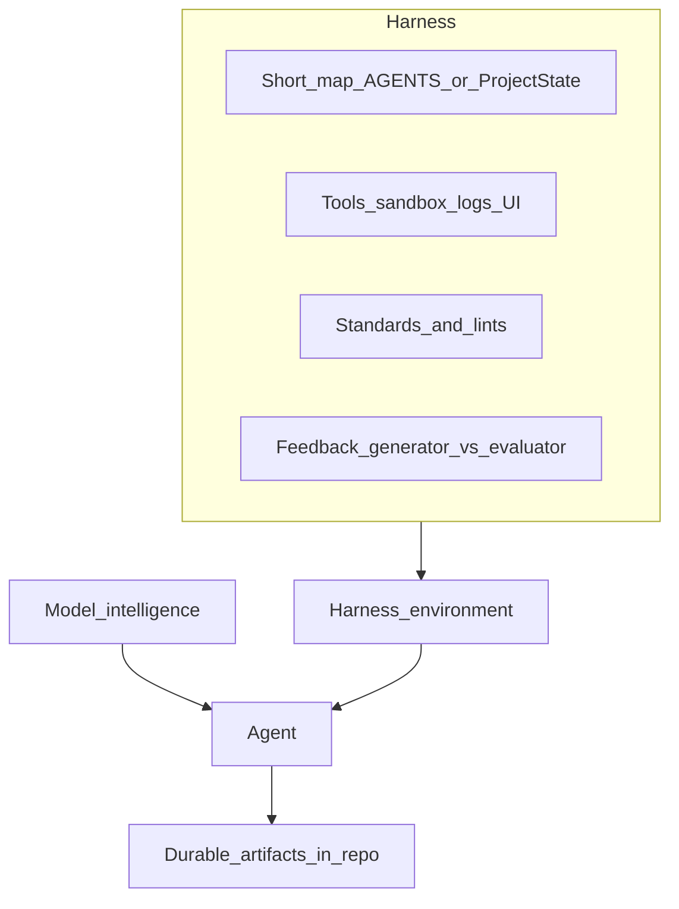

# 2026-OpenAI-Anthropic-Harness-Engineering 阅读笔记

> 类型：工程博文 / 实践报告（非学术论文）  
> 原文（公开）：
>
> 1. [OpenAI — Harness engineering: leveraging Codex in an agent-first world](https://openai.com/index/harness-engineering/)（2026-02-11，Ryan Lopopolo）
> 2. [Anthropic — Harness design for long-running application development](https://www.anthropic.com/engineering/harness-design-long-running-apps)（2026-03-24，Prithvi Rajasekaran）
>
> 二次转述素材：社区摘要（含 Viv「Agent = Model + Harness」、Mitchell Hashimoto 定义等）——未独立核原文处标【转述】

## 1. 该文献是什么？

- **标题**：Harness Engineering / Harness Design（两篇互补工程文）
- **作者 / 方**：OpenAI（Ryan Lopopolo）；Anthropic Labs（Prithvi Rajasekaran）
- **Venue**：公司工程博客（2026）
- **问题**：同一模型下，有人只能让 AI 写几行就卡住，有人能让 Agent 连续数小时交付完整产品——差距在**环境（Harness）**，不只在模型
- **核心贡献**【事实：来自两篇原文】：
  1. **OpenAI**：以「0 行人手写代码」约束，用 Codex 五个月量级交付约百万行、约 1500 PR；工程师职责转为设计环境、表达意图、建设反馈回路
  2. **OpenAI**：短 `AGENTS.md`（约 100 行）作目录 + 结构化 `docs/` 作系统事实源；可观测性/UI 对 Agent 可读；架构分层机械强制；doc-gardening
  3. **Anthropic**：生成器与评估器分离；前端四维评分；全栈变为 Planner–Generator–Evaluator；Playwright 实操验收；对比 Solo 20 min/$9 vs Full 6 hr/$200
- **方法概览**：

- **验证了什么**【事实】：环境与反馈回路显著影响长时程交付质量；自评不可靠，外置评估器 + 可操作工具更有效
- **未验证什么**【推断】：是否直接迁移到机器人/ROS 文档仓；256k 上下文衰减阈值等社区数字未在两篇正文中作为统一结论复述

## 2. 「作者方」信息

| 项 | 内容 | 标注 |
| --- | --- | --- |
| OpenAI 文 | Ryan Lopopolo, Member of the Technical Staff；2026-02-11 | 【事实】 |
| Anthropic 文 | Prithvi Rajasekaran, Labs；2026-03-24 | 【事实】 |
| 实验规模（OpenAI） | 约 5 个月；约百万行；约 1500 PR；早期约 3 名工程师驱动，后增至 7；人手零直接写码 | 【事实】 |
| 实验对比（Anthropic） | Solo 20 min / $9 vs Full harness 6 hr / $200（同一「复古游戏制作器」提示） | 【事实】 |
| Viv「Agent = Model + Harness」 | 社区转述常见定义 | 【转述】未在本次核到一手推文 |
| Hashimoto「错一次就改环境使永不再犯」 | 社区转述 | 【转述】 |
| 「上下文约 256k 开始衰减」 | 社区转述研究数字 | 【待查证】非两篇博文核心数据 |

## 3. 与本项目的关系分析

| 文献内容 | 本项目模块 | 可借鉴？ | 优先级 | 备注 |
| --- | --- | --- | --- | --- |
| 短目录 + 结构化知识库 | `ProjectState.md` §5 + `00`–`06`/`40`/`10` | 是 | **立即跟进** | 已有分层；勿再造巨型单文件 |
| progressive disclosure | `prompt.md` 铁律 + 按需 `@` 文档 | 是 | 立即跟进 | 对齐「正确时机拿正确信息」 |
| 可观测性暴露给 Agent | `motion_ws` 日志/bag/evo/`40-验证` | 是 | 立即跟进 | 文档仓有模板，执行栈【待补充】 |
| 生成 vs 评估拆分 | 文献笔记「附录核校表」+ 独立核对轮 | 是 | **立即跟进** | 三周实践 W3 |
| 四维评分（设计/原创/工艺/功能） | 任意创作验收单可迁移 | 是 | 列入调研 | 文献闭环改写为「完整/准确/可复用/可回链」 |
| Types→…→UI 依赖单向 | L2 架构分层、专利/论文分流 | 部分 | 列入调研 | 本仓以文档状态机为主 |
| doc-gardening Agent | `prompt.md` 要求重扫，缺定期任务 | 是 | 立即跟进 | 见缺口清单 |
| 错误→补环境 | `.cursor/rules` / prompt / 模板 | 是 | **立即跟进** | Hashimoto 循环【转述】+ OpenAI「缺能力就编码进仓」【事实】 |
| 0 手写代码百万行 | 本仓目标非此约束 | 否 | 仅存档 | 取方法不取口号 |
| 公开完整未申请方法 | `confidentiality: patent-sensitive` | — | — | **禁止**借 Harness 讨论外泄独权 |

**一句话结论**：motion 已有文档侧 Harness（分层工作台 + 铁律 + WORKFLOW）；缺口在**可执行反馈、生成/评估拆分、错误固化记录、doc-gardening**——按缺口清单与三周实践补齐即可，无需重造概念。

## 4. 主要设计参考参数指标

| 参数/指标 | 数值（来源） | 对标意义 | 标注 |
| --- | --- | --- | --- |
| `AGENTS.md` 长度 | 约 100 行（OpenAI） | 短目录上限参考 | 【事实】 |
| OpenAI 吞吐 | ~3.5 PR/工程师/天（文中自述） | 组织吞吐参考，非本仓 KPI | 【事实】 |
| 单任务 Agent 时长 | 常见向上 6 小时（OpenAI） | 长时程依赖环境完备 | 【事实】 |
| 前端评估维度 | Design / Originality / Craft / Functionality | 可改写为文档质量门 | 【事实】 |
| 前端迭代轮次 | 5–15 轮/次生成（Anthropic） | 返工预算 | 【事实】 |
| Solo vs Full | 20 min/$9 vs 6 hr/$200 | 「能跑」≠「能用」 | 【事实】 |
| 架构依赖方向 | Types → Config → Repo → Service → Runtime → UI | 代码仓分层强制参考 | 【事实】OpenAI |
| 上下文衰减阈值 | ~256k tokens | 外置文件系统优先级 | 【待查证】 |

## 附：next actions

- [x] 缺口清单 `00-指导AI/motion-Harness缺口清单.md`
- [x] 三周实践 `00-指导AI/Harness三周实践-文献闭环.md`
- [x] 能力卡 `05-知识沉淀/process/CAP-PROCESS-HARNESS-001.md`
- [ ] 按三周实践跑通至少 1 篇文献闭环（含一次错误→环境固化）
- [x] 将 `ProjectState.md` §5 明确标注为「短目录入口」（不新建巨型 AGENTS.md）

---

## 文档元数据

| 字段 | 值 |
| --- | --- |
| id | NOTE-2026-OpenAI-Anthropic-Harness-Engineering |
| type | paper-analysis |
| stage | analysis |
| status | done |
| paper | Harness engineering (OpenAI) + Harness design for long-running apps (Anthropic) |
| venue | OpenAI Engineering Blog 2026-02-11；Anthropic Engineering 2026-03-24 |
| priority | 立即跟进 |
| reader_model | Cursor Grok 4.5 |
| related_capability | CAP-PROCESS-HARNESS-001 |
| related_gap_list | `00-指导AI/motion-Harness缺口清单.md` |
| related_practice | `00-指导AI/Harness三周实践-文献闭环.md` |
| confidentiality | internal |
| updated | 2026-07-17 |
