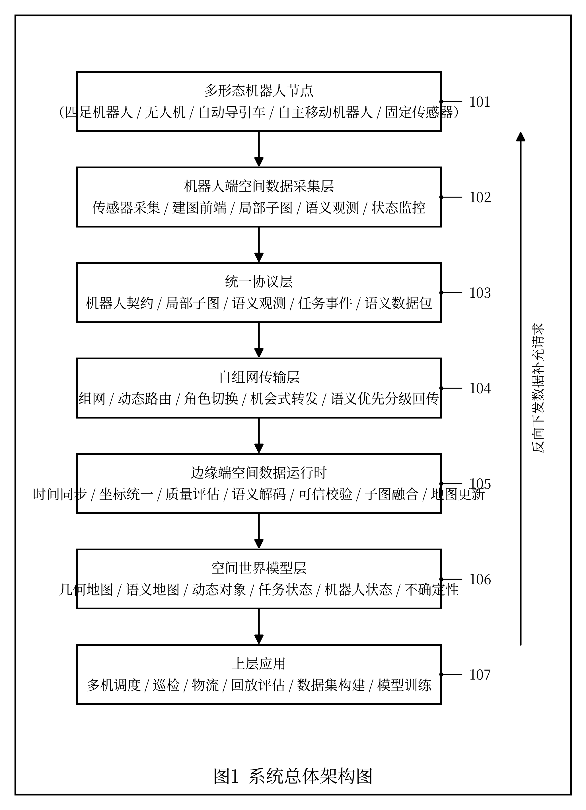
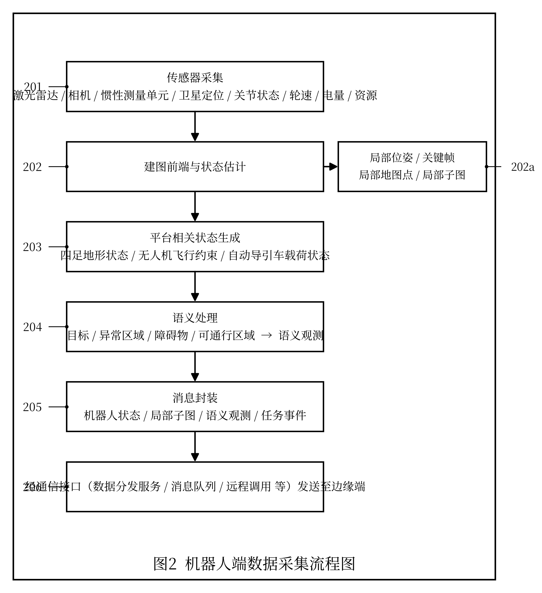
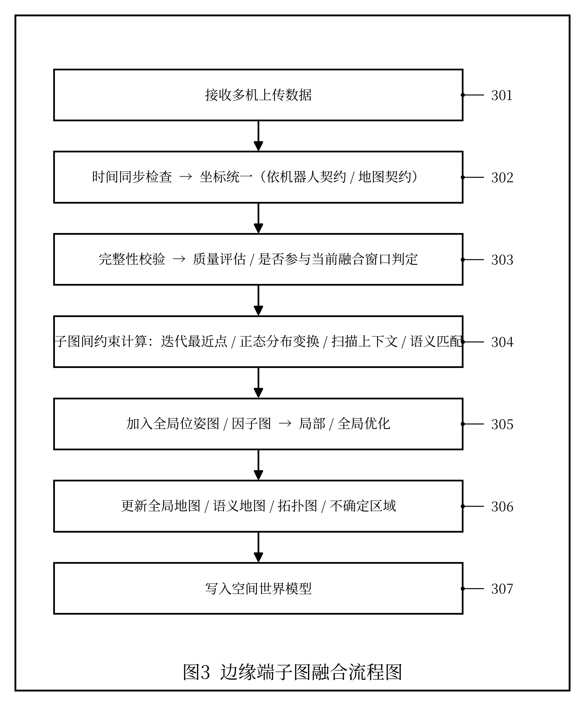
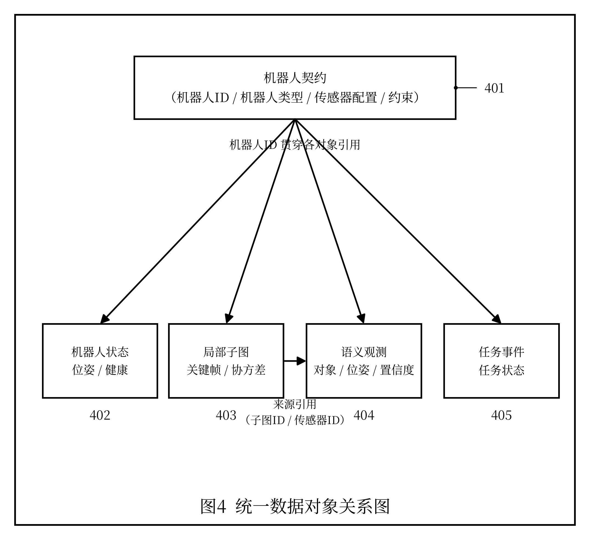
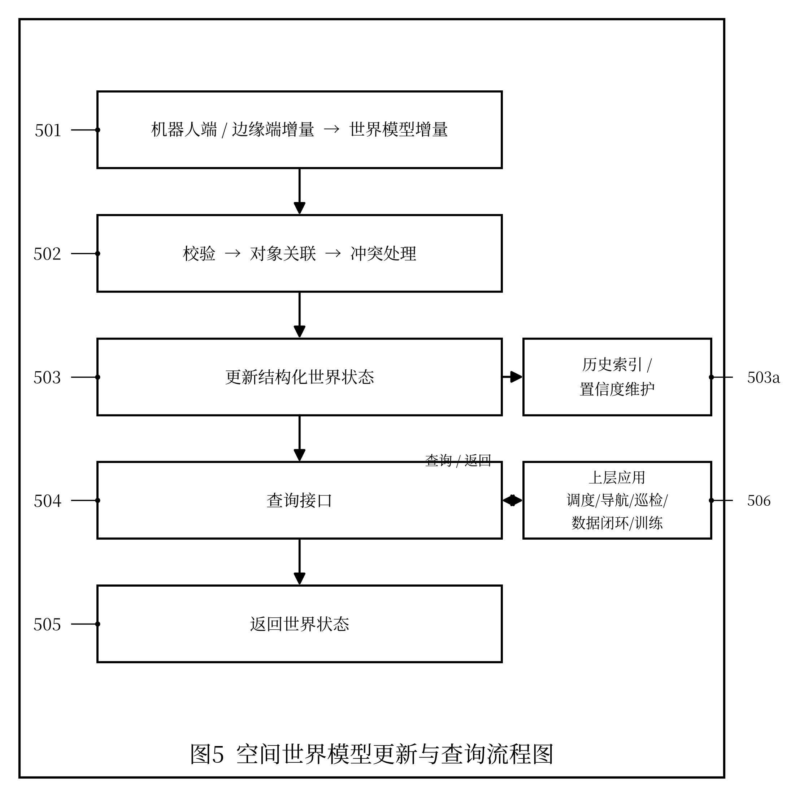
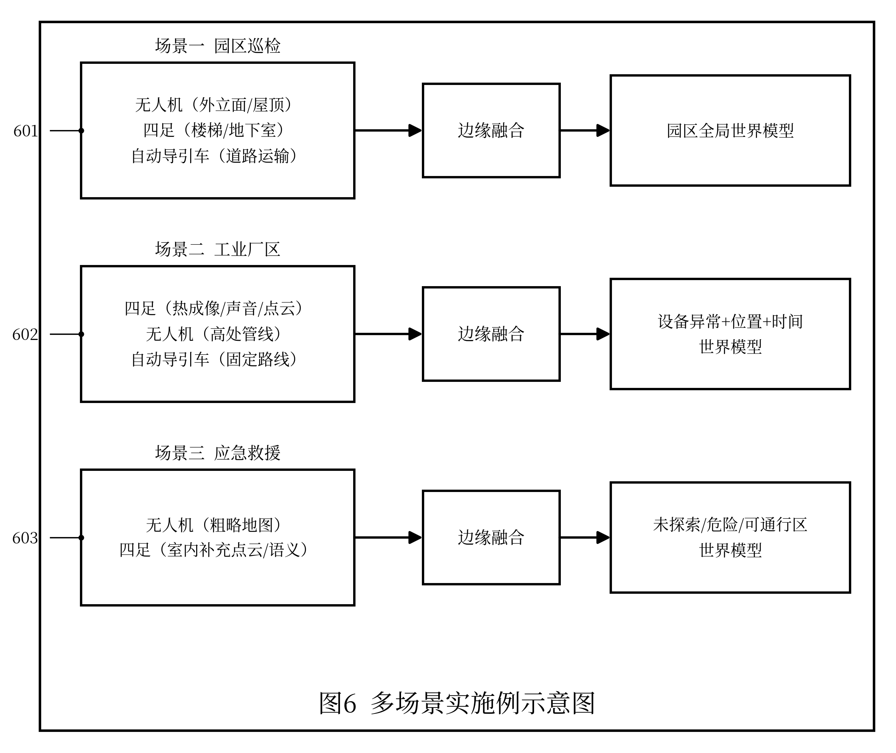
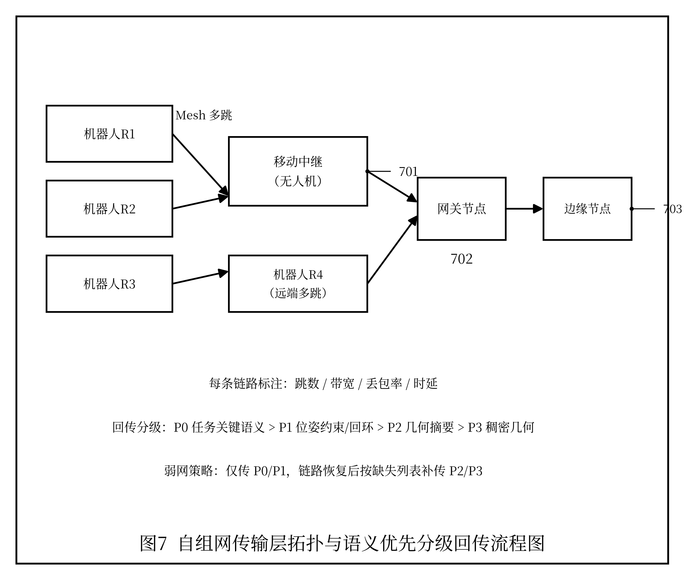

# 发明专利技术交底书

> 以下为专利提交所需信息，请发明人/申请人据实填写（参考品源专利交底书模板）：

| 项目 | 内容 |
|---|---|
| 发明创造名称 | 见下文"一、建议专利名称" |
| 发明人 | 曾欣宇 |
| 申请人 | 上海眸深智能科技有限公司 |
| 统一社会信用代码 | 91310110MAE92P3T6M |
| 联系地址 | 上海眸深智能科技有限公司（详细地址【待补充】） |
| 技术交底书撰写人及技术联系人 | 曾欣宇 |
| 电话 / 传真 | 15700050433 / 【待补充】 |
| E-MAIL | zengxy@moushen.ai |

---

## 一、建议专利名称

一种面向多机异构具身无人系统的空间数据运行时架构及数据处理方法

---

## 二、技术领域

本发明涉及机器人、无人系统、同步定位与建图、云边端协同计算、机器人通信协议、具身智能数据处理和空间世界模型技术领域，尤其涉及一种面向四足机器人、无人机、自动导引车或自主移动机器人等多机异构具身无人系统的空间数据运行时架构及数据处理方法。

---

## 三、背景技术

随着四足机器人、无人机、AGV、AMR 等具身无人系统在巡检、测绘、物流、应急和运维场景中的应用增多，单一机器人系统已经难以满足复杂环境下的空间数据采集和协同作业需求。不同类型机器人具有不同运动能力、传感器配置、作业边界和安全约束。例如，无人机适合大范围空中巡视和高处采集，四足机器人适合楼梯、坡面和复杂地面环境，AGV 或 AMR 适合结构化地面运输和重复路线执行。

现有技术中，多机器人系统通常存在以下问题：

1. 多数系统仅实现任务调度或位置状态共享，缺少对局部子图、地图质量、语义观测和运行数据的统一表达。
2. 不同机器人厂商或平台使用不同通信协议、坐标系、地图格式和任务接口，导致跨平台数据难以融合。
3. SLAM 系统通常部署在单机内部，难以将多机器人产生的关键帧、局部子图、地图质量和不确定性统一接入边缘端进行融合。
4. 上层任务系统通常只关注任务下发与状态返回，缺少对真实世界空间状态的持续维护和查询能力。
5. 机器人运行数据难以直接用于后续回放评估、模型训练、数据质检和世界模型更新。
6. 多数系统依赖固定基础设施网络并采用原始数据全量回传的传统通信范式，在大范围园区、地下、室内复杂结构或通信拒止环境中，机器人一旦脱离覆盖范围即与边缘端失联；同时稠密点云、图像或视频的全量回传带宽消耗大，弱网下还存在性能断崖式下降的悬崖效应。
7. 现有回传普遍构建在 TCP/IP 协议栈之上，其逐字节有序可靠交付、确认重传、拥塞退避和队头阻塞机制，在无线多跳、动态拓扑和高丢包环境下会把无线随机丢包误判为拥塞而降速、并因低价值分段丢失阻塞高价值语义递交，与机器人协同建图"只需保住任务关键语义"的需求不匹配。

在已公开的现有技术中，CN109579843A 公开了一种空地多视角下的多机器人协同定位及融合建图方法，CN116381724A 公开了一种连通分量动态合并的多机 3D 激光 SLAM 方法，二者均能实现多机器人之间的局部地图匹配与融合，是与本发明较为接近的现有技术。但上述方案主要面向地图融合本身，未涉及四足机器人、无人机、AGV 等异构平台通过统一契约接入，未涉及按任务语义价值进行自组网分级回传，也未提供将几何地图、语义观测、任务状态与机器人状态统一维护并对外查询的空间世界模型。

因此，需要一种面向多机异构具身无人系统的空间数据运行时架构，使不同机器人能够通过统一协议接入，并能够以移动自组网方式互联、按任务语义价值进行语义化数据回传，在机器人端、边缘端和云端之间形成可融合、可查询、可回放、可训练的空间数据处理闭环。

---

## 四、发明目的

本发明旨在提出一种空间数据运行时架构及数据处理方法，用于解决多机异构机器人系统中空间数据表达不统一、SLAM 子图难以融合、机器人状态难以共享、任务数据难以闭环和世界状态难以持续维护的问题。

本发明的目标包括：

1. 支持四足机器人、无人机、AGV、AMR 等异构机器人通过统一 Agent Contract 接入系统。
2. 在机器人端统一采集传感器数据、位姿状态、关键帧、局部子图、语义观测、任务状态和系统健康状态。
3. 在边缘端对多机器人数据进行时间同步、坐标统一、完整性校验、质量评估、子图融合和地图更新。
4. 在 World Model 层维护全局空间状态，包括几何地图、语义对象、动态对象、任务进度、机器人能力和通信状态。
5. 通过统一查询接口向调度系统、任务系统、数据闭环系统和模型训练系统提供空间状态。
6. 支持机器人、中继节点与边缘节点以移动自组网（Ad-hoc / MANET / 无线 Mesh）方式互联，并按任务语义价值对空间数据进行语义化分级回传，使系统在弱网、动态拓扑和无固定基础设施环境下仍能维持高效可靠的协同建图与世界模型更新。

---

## 五、技术方案

本技术方案结合附图说明如下。参见图 1，本系统自下而上包括：多形态机器人节点（101）、机器人端空间数据采集层（102）、统一协议层（103）、自组网传输层（104）、边缘端空间数据运行时（105）、空间世界模型层（106）与上层应用（107）。机器人端采集与封装流程参见图 2（步骤 201～206），边缘端子图融合流程参见图 3（步骤 301～307），统一数据对象之间的引用关系参见图 4（机器人契约 401 及其关联对象 402～405），空间世界模型的更新与查询参见图 5（步骤 501～506），多场景实施例参见图 6（601～603），自组网拓扑与语义优先分级回传参见图 7（移动中继 701、网关节点 702、边缘节点 703）。下文各小节中的部件与步骤均沿用上述附图标记。

### 5.1 系统总体架构

本发明的系统包括机器人端、边缘端、云端和协议层。

```text
多形态机器人节点
四足机器人 / 无人机 / AGV / AMR / 固定传感器
        |
        v
机器人端空间数据采集层
传感器采集 / SLAM前端 / 局部子图 / 语义观测 / 状态监控
        |
        v
统一协议层
Agent Contract / SensorFrame / Submap / SemanticObservation / TaskEvent / SemanticPacket
        |
        v
自组网传输层
移动自组网组网 / 动态路由 / 角色切换 / 机会式转发 / 语义优先分级回传
        |
        v
边缘端空间数据运行时
时间同步 / 坐标统一 / 质量评估 / 语义解码 / 可信校验 / 子图融合 / 地图更新 / 状态缓存
        |
        v
World Model层
几何地图 / 语义地图 / 动态对象 / 任务状态 / 机器人状态 / 不确定性
        |
        v
上层应用
多机器人调度 / 巡检任务 / 物流任务 / 回放评估 / 数据集构建 / 模型训练
```

### 5.2 机器人端处理流程

每个机器人端部署空间数据代理模块，执行以下步骤：

1. 获取机器人平台类型、能力描述、传感器配置和安全约束，生成 Agent Contract。
2. 采集 LiDAR、Camera、IMU、GNSS、关节状态、足端接触状态、轮速、电量和系统资源状态。
3. 运行本地 SLAM 前端或状态估计模块，生成局部位姿、关键帧、局部地图点和局部子图。
4. 根据机器人平台类型生成平台相关状态，例如四足机器人的地形状态、无人机的飞行约束、AGV 的载荷状态。
5. 对传感器观测进行语义处理，生成语义目标、异常区域、障碍物和可通行区域等 SemanticObservation。
6. 将上述数据封装为统一消息，通过 DDS、MQTT、WebSocket、gRPC 或其他通信方式发送到边缘端。

### 5.3 统一数据对象

本发明定义以下核心数据对象。

#### 5.3.1 Agent Contract

用于描述机器人身份、能力、传感器、运动约束和安全边界。

```yaml
agent_contract:
  agent_id: robot_001
  agent_type: quadruped | uav | agv | amr
  sensor_profile:
    lidar: true
    camera: true
    imu: true
  motion_constraints:
    max_speed: 1.5
    max_slope: 25
  safety_constraints:
    min_battery: 0.2
    localization_confidence_threshold: 0.65
```

#### 5.3.2 Agent State

用于描述机器人实时运行状态。

```yaml
agent_state:
  timestamp: 1710000000.12
  frame_id: global_map
  pose: [x, y, z, qx, qy, qz, qw]
  velocity: [vx, vy, vz, wx, wy, wz]
  battery: 0.76
  health_state: normal | degraded | fault
  network_state:
    rtt_ms: 80
    packet_loss: 0.04
```

#### 5.3.3 Submap

用于描述机器人局部建图结果。

```yaml
submap:
  submap_id: submap_0001
  agent_id: robot_001
  timestamp_begin: 1710000000.00
  timestamp_end: 1710000005.00
  local_frame_id: robot_001_odom
  pose_in_local_frame: [...]
  keyframes: [...]
  pointcloud_uri: ...
  covariance: [...]
  map_quality_score: 0.82
```

#### 5.3.4 Semantic Observation

用于描述语义观测结果。

```yaml
semantic_observation:
  observation_id: obs_0001
  agent_id: robot_001
  timestamp: 1710000001.12
  object_class: fire_extinguisher
  pose_in_map: [...]
  confidence: 0.91
  source_sensor: camera_front
```

### 5.4 边缘端空间数据运行时处理流程

边缘端接收多个机器人上传的数据后，执行以下步骤：

1. 根据消息时间戳、时钟源和接收时间进行时间同步检查。
2. 根据 Agent Contract 和 Map Contract 将各机器人局部坐标系转换到统一全局坐标系。
3. 对上传的关键帧、子图、位姿状态和语义观测进行完整性校验。
4. 根据子图质量评分、位姿协方差、点云重叠度、回环候选数量和网络状态决定是否参与当前融合窗口。
5. 通过 ICP、NDT、特征匹配、Scan Context、语义匹配或其他方法计算子图间约束。
6. 将可靠约束加入全局位姿图或因子图，执行局部优化或全局优化。
7. 生成或更新全局地图、语义地图、拓扑图和不确定区域。
8. 将更新后的状态写入 World Model。

### 5.5 World Model 更新与查询

World Model 层维护全局空间状态，包括：

- 机器人状态；
- 全局几何地图；
- 局部子图索引；
- 语义对象；
- 动态障碍物；
- 任务状态；
- 通信状态；
- 地图不确定性；
- 历史观测记录。

上层系统可通过查询接口获取：

- 某机器人当前状态；
- 某区域地图质量；
- 某目标对象的位置；
- 某任务完成进度；
- 某区域是否适合某类型机器人通行；
- 某时间段内的观测和任务数据。

### 5.6 自组网传输与语义优先回传

本架构的统一协议层与边缘端之间设置自组网传输层，使多机异构系统在无固定基础设施条件下仍能完成空间数据回传：

1. **移动自组网互联**：机器人节点、可移动中继节点（如充当空中中继的无人机）和边缘节点构成移动自组织网络，通过邻居发现自动组网，采用面向移动场景的动态路由（如 OLSR、AODV、BATMAN 或其改进算法）在拓扑变化时更新多跳路径，节点可在数据源、中继、网关、边缘角色间动态切换。
2. **语义优先分级回传**：机器人端按任务语义价值将待回传数据划分优先级，由高到低依次为任务关键语义观测、位姿约束与回环、几何摘要、稠密原始几何；带宽受限时优先保证任务相关语义与约束送达，而非追求原始数据逐比特完整恢复。
3. **链路自适应**：根据自组网链路质量、跳数、拥塞和时延约束，自适应调整语义编码强度、压缩比、冗余/多路径编码与路由路径，缓解弱网下的悬崖效应；链路中断时机会式缓存并在恢复后按优先级补传。
4. **语义互操作**：节点入网时在 Agent Contract 中声明所支持的共享语义字典与编解码版本，边缘端据此选择兼容编码，解决跨平台语义编解码不一致问题。
5. **可信解码融合**：边缘端对恢复的语义数据进行多机一致性、几何与协方差校验，抑制生成式重建可能产生的幻觉，保证写入 World Model 的状态可靠。
6. **数据链路层语义传输**：在弱网与多跳自组网下，可绕过 TCP 的逐字节有序可靠交付，在数据链路层按语义优先级进行差异化可靠传输（对高优先级语义施加前向纠错与多路径冗余），并由物理层/MAC 层信道状态直接驱动语义编码，消除队头阻塞并避免无线丢包被误判为拥塞。
7. **多模链路自适应承载**：上述机制不绑定具体通信标准，可映射到 DDS QoS、5G-TSN/TSN（确定性承载）、IEEE 802.11s（无线 Mesh 自组网）、IEEE 802.15.4（低速兜底）等承载，并根据链路状态在"确定性承载"与"语义优先尽力传输"之间自适应切换。

上述自组网传输、数据链路层语义传输、多模链路自适应承载与语义优先回传的具体决策、编码与融合方法，可由配套子方法专利进一步展开。

---

## 六、关键创新点

1. 提出一种面向多机异构具身无人系统的空间数据运行时架构，将机器人端 SLAM 前端、边缘端子图融合和 World Model 状态管理统一为可运行闭环。
2. 提出 Agent Contract、Submap、SemanticObservation、TaskEvent 等统一数据对象，使四足机器人、无人机、AGV 等平台能够以统一方式表达空间数据和任务状态。
3. 将 SLAM 子图、地图质量、机器人健康状态、网络状态和任务状态同时纳入运行时处理流程，区别于仅进行任务调度或位置共享的系统。
4. 在边缘端进行多机器人时间同步、坐标统一、子图质量评估和地图融合，为上层世界模型提供可信空间状态。
5. 支持将运行时数据进一步用于任务调度、数据回放、模型训练、异常分析和具身智能数据闭环。
6. 在运行时架构中引入自组网传输层与语义优先分级回传机制，使多机异构系统在弱网、动态拓扑和无固定基础设施环境下仍能完成可靠的空间数据回传与世界模型更新，区别于依赖固定网络和原始数据全量回传的系统。

---

## 七、有益效果

与现有技术相比，本发明具有以下有益效果：

1. 提高多机异构机器人系统的数据互操作能力，使不同形态机器人产生的空间数据能够统一接入。
2. 提高多机器人协同建图和空间状态维护能力，避免各机器人地图和任务状态割裂。
3. 提高真实环境下机器人运行数据的可复盘性和可训练性，为后续模型训练和任务优化提供结构化数据。
4. 降低上层任务系统对具体机器人平台的依赖，使任务调度、世界模型和数据闭环能够基于统一接口开发。
5. 支持巡检、测绘、物流、应急和运维等社会化场景下的具身无人系统规模化部署。
6. 通过自组网互联与语义优先回传，显著降低弱网下的回传带宽消耗、缓解悬崖效应，并支持地下、室内、园区和灾害拒止等无固定基础设施场景下的多机协同。

---

## 八、可选实施例

### 实施例一：园区多机器人巡检

无人机负责园区外立面和屋顶区域快速采集，四足机器人负责楼梯、地下室和复杂地面区域巡检，AGV 负责结构化道路上的物料运输和固定路线采集。三个机器人通过各自 Agent Contract 接入系统，边缘端融合各自上传的子图和语义观测，World Model 维护园区全局空间状态。

### 实施例二：工业厂区设备巡检

四足机器人在设备区采集热成像、声音、图像和点云，无人机采集高处设备和管线图像，AGV 搭载传感器在固定路线巡检。系统将设备异常、空间位置、采集时间和机器人状态统一写入 World Model，为资产管理系统提供查询接口。

### 实施例三：应急救援空间建图

无人机先进入灾害区域快速生成粗略地图，四足机器人进入室内复杂区域补充近距离点云和语义观测，边缘端根据子图质量和通信状态进行增量融合，World Model 输出未探索区域、危险区域和可通行路线。

---

## 九、替代方案

本发明多个环节均可采用替代实现，而不脱离本发明的保护范围：

1. 机器人端 SLAM（同步定位与建图）前端可采用 LIO-SAM、FAST-LIO、LOAM、Cartographer、ORB-SLAM、VINS 或其他里程计与状态估计算法替代；
2. 通信中间件可采用 DDS（数据分发服务）、MQTT、WebSocket、gRPC 或自定义协议替代；承载链路可采用 5G/5G-TSN、有线 TSN（时间敏感网络）、Wi-Fi（含 IEEE 802.11s 无线 Mesh）、IEEE 802.15.4 或移动自组网等替代；
3. 子图融合中的配准与匹配可采用 ICP、GICP、NDT、Scan Context、特征匹配或语义匹配替代；全局优化可采用位姿图优化（如 g2o、Ceres）或因子图优化（如 GTSAM、iSAM2）替代；
4. World Model（空间世界模型）的存储可采用关系数据库、时序数据库、图数据库或内存数据结构替代；
5. 边缘端可由独立边缘服务器、车载/机载计算单元，或由被选举为网关的机器人节点承担；
6. 异构机器人不限于四足机器人、无人机、AGV（自动导引车）、AMR（自主移动机器人），亦可为轮式机器人、履带机器人或固定式传感器节点。

上述替代方案可单独或组合使用，均能实现本发明目的。

---

## 十、建议权利要求保护方向

后续撰写权利要求时，建议至少覆盖：

1. 一种多机异构具身无人系统的空间数据运行时处理方法；
2. 一种包括机器人端、边缘端、云端和协议层的系统架构；
3. 一种 Agent Contract 数据结构及其在多机器人接入中的使用方法；
4. 一种将局部子图、语义观测、机器人状态和任务状态统一写入 World Model 的方法；
5. 一种基于统一空间数据运行时向上层调度、回放、训练和查询系统提供接口的方法；
6. 一种在空间数据运行时架构中通过移动自组网互联并按任务语义价值进行语义优先分级回传的方法。

---

## 十一、附图说明

本发明附图均为黑白线条示意图，方框表示功能模块或处理步骤，箭头表示数据流向或调用关系；图中阿拉伯数字为附图标记，与说明书具体实施方式中的部件/步骤编号一一对应。

**图 1 系统总体架构图**



说明：自上而下为数据上行主链路；空间世界模型经查询接口向上层应用提供状态，并可经各层向机器人端反向下发数据补充请求。

**图 2 机器人端数据采集流程图**



**图 3 边缘端子图融合流程图**



**图 4 统一数据对象关系图**



说明：机器人契约为根节点，机器人ID 贯穿各对象；局部子图的子图ID 被语义观测的来源字段引用。

**图 5 World Model 更新与查询流程图**



**图 6 多场景实施例示意图**



**图 7 自组网传输层拓扑与语义优先分级回传流程图**



---

## 十二、参考文献

以下文献用于说明本发明所涉及的现有技术背景，供撰写权利要求和说明书时参考：

1. C. E. Shannon, "A Mathematical Theory of Communication," The Bell System Technical Journal, vol. 27, pp. 379–423, 1948.
2. S. Thrun, W. Burgard, and D. Fox, "Probabilistic Robotics," MIT Press, 2005.
3. J. Zhang and S. Singh, "LOAM: Lidar Odometry and Mapping in Real-time," in Proc. Robotics: Science and Systems (RSS), 2014.
4. T. Shan, B. Englot, D. Meyers, W. Wang, C. Ratti, and D. Rus, "LIO-SAM: Tightly-coupled Lidar Inertial Odometry via Smoothing and Mapping," in Proc. IEEE/RSJ Int. Conf. on Intelligent Robots and Systems (IROS), 2020.
5. W. Xu, Y. Cai, D. He, J. Lin, and F. Zhang, "FAST-LIO2: Fast Direct LiDAR-Inertial Odometry," IEEE Transactions on Robotics (T-RO), vol. 38, no. 4, pp. 2053–2073, 2022.
6. Y. Tian, Y. Chang, F. Herrera Arias, C. Nieto-Granda, J. P. How, and L. Carlone, "Kimera-Multi: Robust, Distributed, Dense Metric-Semantic SLAM for Multi-Robot Systems," IEEE Transactions on Robotics (T-RO), vol. 38, no. 4, pp. 2022–2038, 2022.
7. N. Hughes, Y. Chang, and L. Carlone, "Hydra: A Real-time Spatial Perception System for 3D Scene Graph Construction and Optimization," in Proc. Robotics: Science and Systems (RSS), 2022.
8. D. Gündüz, Z. Qin, I. E. Aguerri, et al., "Beyond Transmitting Bits: Context, Semantics, and Task-Oriented Communications," IEEE Journal on Selected Areas in Communications (JSAC), vol. 41, no. 1, pp. 5–41, 2023.
9. Object Management Group (OMG), "Data Distribution Service (DDS), Version 1.4," 2015.
10. IEEE Std 802.1Q, "IEEE Standard for Local and Metropolitan Area Networks—Bridges and Bridged Networks (including Time-Sensitive Networking amendments)."
11. 3GPP TS 23.501, "System Architecture for the 5G System (5GS)," 3rd Generation Partnership Project.
12. 刘盛, 柯正昊, 陈彬, 等. 一种空地多视角下的多机器人协同定位及融合建图方法: 中国发明专利申请, 公开号 CN109579843A.
13. 一种连通分量动态合并的多机3D激光SLAM方法及系统: 中国发明专利申请, 公开号 CN116381724A.
14. 基于视觉多机器人即时定位与同步建图方法、系统及介质: 中国发明专利申请, 公开号 CN113674409A.

---

## 附：术语与缩略语

| 缩略语 | 全称 / 中文含义 |
|---|---|
| SLAM | Simultaneous Localization and Mapping，同步定位与建图 |
| LiDAR | Light Detection and Ranging，激光雷达 |
| IMU | Inertial Measurement Unit，惯性测量单元 |
| GNSS | Global Navigation Satellite System，全球导航卫星系统 |
| AGV | Automated Guided Vehicle，自动导引车 |
| AMR | Autonomous Mobile Robot，自主移动机器人 |
| DDS | Data Distribution Service，数据分发服务（通信中间件） |
| TSN | Time-Sensitive Networking，时间敏感网络 |
| 5G-TSN | 5G 与时间敏感网络融合的确定性承载 |
| MANET | Mobile Ad-hoc Network，移动自组织网络 |
| Mesh | 无线网状网络 |
| ICP / NDT | Iterative Closest Point / Normal Distributions Transform，迭代最近点 / 正态分布变换（点云配准方法） |
| World Model | 空间世界模型 |

