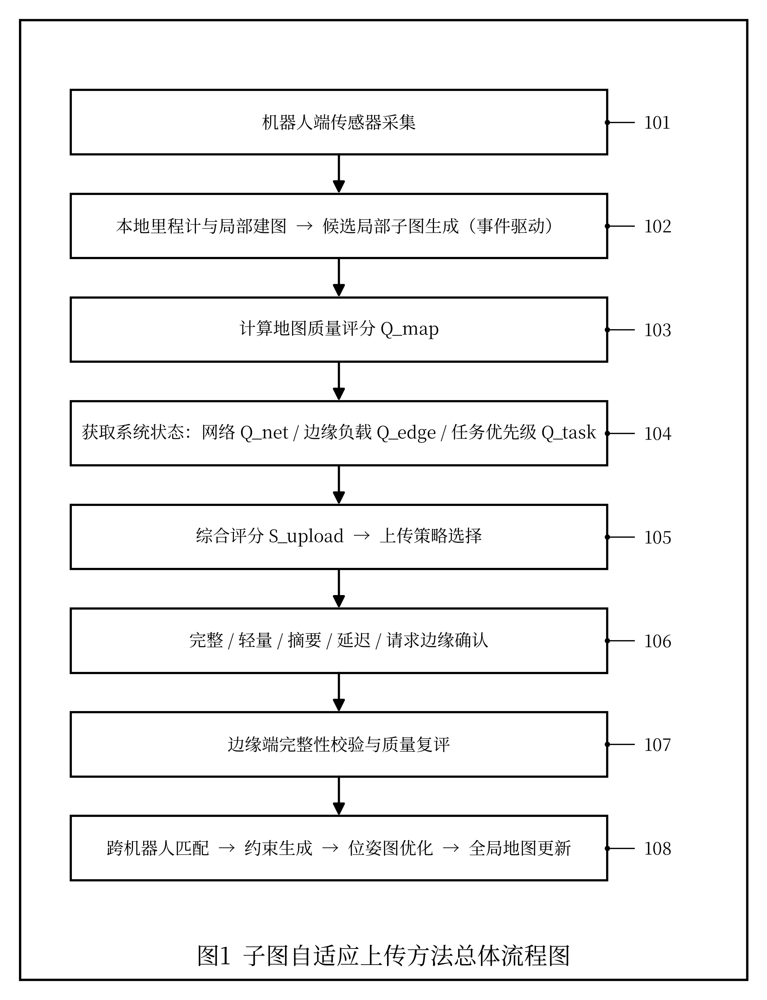
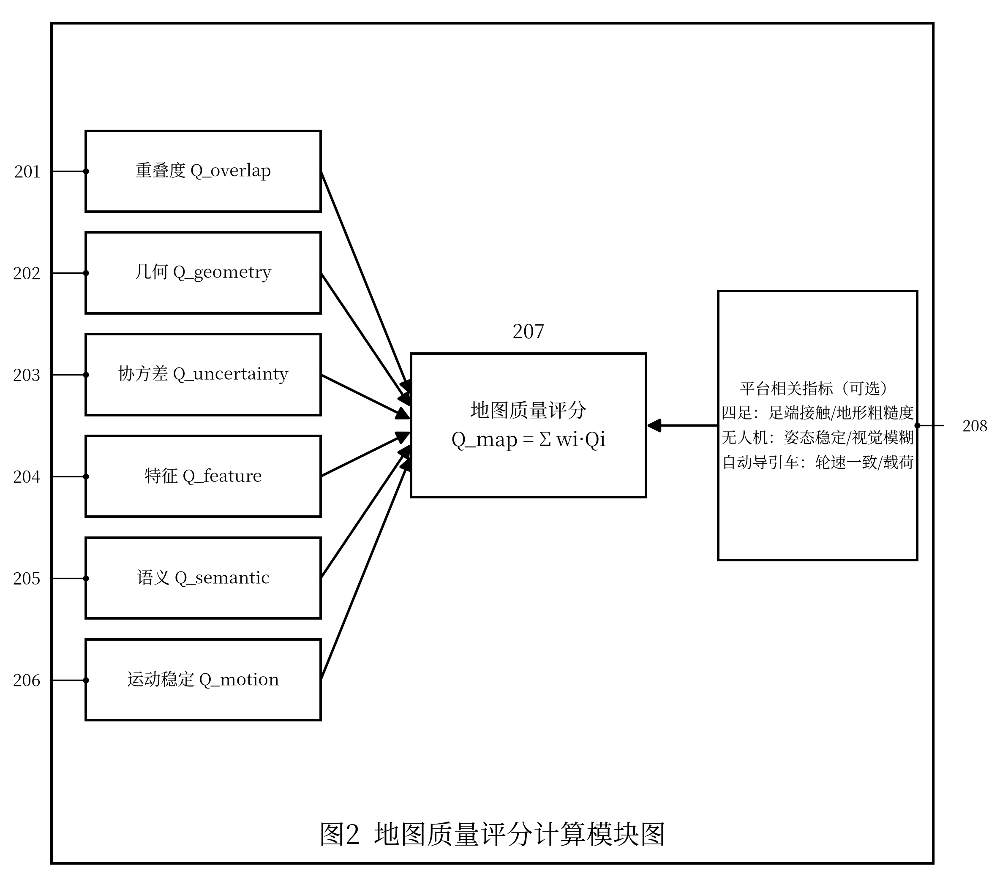
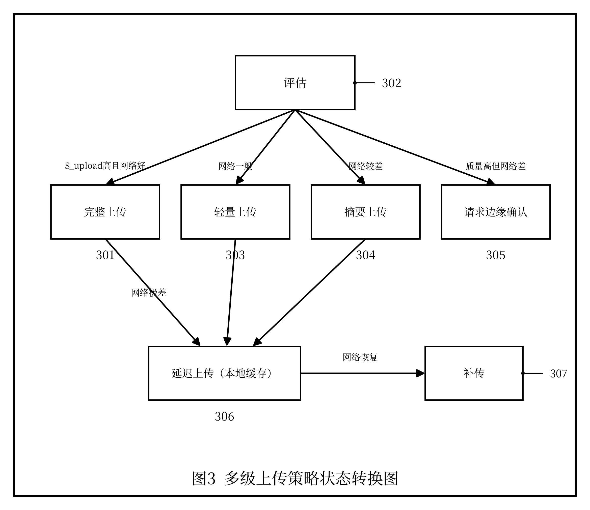
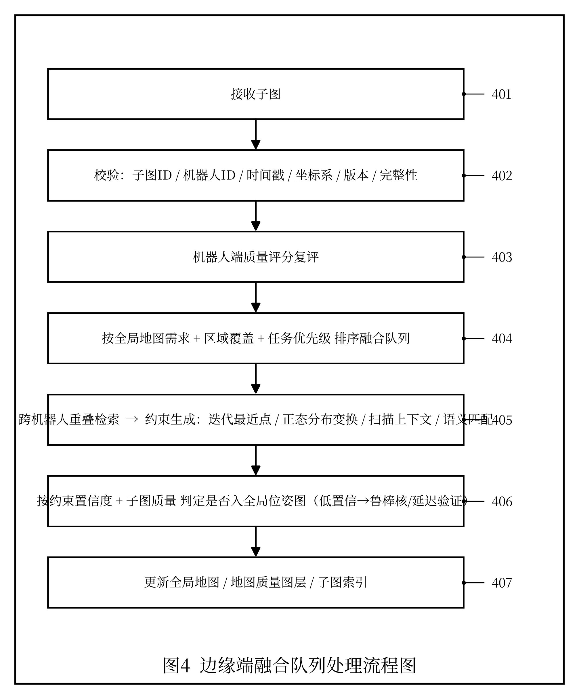
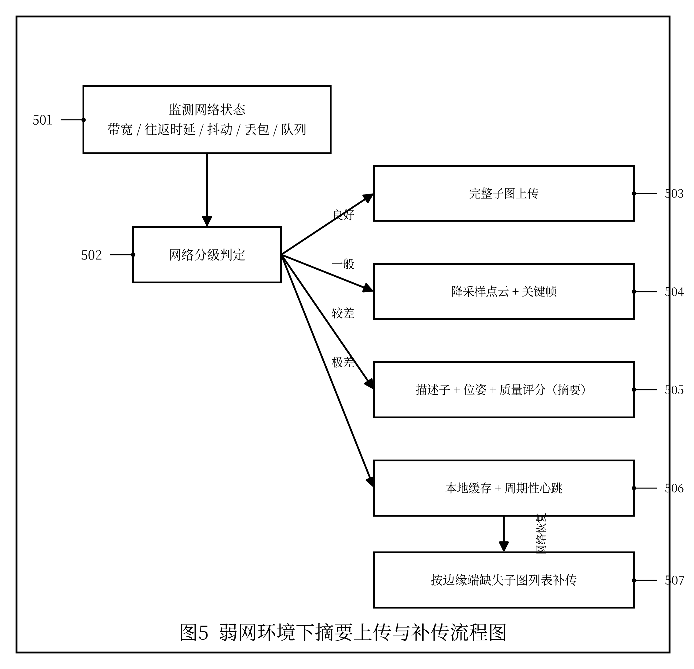

# 发明专利技术交底书

> 以下为专利提交所需信息，请发明人/申请人据实填写（参考品源专利交底书模板）：

| 项目 | 内容 |
|---|---|
| 发明创造名称 | 见下文"一、建议专利名称" |
| 发明人 | 曾欣宇 |
| 申请人 | 上海眸深智能科技有限公司 |
| 统一社会信用代码 | 91310110MAE92P3T6M |
| 联系地址 | 上海眸深智能科技有限公司（详细地址【待补充】） |
| 技术交底书撰写人及技术联系人 | 曾欣宇 |
| 电话 / 传真 | 15700050433 / 【待补充】 |
| E-MAIL | zengxy@moushen.ai |

---

## 一、建议专利名称

一种基于地图质量评分的多机器人局部子图自适应上传与融合方法

---

## 二、技术领域

本发明涉及机器人同步定位与建图、多机器人协同建图、边缘计算、弱网通信、地图融合和机器人数据传输技术领域，尤其涉及一种基于地图质量评分、网络状态和任务优先级的多机器人局部子图自适应上传与融合方法。

---

## 三、背景技术

多机器人协同 SLAM 系统中，每个机器人通常在本地运行前端里程计或 SLAM 模块，并周期性生成关键帧、局部点云或子图。边缘端或服务器端根据多个机器人上传的数据进行跨机器人匹配、回环检测、位姿图优化和全局地图构建。

现有方法通常存在以下问题：

1. 固定频率上传子图，容易在网络带宽受限时造成拥塞，导致关键子图延迟或丢失。
2. 单纯根据时间或位移阈值生成子图，不能反映局部地图质量、场景退化程度和位姿不确定性。
3. 弱网或边缘计算负载较高时，缺乏对上传内容的分级降级策略。
4. 子图是否参与融合往往在边缘端被动决定，机器人端缺少基于自身状态的主动上传判断。
5. 不同机器人平台产生的数据质量差异较大，缺少统一地图质量评分和融合优先级机制。

在已公开的现有技术中，CN110119144B 公开了一种基于子地图特征匹配的多机器人 SLAM 算法，CN106272423A 公开了一种针对大尺度环境的多机器人协同制图与定位方法，二者均能实现子图匹配与全局地图融合，是与本发明较为接近的现有技术。但上述方案的子图生成与上传通常基于固定周期或位移阈值，未根据局部地图质量、位姿不确定性、网络状态、边缘负载与任务优先级自适应地决定上传时机与上传内容，也未提供弱网环境下的分级降级传输与恢复后补传机制。

因此，需要一种能够综合地图质量、位姿不确定性、网络状态、机器人任务优先级和边缘端负载的自适应子图上传与融合方法。

---

## 四、发明目的

本发明旨在提出一种多机器人局部子图自适应上传与融合方法，使机器人端能够根据自身 SLAM 状态、地图质量和网络条件动态决定上传时机和上传内容，边缘端能够根据子图质量和全局融合需求进行分级处理，从而提高多机器人协同建图在弱网、资源受限和复杂环境下的稳定性和效率。

---

## 五、技术方案

本技术方案结合附图说明如下。参见图 1，本方法总体流程包括：机器人端传感器采集（101）、本地里程计与局部建图及候选子图生成（102）、地图质量评分计算（103）、系统状态评分获取（104）、综合评分与上传策略选择（105）、多级上传执行（106）、边缘端完整性校验与质量复评（107）以及跨机器人匹配与全局地图更新（108）。其中地图质量评分的构成参见图 2（各质量分量 201～206、加权融合 207、平台相关指标 208），多级上传策略的状态转移参见图 3（完整/轻量/摘要/请求边缘确认 301～305、延迟上传 306、补传 307），边缘端融合队列处理参见图 4（步骤 401～407），弱网降级与补传机制参见图 5（监测 501、分级判定 502、分级策略 503～506、补传 507）。下文各小节沿用上述附图标记。

### 5.1 方法总体流程

本方法包括以下步骤：

```text
机器人端传感器采集
        ↓
本地里程计与局部建图
        ↓
计算局部地图质量评分
        ↓
获取网络状态、资源状态和任务优先级
        ↓
生成子图上传决策
        ↓
选择完整子图、轻量子图、描述子或延迟上传
        ↓
边缘端完整性校验与质量复评
        ↓
跨机器人匹配与约束生成
        ↓
位姿图优化与全局地图更新
```

### 5.2 机器人端局部子图生成

机器人端基于 LiDAR、Camera、IMU、GNSS、关节状态或轮速等传感器数据运行本地 SLAM 前端。当满足以下任一条件时，生成候选局部子图：

1. 机器人移动距离超过预设阈值；
2. 机器人转角超过预设阈值；
3. 累积关键帧数量超过阈值；
4. 位姿协方差超过阈值；
5. 检测到潜在回环区域；
6. 任务进入关键区域，例如门口、楼梯、设备点、狭窄通道或高风险区域；
7. 边缘端主动请求补充数据。

### 5.3 地图质量评分

对候选局部子图计算地图质量评分 `Q_map`。该评分可由以下指标加权得到：

```text
Q_map = w1 * Q_overlap
      + w2 * Q_geometry
      + w3 * Q_uncertainty
      + w4 * Q_feature
      + w5 * Q_semantic
      + w6 * Q_motion
```

其中：

- `Q_overlap` 表示与历史地图或邻近子图的重叠质量；
- `Q_geometry` 表示局部几何结构丰富度，例如平面、边缘、角点或点云分布均匀性；
- `Q_uncertainty` 表示位姿不确定性，协方差越小评分越高；
- `Q_feature` 表示图像特征、点云特征或回环描述子的有效性；
- `Q_semantic` 表示语义目标或任务关键对象的观测价值；
- `Q_motion` 表示机器人运动状态稳定性，例如急停、震动或足端冲击越强评分越低。

在一种实施方式中，地图质量评分还可引入平台相关指标：

- 对四足机器人，引入足端接触置信度、支撑面高度变化和地形粗糙度；
- 对无人机，引入飞行姿态稳定性、视觉模糊程度和高度变化；
- 对 AGV 或 AMR，引入轮速里程计一致性、载荷状态和地面路径约束。

### 5.4 系统状态评分

机器人端同时获取网络状态评分 `Q_net`、边缘负载评分 `Q_edge` 和任务优先级评分 `Q_task`。

网络状态评分包括：

- 当前带宽；
- 往返延迟；
- 抖动；
- 丢包率；
- 发送队列长度。

边缘负载评分包括：

- 边缘端 CPU、GPU、内存负载；
- 待处理子图队列长度；
- 当前优化任务数量；
- 子图融合延迟。

任务优先级评分包括：

- 是否处于关键任务区域；
- 是否接近任务目标；
- 是否为异常事件或高风险区域；
- 是否需要实时决策支持。

### 5.5 子图上传决策

机器人端根据综合评分 `S_upload` 决定上传策略：

```text
S_upload = a * Q_map
         + b * Q_task
         + c * Q_net
         + d * Q_edge
         - e * C_data
```

其中 `C_data` 表示上传数据量成本，`a`、`b`、`c`、`d`、`e` 为权重系数。

根据 `S_upload` 和各项阈值，选择以下策略之一：

1. **完整上传**：上传完整点云、关键帧、描述子、协方差和语义观测。
2. **轻量上传**：上传降采样点云、关键帧位姿、局部描述子和质量评分。
3. **摘要上传**：仅上传描述子、关键帧位姿、地图质量评分和语义摘要。
4. **延迟上传**：本地缓存完整子图，待网络或边缘负载恢复后再上传。
5. **请求边缘确认**：当地图质量较高但网络状态较差时，先上传摘要，由边缘端决定是否请求完整子图。

### 5.6 边缘端融合处理

边缘端接收子图后执行以下步骤：

1. 检查子图 ID、机器人 ID、时间戳、坐标系、数据版本和完整性。
2. 对机器人端上传的地图质量评分进行复评。
3. 根据全局地图需求、区域覆盖情况和任务优先级确定融合队列顺序。
4. 对候选子图进行跨机器人重叠检索。
5. 使用 ICP、GICP、NDT、Scan Context、图像特征匹配、语义匹配或其他方法生成子图间约束。
6. 根据约束置信度和子图质量，决定是否加入全局位姿图。
7. 对低置信度约束使用鲁棒核函数或延迟验证机制。
8. 更新全局地图、地图质量图层和子图索引。

### 5.7 弱网降级机制

在弱网环境下，本方法采用分级降级策略：

| 网络状态 | 上传内容 | 说明 |
|---|---|---|
| 良好 | 完整子图 | 支持实时融合 |
| 一般 | 降采样点云 + 关键帧 | 降低带宽占用 |
| 较差 | 描述子 + 位姿 + 质量评分 | 支持候选检索 |
| 极差 | 本地缓存，周期性心跳 | 等待恢复后补传 |

当网络恢复后，机器人端根据边缘端缺失子图列表进行补传。

---

## 六、关键创新点

1. 提出基于地图质量、网络状态、边缘负载和任务优先级的综合子图上传决策方法。
2. 将局部地图质量评分引入机器人端上传策略，使上传行为从固定周期变为事件驱动和质量驱动。
3. 针对不同机器人平台引入平台相关质量指标，例如足端接触置信度、飞行姿态稳定性和轮速一致性。
4. 提出完整上传、轻量上传、摘要上传、延迟上传和边缘确认的多级上传策略。
5. 在边缘端根据子图质量、任务优先级和全局地图需求进行融合队列排序，提高关键数据处理优先级。
6. 支持弱网下的子图摘要传输和恢复后补传机制，提高多机器人协同 SLAM 系统鲁棒性。

---

## 七、有益效果

本发明具有以下有益效果：

1. 降低弱网环境下多机器人子图传输带宽占用。
2. 提高高价值子图的上传优先级，减少低质量冗余数据对边缘端的影响。
3. 提高全局地图融合质量，降低错误约束和地图重影概率。
4. 支持四足机器人、无人机、AGV 等不同平台根据自身状态自适应上传数据。
5. 提高边缘端资源利用率，避免大量低价值子图同时触发全局优化。
6. 为后续 World Model 更新、任务回放和数据训练提供质量标注基础。

---

## 八、可选实施例

### 实施例一：四足机器人楼梯巡检

四足机器人在楼梯环境中运行时，IMU 冲击和足端接触切换频繁。本方法将足端接触置信度、支撑面高度变化和 Z 轴位姿不确定性纳入地图质量评分。当机器人进入楼梯转角或检测到高质量几何结构时，系统提高子图上传优先级。

### 实施例二：无人机弱网巡检

无人机在厂区高处巡检时，网络信号不稳定。系统检测到丢包率上升后，从完整点云上传切换为关键帧位姿、图像描述子和低分辨率局部地图摘要上传。边缘端根据摘要判断该区域具有高任务价值后，下发完整子图补传请求。

### 实施例三：AGV 仓储物流

AGV 在仓储环境中按固定路线运行，部分区域已被充分建图。系统根据地图覆盖率和重叠度降低重复子图上传频率，仅在货架布局变化、障碍物变化或定位不确定性升高时上传完整子图。

---

## 九、替代方案

本发明多个环节均可采用替代实现，而不脱离本发明的保护范围：

1. 地图质量评分 `Q_map` 的各项指标、权重及计算方式可替代，例如采用线性加权、非线性映射或基于机器学习的评分模型；
2. 子图上传决策可采用固定阈值规则、效用函数、启发式策略或强化学习策略替代；
3. 多级上传策略的分级数量与内容可调整，例如增设中间等级或合并部分等级；
4. 子图配准与匹配可采用 ICP、GICP、NDT、Scan Context、特征匹配或语义匹配替代；全局优化可采用位姿图优化（如 g2o、Ceres）或因子图优化（如 GTSAM、iSAM2）替代；
5. 网络状态评估可采用主动探测、被动统计或基于历史数据的预测方法替代；
6. 平台相关质量指标可依据机器人类型（四足、无人机、AGV/AMR 等）增减；
7. 承载链路可采用 5G/5G-TSN、TSN、Wi-Fi（含 IEEE 802.11s）、IEEE 802.15.4 或移动自组网等替代。

上述替代方案可单独或组合使用，均能实现本发明目的。

---

## 十、建议权利要求保护方向

后续撰写权利要求时，建议覆盖：

1. 一种基于地图质量评分的局部子图上传决策方法；
2. 一种结合网络状态、边缘负载和任务优先级的上传策略选择方法；
3. 一种支持完整、轻量、摘要和延迟多级上传的机器人子图传输方法；
4. 一种边缘端基于子图质量进行融合队列排序和鲁棒融合的方法；
5. 一种面向四足机器人、无人机和 AGV 的平台相关地图质量评分方法。

---

## 十一、附图说明

本发明附图均为黑白线条示意图，方框表示功能模块或处理步骤，箭头表示数据流向或调用关系；图中阿拉伯数字为附图标记，与说明书具体实施方式中的部件/步骤编号一一对应。

**图 1 子图自适应上传方法总体流程图**



**图 2 地图质量评分计算模块图**



**图 3 多级上传策略状态转换图**



**图 4 边缘端融合队列处理流程图**



**图 5 弱网环境下摘要上传与补传流程图**



---

## 十二、参考文献

以下文献用于说明本发明所涉及的现有技术背景，供撰写权利要求和说明书时参考：

1. P. J. Besl and N. D. McKay, "A Method for Registration of 3-D Shapes," IEEE Transactions on Pattern Analysis and Machine Intelligence (TPAMI), vol. 14, no. 2, pp. 239–256, 1992.
2. A. Segal, D. Haehnel, and S. Thrun, "Generalized-ICP," in Proc. Robotics: Science and Systems (RSS), 2009.
3. P. Biber and W. Straßer, "The Normal Distributions Transform: A New Approach to Laser Scan Matching," in Proc. IEEE/RSJ Int. Conf. on Intelligent Robots and Systems (IROS), 2003.
4. G. Kim and A. Kim, "Scan Context: Egocentric Spatial Descriptor for Place Recognition within 3D Point Cloud Map," in Proc. IEEE/RSJ Int. Conf. on Intelligent Robots and Systems (IROS), 2018.
5. J. Zhang, M. Kaess, and S. Singh, "On Degeneracy of Optimization-based State Estimation Problems," in Proc. IEEE Int. Conf. on Robotics and Automation (ICRA), 2016.
6. R. Kümmerle, G. Grisetti, H. Strasdat, K. Konolige, and W. Burgard, "g2o: A General Framework for Graph Optimization," in Proc. IEEE Int. Conf. on Robotics and Automation (ICRA), 2011.
7. M. Kaess, H. Johannsson, R. Roberts, V. Ila, J. Leonard, and F. Dellaert, "iSAM2: Incremental Smoothing and Mapping Using the Bayes Tree," International Journal of Robotics Research (IJRR), vol. 31, no. 2, pp. 216–235, 2012.
8. E. Bourtsoulatze, D. B. Kurka, and D. Gündüz, "Deep Joint Source-Channel Coding for Wireless Image Transmission," IEEE Transactions on Cognitive Communications and Networking (TCCN), vol. 5, no. 3, pp. 567–579, 2019.
9. 孙荣川, 仇昌成, 郁树梅, 等. 基于子地图特征匹配的多机器人SLAM算法: 中国发明专利, 公开号 CN110119144B.
10. 一种针对大尺度环境的多机器人协同制图与定位的方法: 中国发明专利申请, 公开号 CN106272423A.
11. 一种连通分量动态合并的多机3D激光SLAM方法及系统: 中国发明专利申请, 公开号 CN116381724A.
12. 基于视觉多机器人即时定位与同步建图方法、系统及介质: 中国发明专利申请, 公开号 CN113674409A.

---

## 附：术语与缩略语

| 缩略语 | 全称 / 中文含义 |
|---|---|
| SLAM | Simultaneous Localization and Mapping，同步定位与建图 |
| LiDAR | Light Detection and Ranging，激光雷达 |
| IMU | Inertial Measurement Unit，惯性测量单元 |
| GNSS | Global Navigation Satellite System，全球导航卫星系统 |
| ICP / GICP | Iterative Closest Point / Generalized-ICP，迭代最近点 / 广义迭代最近点 |
| NDT | Normal Distributions Transform，正态分布变换 |
| Scan Context | 扫描上下文（三维点云场景描述子） |
| RTT | Round-Trip Time，往返时延 |
| AGV / AMR | 自动导引车 / 自主移动机器人 |

