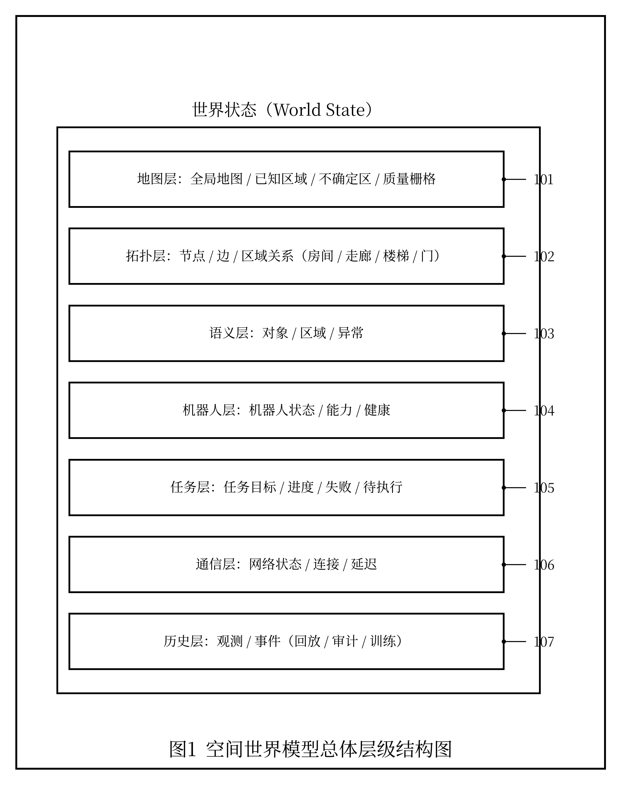
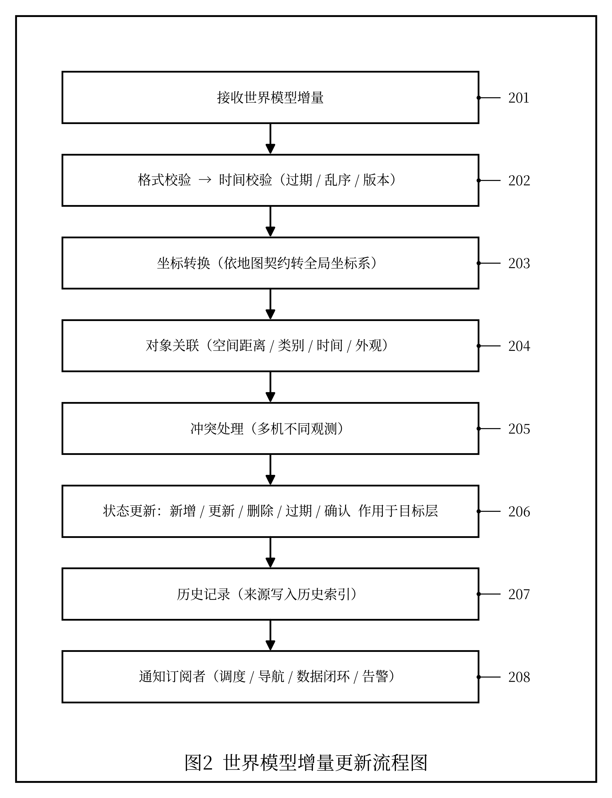
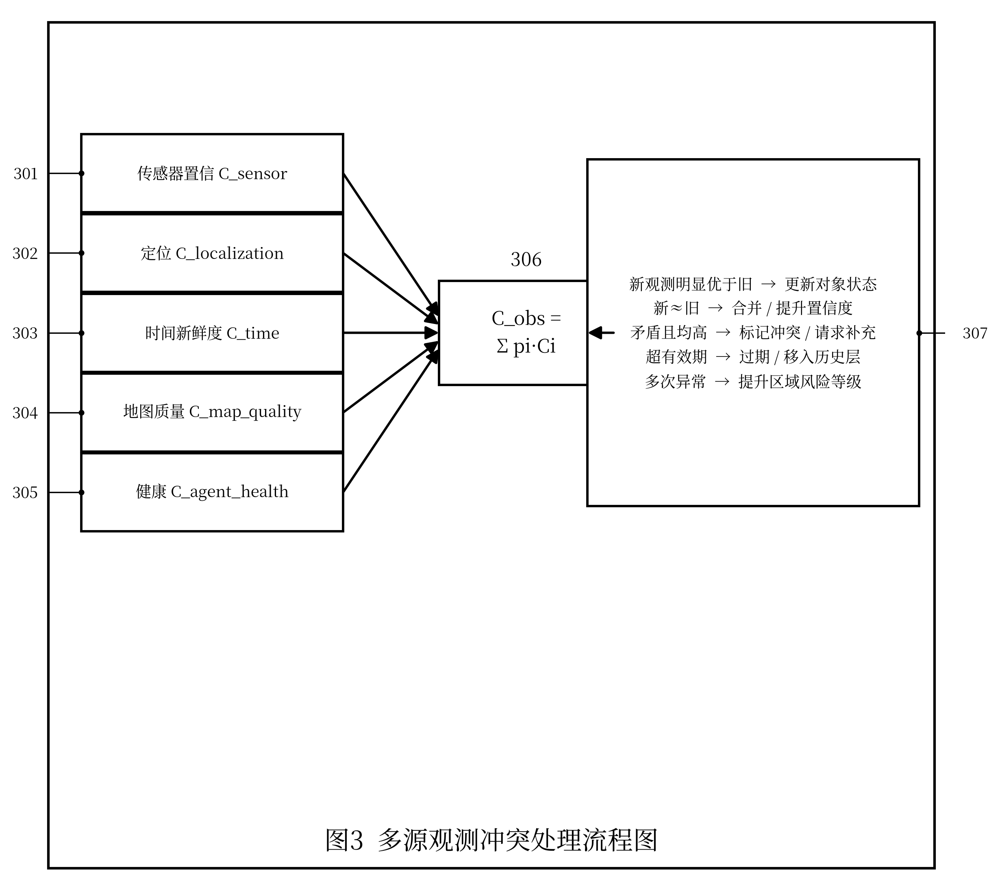
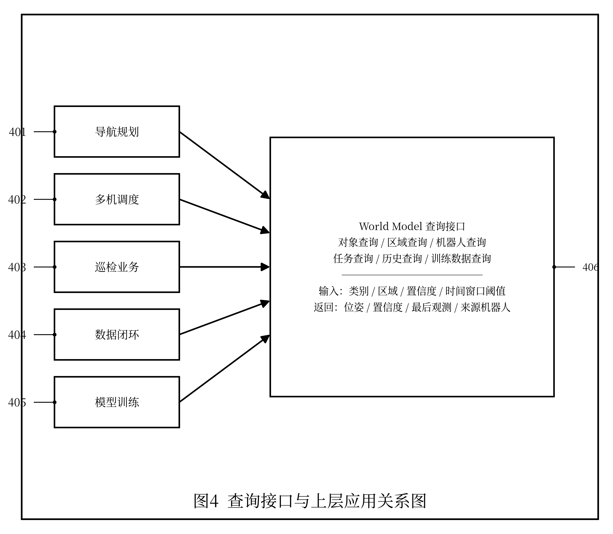
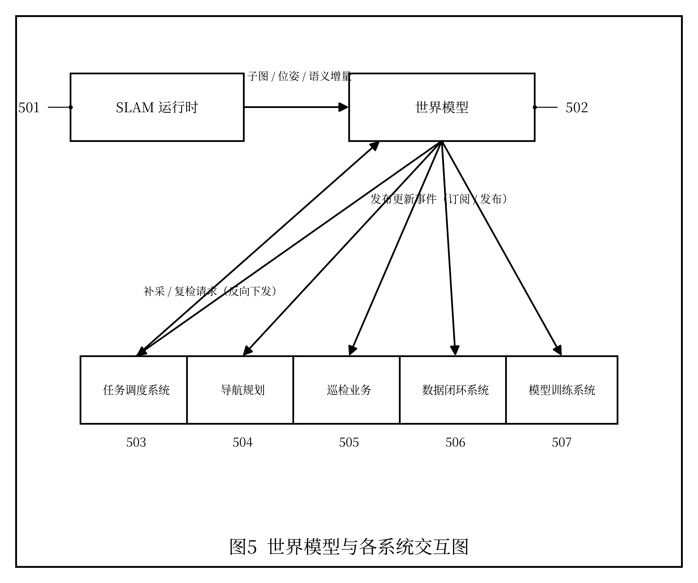

# 发明专利技术交底书

> 以下为专利提交所需信息，请发明人/申请人据实填写（参考品源专利交底书模板）：

| 项目 | 内容 |
|---|---|
| 发明创造名称 | 见下文"一、建议专利名称" |
| 发明人 | 曾欣宇 |
| 申请人 | 上海眸深智能科技有限公司 |
| 统一社会信用代码 | 91310110MAE92P3T6M |
| 联系地址 | 上海眸深智能科技有限公司（详细地址【待补充】） |
| 技术交底书撰写人及技术联系人 | 曾欣宇 |
| 电话 / 传真 | 15700050433 / 【待补充】 |
| E-MAIL | zengxy@moushen.ai |

---

## 一、建议专利名称

一种面向多机具身无人系统的空间世界模型增量更新与查询方法

---

## 二、技术领域

本发明涉及机器人世界模型、空间智能、同步定位与建图、语义地图、多机器人协同、任务状态管理、具身智能数据闭环和云边端系统技术领域，尤其涉及一种面向多机具身无人系统的空间世界模型增量更新与查询方法。

---

## 三、背景技术

机器人在真实环境中运行时，需要维护关于环境、自身、任务和动作后果的内部状态。传统 SLAM 系统主要输出位姿和地图，能够回答“机器人在哪里”和“环境几何结构是什么”。然而，在多机器人巡检、测绘、物流和应急场景中，仅有几何地图并不足以支持复杂任务。

实际应用中，系统还需要回答以下问题：

1. 某个目标对象在哪里，最后一次被哪个机器人看到；
2. 某个区域是否已经探索，地图质量是否可靠；
3. 哪些区域对四足机器人可通行，但对 AGV 不可通行；
4. 当前任务完成到哪一步，哪些区域尚未覆盖；
5. 哪些语义对象发生变化，哪些观测已经过期；
6. 某个机器人当前状态是否适合继续执行任务；
7. 某个区域是否需要重新采集、补图或人工确认。

现有系统通常将 SLAM 地图、语义检测结果、任务状态、机器人状态和通信状态分别存储在不同模块中，缺乏统一的空间世界模型表示。若每次都重建完整世界状态，会造成计算和传输开销较大，也难以支持实时查询和多机器人协同更新。

在已公开的现有技术中，CN111968129A 公开了一种具有语义感知的即时定位与地图构建系统，CN115655262A 公开了一种基于深度学习感知的多层级语义地图构建方法，二者均能构建带语义信息的三维地图，是与本发明较为接近的现有技术。但上述方案主要面向单机或单一地图层的语义建图，未将几何地图、语义对象、动态对象、任务状态、机器人状态与通信状态统一组织为结构化世界状态，也未提供基于增量更新、多源观测冲突处理与多维查询的世界模型维护方法。

因此，需要一种能够接收多机器人增量观测、维护结构化世界状态、处理冲突观测并支持上层查询的空间世界模型增量更新方法。

---

## 四、发明目的

本发明旨在提出一种面向多机具身无人系统的空间世界模型增量更新与查询方法，将多机器人产生的几何地图、语义观测、动态对象、任务状态、机器人状态、通信状态和不确定性统一组织为结构化 World State，并通过 WorldModelDelta 进行增量更新，从而提高世界状态维护效率、查询效率和多机器人协同能力。

---

## 五、技术方案

本技术方案结合附图说明如下。参见图 1，空间世界模型的世界状态包括：地图层（101）、拓扑层（102）、语义层（103）、机器人层（104）、任务层（105）、通信层（106）与历史层（107）。增量更新流程参见图 2（步骤 201～208），多源观测冲突处理参见图 3（各置信分量 301～305、置信融合 306、冲突判定规则 307），查询接口与上层应用的关系参见图 4（应用 401～405、查询接口 406），空间世界模型与 SLAM 运行时、任务系统及数据闭环系统的交互参见图 5（SLAM 运行时 501、空间世界模型 502、订阅系统 503～507）。下文各小节沿用上述附图标记。

### 5.1 总体流程

本方法包括以下步骤：

```text
接收机器人运行时数据
        ↓
解析为标准观测对象
        ↓
生成 WorldModelDelta
        ↓
执行时间、坐标和版本校验
        ↓
执行对象关联与冲突处理
        ↓
更新结构化 World State
        ↓
维护历史索引和置信度
        ↓
向任务、调度、回放和训练系统提供查询接口
```

### 5.2 World State 数据结构

World State 至少包括以下层：

```yaml
world_state:
  map_layer:
    global_frame_id: global_map
    metric_map_version: map_v12
    known_area_ratio: 0.72
    uncertain_regions: [...]
    local_map_quality_grid: [...]

  topology_layer:
    nodes: [...]
    edges: [...]
    region_relations: [...]

  semantic_layer:
    objects: [...]
    regions: [...]
    anomalies: [...]

  agent_layer:
    agents: [...]

  task_layer:
    missions: [...]
    task_progress: [...]

  communication_layer:
    network_states: [...]

  history_layer:
    observations: [...]
    events: [...]
```

其中：

- `map_layer` 用于表示几何地图、已知区域、不确定区域和地图质量；
- `topology_layer` 用于表示房间、走廊、路口、楼梯、门等空间拓扑关系；
- `semantic_layer` 用于表示目标对象、异常区域、禁行区和任务区域；
- `agent_layer` 用于表示机器人当前状态、能力和健康状态；
- `task_layer` 用于表示任务目标、进度、失败原因和待执行区域；
- `communication_layer` 用于表示网络状态、边缘连接状态和数据延迟；
- `history_layer` 用于支持回放、追踪、训练数据构建和状态溯源。

### 5.3 WorldModelDelta 数据结构

机器人端或边缘端不需要每次上传完整世界状态，而是生成增量更新对象 `WorldModelDelta`。

```yaml
world_model_delta:
  delta_id: delta_0001
  source_agent_id: robot_001
  source_type: submap | semantic | task | agent_state | network | anomaly
  timestamp: 1710000000.12
  frame_id: global_map
  operation: add | update | delete | expire | confirm
  target_layer: map | topology | semantic | agent | task | communication
  payload: {...}
  confidence: 0.91
  validity:
    start_time: 1710000000.12
    end_time: 1710000300.12
  provenance:
    sensor_id: camera_front
    submap_id: submap_0001
    algorithm_version: detector_v3
```

### 5.4 增量更新步骤

系统接收 `WorldModelDelta` 后，执行以下步骤：

1. **格式校验**：检查 delta ID、数据类型、目标层、时间戳、坐标系和置信度字段。
2. **时间校验**：判断该增量是否过期、是否乱序、是否与当前世界模型版本兼容。
3. **坐标转换**：根据 Map Contract 将增量中的位姿、区域或对象位置转换至统一全局坐标系。
4. **对象关联**：将新的语义对象或地图区域与已有对象进行空间距离、类别、时间和外观特征匹配。
5. **冲突处理**：若多个机器人对同一区域或对象给出不同观测，根据置信度、时间新鲜度、传感器类型和机器人状态进行融合。
6. **状态更新**：对目标层执行新增、更新、删除、过期或确认操作。
7. **历史记录**：将增量及其来源写入历史索引，用于回放、审计和训练数据构建。
8. **通知订阅者**：向任务调度、导航规划、数据闭环或告警系统发布更新事件。

### 5.5 冲突处理方法

当多个机器人对同一对象或区域产生冲突观测时，系统计算观测可信度 `C_obs`：

```text
C_obs = p1 * C_sensor
      + p2 * C_localization
      + p3 * C_time
      + p4 * C_map_quality
      + p5 * C_agent_health
```

其中：

- `C_sensor` 表示传感器或检测算法置信度；
- `C_localization` 表示观测时机器人定位可信度；
- `C_time` 表示观测新鲜度；
- `C_map_quality` 表示该区域地图质量；
- `C_agent_health` 表示机器人健康状态和运行稳定性。

系统根据 `C_obs` 执行以下策略：

1. 若新观测置信度显著高于旧观测，则更新对象状态；
2. 若新旧观测接近，则合并为多源观测并提高综合置信度；
3. 若观测矛盾且置信度均较高，则标记为冲突状态并请求补充观测；
4. 若观测超过有效期，则执行过期操作，降低置信度或移入历史层；
5. 若同一区域多次出现异常观测，则提升区域风险等级。

### 5.6 查询接口

World Model 提供面向上层系统的查询能力，包括：

1. **对象查询**：查询某类目标对象的位置、置信度、最后观测时间和来源机器人。
2. **区域查询**：查询某区域地图质量、已探索程度、风险等级和可通行性。
3. **机器人查询**：查询机器人状态、任务状态、能力、位置和通信质量。
4. **任务查询**：查询任务进度、已完成区域、失败区域和待补采区域。
5. **历史查询**：按时间窗口、机器人 ID、任务 ID 或区域查询历史观测。
6. **训练数据查询**：查询满足条件的 episode、失败样例、异常片段和高质量样本。

示例查询：

```yaml
query:
  type: object
  object_class: fire_extinguisher
  region: corridor_3F
  min_confidence: 0.7
```

返回：

```yaml
result:
  object_id: fire_extinguisher_01
  pose: [...]
  confidence: 0.91
  last_seen: 1710000000.12
  source_agent_id: robot_002
```

### 5.7 与任务系统和数据闭环的结合

World Model 更新后，可向以下系统提供数据：

- 导航规划系统：获取可通行区域、禁行区和目标位置；
- 多机器人调度系统：获取机器人能力、位置、任务负载和网络状态；
- 巡检业务系统：获取异常对象、设备状态和趋势记录；
- 数据闭环系统：获取 episode metadata、失败原因、地图质量和任务状态；
- 模型训练系统：获取高质量样本、失败样例、长尾场景和状态转移数据。

---

## 六、关键创新点

1. 提出面向多机具身无人系统的结构化 World State，将几何地图、语义对象、任务状态、机器人状态和通信状态统一组织。
2. 提出 WorldModelDelta 增量更新机制，避免频繁传输和重建完整世界状态。
3. 提出基于传感器置信度、定位可信度、时间新鲜度、地图质量和机器人健康状态的多源观测冲突处理方法。
4. 支持按对象、区域、机器人、任务、时间窗口和训练数据条件进行多维查询。
5. 将 World Model 与 SLAM Runtime、任务调度、数据回放和模型训练闭环打通。

---

## 七、有益效果

与现有技术相比，本发明具有以下有益效果：

1. 提高多机器人空间状态维护效率，减少全量地图或全量状态重复传输。
2. 使 SLAM 地图、语义观测和任务状态能够被统一查询和持续更新。
3. 提高多机器人观测冲突处理能力，避免单一机器人误检或定位漂移污染全局状态。
4. 支持任务系统基于最新 World State 进行动态调度和任务调整。
5. 支持机器人运行数据向具身智能训练数据转化，形成可回放、可质检、可训练的数据资产。

---

## 八、可选实施例

### 实施例一：工业巡检目标更新

四足机器人在设备区检测到仪表读数异常，无人机从高处检测到同一设备区域存在热异常。两个观测分别生成 WorldModelDelta。系统根据时间、位置、设备 ID 和置信度将二者关联，提升该设备异常等级，并通知任务系统安排复检。

### 实施例二：未探索区域查询

AGV 仅能覆盖厂区地面主通道，无人机覆盖屋顶和外立面，四足机器人覆盖楼梯和狭窄通道。World Model 根据多个机器人上传的地图质量和探索区域，维护全局 known_area_ratio 和 uncertain_regions。调度系统查询未探索区域后，选择合适机器人补采。

### 实施例三：语义对象冲突处理

无人机识别某区域存在障碍物，但四足机器人近距离观测后发现该目标为可移动临时物料。系统根据近距离观测、定位置信度和时间新鲜度更新语义对象类别，并保留无人机原始观测作为历史记录。

---

## 九、替代方案

本发明多个环节均可采用替代实现，而不脱离本发明的保护范围：

1. World State（世界状态）各层可增减或合并，存储介质可采用关系数据库、时序数据库、图数据库或内存数据结构替代；
2. WorldModelDelta（世界模型增量）的操作类型、目标层与字段结构可扩展或裁剪；
3. 多源观测冲突处理的可信度 `C_obs` 计算可采用加权融合、贝叶斯估计、证据理论（D-S 理论）或基于学习的方法替代；
4. 对象关联可采用空间距离、外观特征、类别、运动轨迹或上述多者结合替代；
5. 查询接口可采用 REST、gRPC、发布订阅或图查询语言替代；
6. 状态过期、置信度衰减与冲突裁决的阈值与策略可依据场景调整；
7. World Model 更新触发可采用事件驱动、周期驱动或两者结合替代。

上述替代方案可单独或组合使用，均能实现本发明目的。

---

## 十、建议权利要求保护方向

后续撰写权利要求时，建议覆盖：

1. 一种面向多机具身无人系统的 World State 数据结构；
2. 一种基于 WorldModelDelta 的空间世界模型增量更新方法；
3. 一种基于多源观测可信度的冲突处理方法；
4. 一种支持对象、区域、机器人、任务和时间窗口的世界状态查询方法；
5. 一种将 World Model 更新结果用于任务调度、数据回放和训练数据构建的方法。

---

## 十一、附图说明

本发明附图均为黑白线条示意图，方框表示功能模块或处理步骤，箭头表示数据流向或调用关系；图中阿拉伯数字为附图标记，与说明书具体实施方式中的部件/步骤编号一一对应。

**图 1 World Model 总体层级结构图**



**图 2 WorldModelDelta 增量更新流程图**



**图 3 多源观测冲突处理流程图**



**图 4 查询接口与上层应用关系图**



**图 5 World Model 与 SLAM Runtime、任务系统、数据闭环系统交互图**



---

## 十二、参考文献

以下文献用于说明本发明所涉及的现有技术背景，供撰写权利要求和说明书时参考：

1. S. Thrun, W. Burgard, and D. Fox, "Probabilistic Robotics," MIT Press, 2005.
2. I. Kostavelis and A. Gasteratos, "Semantic Mapping for Mobile Robotics Tasks: A Survey," Robotics and Autonomous Systems (RAS), vol. 66, pp. 86–103, 2015.
3. A. Rosinol, M. Abate, Y. Chang, and L. Carlone, "Kimera: an Open-Source Library for Real-Time Metric-Semantic Localization and Mapping," in Proc. IEEE Int. Conf. on Robotics and Automation (ICRA), 2020.
4. I. Armeni, Z. He, J. Gwak, A. R. Zamir, M. Fischer, J. Malik, and S. Savarese, "3D Scene Graph: A Structure for Unified Semantics, 3D Space, and Camera," in Proc. IEEE/CVF Int. Conf. on Computer Vision (ICCV), 2019.
5. N. Hughes, Y. Chang, and L. Carlone, "Hydra: A Real-time Spatial Perception System for 3D Scene Graph Construction and Optimization," in Proc. Robotics: Science and Systems (RSS), 2022.
6. A. Hornung, K. M. Wurm, M. Bennewitz, C. Stachniss, and W. Burgard, "OctoMap: An Efficient Probabilistic 3D Mapping Framework Based on Octrees," Autonomous Robots, vol. 34, no. 3, pp. 189–206, 2013.
7. M. Kaess, H. Johannsson, R. Roberts, V. Ila, J. Leonard, and F. Dellaert, "iSAM2: Incremental Smoothing and Mapping Using the Bayes Tree," International Journal of Robotics Research (IJRR), vol. 31, no. 2, pp. 216–235, 2012.
8. 具有语义感知的即时定位与地图构建系统及方法: 中国发明专利申请, 公开号 CN111968129A.
9. 基于深度学习感知的多层级语义地图构建方法和装置: 中国发明专利, 公开号 CN115655262A.
10. 基于深度相机的语义地图构建方法及扫地机器人: 中国发明专利申请, 公开号 CN111679661A.
11. 基于激光雷达的高精度语义导航地图构建方法和装置: 中国发明专利申请, 公开号 CN111912419A.
12. 几何-语义协同融合的移动机器人三维语义地图构建方法: 中国发明专利申请, 公开号 CN120141435A.

---

## 附：术语与缩略语

| 缩略语 | 全称 / 中文含义 |
|---|---|
| SLAM | Simultaneous Localization and Mapping，同步定位与建图 |
| SLAM Runtime | 同步定位与建图运行时 |
| World Model | 空间世界模型 |
| World State | 世界状态 |
| WorldModelDelta | 世界模型增量（增量更新对象） |
| D-S 理论 | Dempster-Shafer Theory，证据理论 |
| REST / gRPC | 两种远程接口/远程过程调用方式 |
| AGV / AMR | 自动导引车 / 自主移动机器人 |

