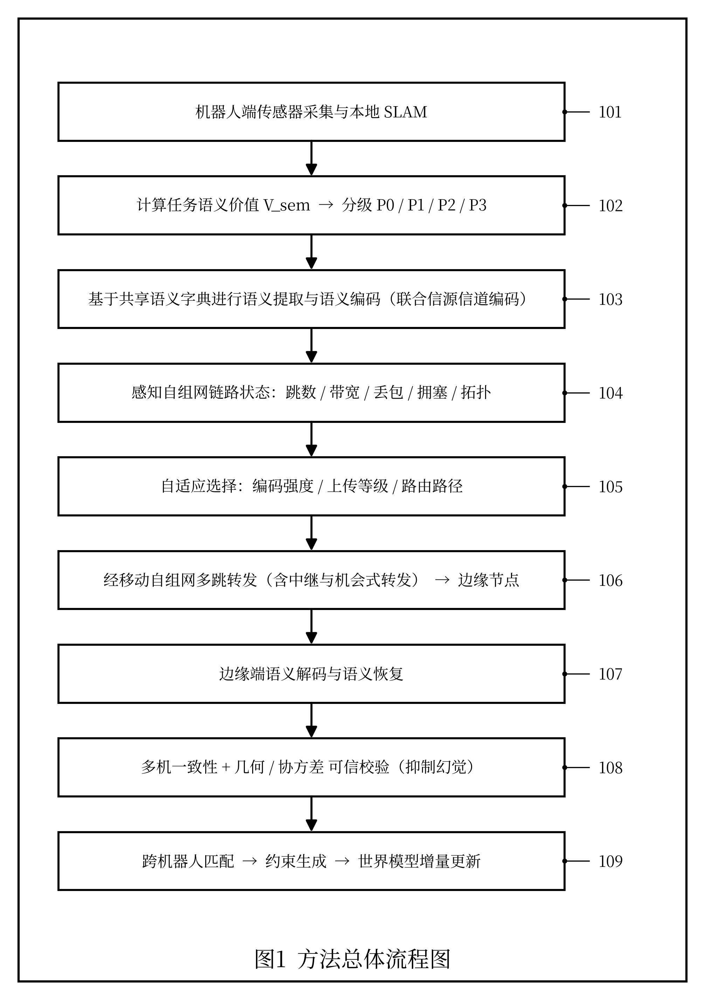
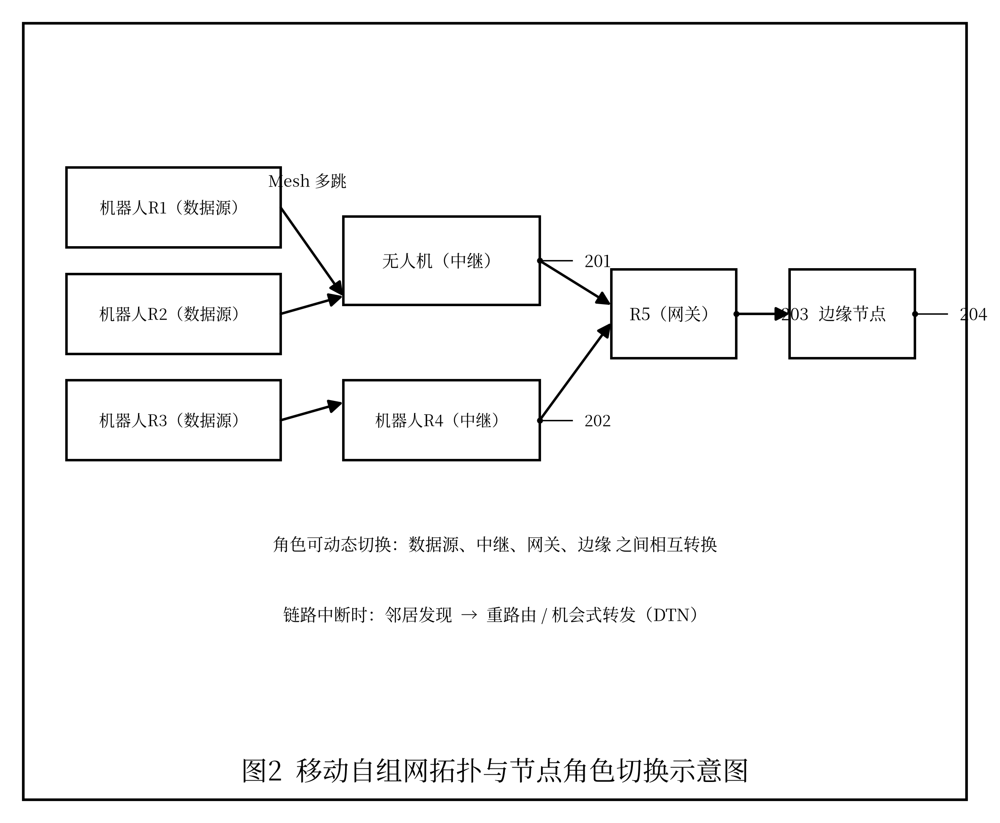
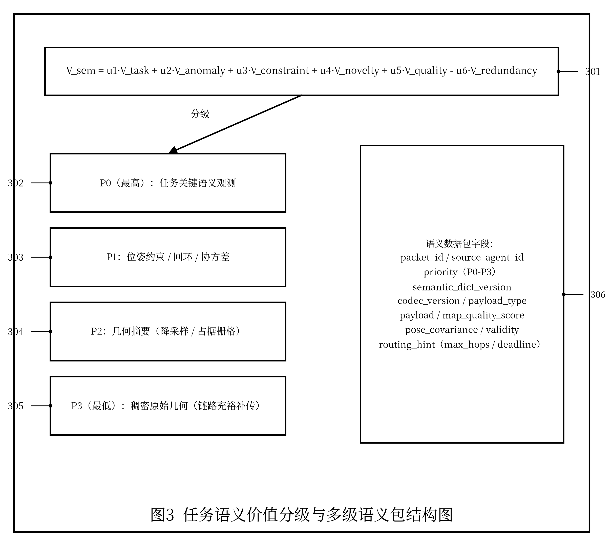
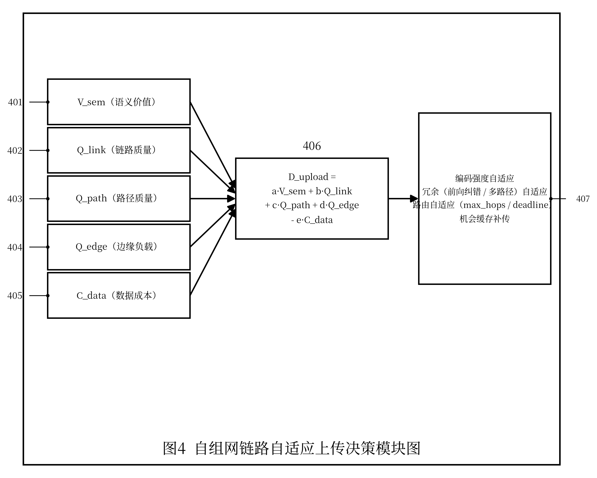
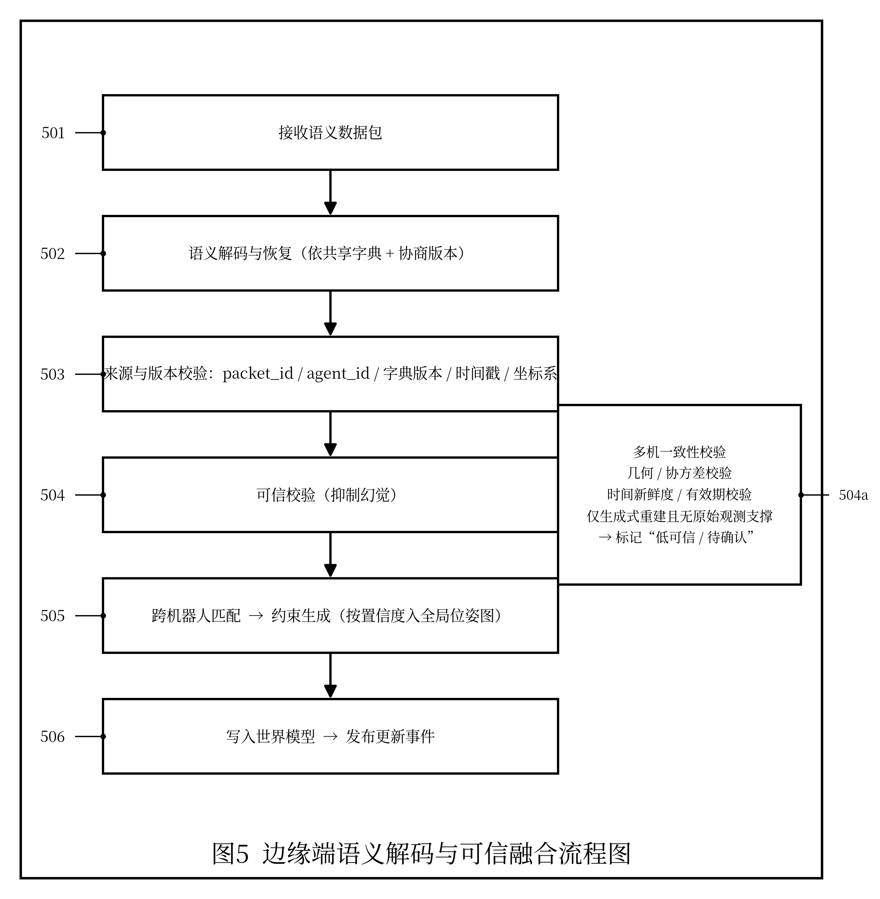
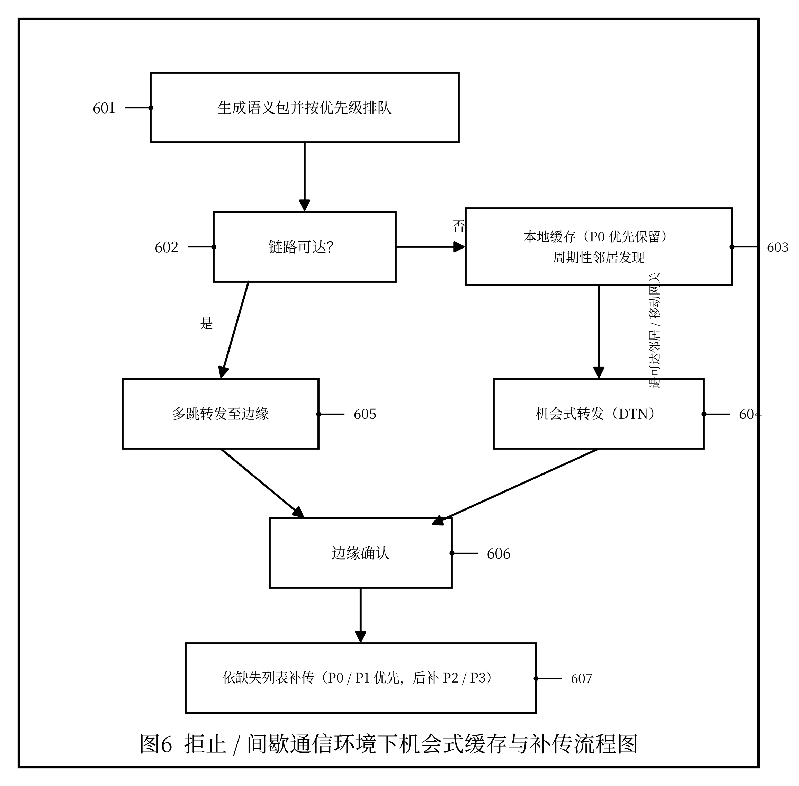
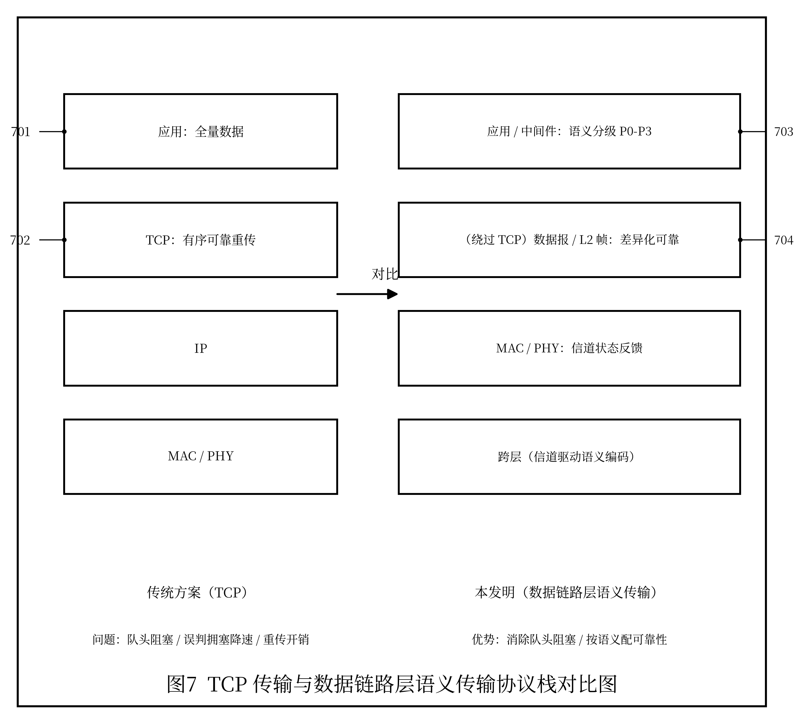
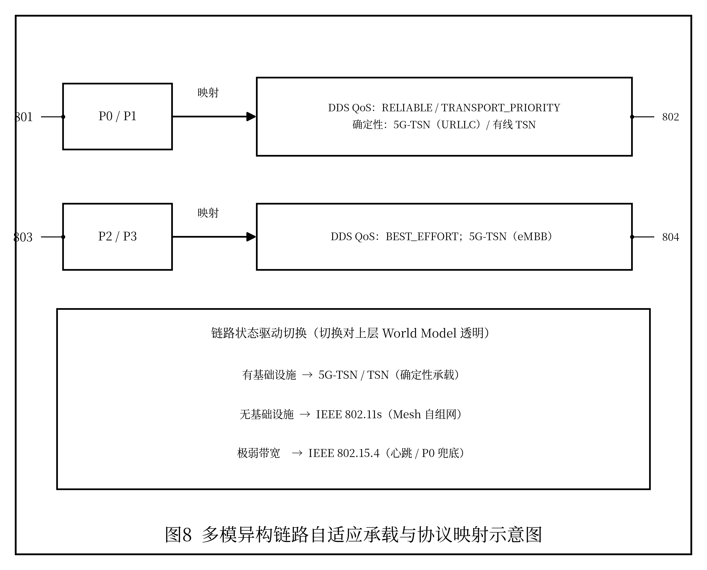

# 发明专利技术交底书

> 以下为专利提交所需信息，请发明人/申请人据实填写（参考品源专利交底书模板）：

| 项目 | 内容 |
|---|---|
| 发明创造名称 | 见下文"一、建议专利名称" |
| 发明人 | 曾欣宇 |
| 申请人 | 上海眸深智能科技有限公司 |
| 统一社会信用代码 | 91310110MAE92P3T6M |
| 联系地址 | 上海眸深智能科技有限公司（详细地址【待补充】） |
| 技术交底书撰写人及技术联系人 | 曾欣宇 |
| 电话 / 传真 | 15700050433 / 【待补充】 |
| E-MAIL | zengxy@moushen.ai |

---

## 一、建议专利名称

一种面向多机异构具身无人系统的基于语义优先与自组网自适应的空间数据语义化上传与融合方法

---

## 二、技术领域

本发明涉及机器人同步定位与建图、多机器人协同建图、语义通信、移动自组织网络（Ad-hoc / MANET）、无线 Mesh 网络、边缘计算、弱网与拒止环境通信、空间世界模型和具身智能数据传输技术领域，尤其涉及一种在多机异构机器人之间以移动自组网方式互联，并按任务语义价值对 SLAM 子图、语义观测和位姿约束进行分级语义化编码、自适应上传与融合的方法。

---

## 三、背景技术

多机异构具身无人系统（四足机器人、无人机、AGV、AMR 等）在巡检、测绘、物流、应急救援等场景中协同运行时，需要将各自产生的关键帧、局部子图、语义观测、位姿约束和系统状态回传到边缘端进行融合并更新空间世界模型。现有方法通常存在以下问题：

1. 采用"原始数据全量回传"的传统通信范式，将传感器产生的稠密点云、图像或视频比特流尽量完整地传输到边缘端。然而对世界模型更新真正有价值的，往往只是少量任务相关的语义特征、关键帧摘要和位姿约束，造成大量带宽、算力和时延浪费。

2. 传统数字通信存在"悬崖效应"：当机器人高速移动、遮挡或多径效应导致信噪比下降到阈值以下时，误码率急剧上升，子图回传出现断崖式失败，进而导致全局优化中断或地图重影。

3. 多数系统依赖固定基础设施网络（如单一 AP、蜂窝基站或固定边缘服务器），在大范围园区、地下、室内复杂结构、灾害现场或通信拒止环境中，机器人一旦脱离覆盖范围即与边缘端失联，无法继续协同建图。

4. 评价传输有效性时仍沿用峰值信噪比（PSNR）、均方误差（MSE）或字节完整率等比特级指标，无法反映"语义是否被正确保留、任务是否可被完成"，导致系统在带宽紧张时难以做出正确的取舍决策。

5. 语义化压缩通常依赖收发双方共享的背景知识库或编解码模型，但不同机器人平台、不同厂商或不同训练数据集会导致语义编解码规则不一致、互不兼容，存在严重的互操作性问题。

6. 接收端若直接使用生成式模型重建语义内容，可能产生"幻觉"，即生成出看似自洽但与真实环境不符的几何或语义结果，污染世界模型并影响下游决策安全。

7. 现有空间数据回传普遍构建在 TCP/IP 协议栈之上。TCP 面向"可靠、有序、逐字节交付"设计，其确认重传（ARQ）、拥塞控制退避、慢启动、队头阻塞（Head-of-Line Blocking）和长连接保活机制，在有线、稳定、点对点链路上表现良好；但在无线多跳自组网、动态拓扑和高丢包环境中存在结构性弊端：其一，TCP 无法区分"无线随机丢包"与"网络拥塞丢包"，会把信道误码误判为拥塞而主动降速，导致弱网下吞吐急剧下降；其二，逐字节有序交付造成队头阻塞——一个低价值数据分段的丢失会阻塞其后所有高价值语义分段的递交；其三，多跳路径上链路频繁变化和重路由会引发 RTT 抖动与频繁超时重传，连接维持和握手开销被进一步放大；其四，TCP 的"全部比特都必须可靠送达"语义与机器人协同建图"只需保住任务关键语义"的真实需求不匹配，在带宽紧张时仍把资源浪费在低价值数据的可靠重传上。

在已公开的现有技术中，CN113839750B 公开了一种语义通信系统中的信息传输方法（基于信道与语义译码反馈进行重传），CN113727415A 公开了一种动态感知的无人机自组网改进 AODV 路由协议方法，二者分别从语义重传与自组网路由角度改进通信，是与本发明较为接近的现有技术。但上述方案未将机器人任务语义价值分级与自组网链路状态联合用于上传与路由决策，未针对 SLAM 子图与位姿约束进行差异化可靠的语义化回传，也未在边缘端通过多机一致性与几何/协方差校验抑制语义重建幻觉。

因此，需要一种既能以移动自组网方式保证多机互联鲁棒性、又能按任务语义价值对空间数据进行分级语义化编码、自适应上传与可信融合的方法，使多机异构系统在弱网、动态拓扑和通信拒止环境下仍能维持高效、可靠的协同建图与世界模型更新。

---

## 四、发明目的

本发明旨在提出一种基于语义优先与自组网自适应的空间数据语义化上传与融合方法，解决多机异构具身无人系统在弱网、动态网络拓扑和无固定基础设施环境下，空间数据回传带宽消耗大、抗噪能力弱、互操作性差和融合结果不可信的问题。

本发明的目标包括：

1. 在多机器人之间构建移动自组织网络，使机器人、中继节点和边缘节点能够在无固定基础设施条件下自动组网、自动路由和动态重连。
2. 将待回传的空间数据按任务语义价值分级，优先传输语义观测、关键帧摘要、位姿约束和地图质量评分，再按链路状态决定是否补传稠密几何数据。
3. 基于共享语义字典与版本协商，实现跨机器人、跨平台的语义编解码一致性与互操作性。
4. 根据自组网链路状态、跳数、拥塞和算力，自适应切换语义编码强度、压缩比和路由策略。
5. 在边缘端对语义化数据进行可信融合，通过多机一致性、几何与协方差校验抑制语义重建幻觉，保证写入世界模型的状态可靠。

---

## 五、技术方案

本技术方案结合附图说明如下。参见图 1，本方法总体流程包括：机器人端传感器采集与本地 SLAM（101）、任务语义价值计算与分级（102）、语义提取与语义编码（103）、自组网链路状态感知（104）、自适应选择（105）、多跳转发至边缘节点（106）、边缘端语义解码与恢复（107）、可信校验（108）以及跨机器人匹配与世界模型增量更新（109）。移动自组网拓扑与角色切换参见图 2（无人机中继 201、机器人中继 202、网关 203、边缘节点 204），任务语义价值分级与语义包结构参见图 3（价值函数 301、分级 P0～P3 对应 302～305、语义包字段 306），链路自适应上传决策参见图 4（输入分量 401～405、决策函数 406、自适应执行 407），边缘端语义解码与可信融合参见图 5（步骤 501～506 及可信校验子项 504a），机会式缓存与补传参见图 6（步骤 601～607），TCP 与数据链路层语义传输协议栈对比参见图 7（传统协议栈 701/702、本发明协议栈 703/704），多模异构链路承载与协议映射参见图 8（语义优先级 801/803、承载映射 802/804）。下文各小节沿用上述附图标记。

### 5.1 方法总体流程

本方法包括以下步骤：

```text
机器人端传感器采集与本地 SLAM
        ↓
计算任务语义价值并分级（语义观测/关键帧/位姿约束/稠密几何）
        ↓
基于共享语义字典进行语义提取与语义编码
        ↓
感知自组网链路状态（跳数/带宽/丢包/拥塞/拓扑）
        ↓
自适应选择语义编码强度、上传等级与路由路径
        ↓
经移动自组网多跳转发至边缘节点（含中继与机会转发）
        ↓
边缘端语义解码与语义恢复
        ↓
多机一致性、几何与协方差可信校验（抑制幻觉）
        ↓
跨机器人匹配、约束生成与世界模型增量更新
```

### 5.2 移动自组网构建与维护

多机异构系统不依赖固定基础设施，而是由机器人节点、可移动中继节点和边缘节点共同构成移动自组织网络（MANET / 无线 Mesh）。其特征包括：

1. **自动组网**：节点上线后通过邻居发现协议广播自身 `Agent Contract` 摘要、位置、剩余电量和可用算力，自动加入网络。
2. **动态路由**：采用面向移动场景的路由机制（如 OLSR、AODV、BATMAN 或其改进算法），在拓扑变化时动态更新多跳路径。
3. **角色自适应**：节点可在"数据源、中继、网关、边缘"角色之间动态切换。例如无人机可在四足机器人与边缘节点失联时临时充当空中中继。
4. **机会式转发**：在链路间歇连通（DTN 特性）场景下，节点缓存语义数据包，待遇到可达邻居时再转发，保证拒止或间歇通信环境下的数据最终送达。
5. **拓扑感知**：网络维护每条链路的跳数、带宽、时延、丢包率、抖动和稳定性，供上传决策与路由选择使用。

### 5.3 任务语义价值分级

机器人端对待回传内容计算任务语义价值 `V_sem`，按价值由高到低划分为若干数据类别：

```text
V_sem = u1 * V_task        # 与当前任务/目标的相关性
      + u2 * V_anomaly     # 异常/风险事件价值
      + u3 * V_constraint  # 对全局位姿图优化的约束贡献
      + u4 * V_novelty     # 区域新颖度/未探索程度
      + u5 * V_quality      # 局部地图质量与可信度
      - u6 * V_redundancy  # 与已有世界模型的冗余度
```

据此将数据划分为以下语义优先级：

| 优先级 | 数据类别 | 典型内容 |
|---|---|---|
| P0 最高 | 任务关键语义观测 | 异常对象、目标检测、风险区域、任务事件 |
| P1 | 位姿约束与回环 | 关键帧位姿、回环描述子、协方差、子图间约束 |
| P2 | 几何摘要 | 降采样点云、平面/边缘/语义占据栅格摘要 |
| P3 最低 | 稠密原始几何 | 完整点云、原始图像/视频，仅在链路充裕时补传 |

本方法的核心思想是"传意义优先于传比特"：在带宽受限时优先保证 P0、P1 等任务相关语义送达，而非追求原始数据的逐比特完整恢复。

### 5.4 共享语义字典与语义编码

为解决跨平台互操作性问题，系统维护**共享语义字典**与编解码版本协商机制：

1. **语义字典**：定义对象类别、区域类型、事件类型、约束类型及其编码格式，所有节点引用统一字典版本。
2. **版本协商**：节点入网时在 `Agent Contract` 中声明所支持的语义字典版本与编解码模型版本，边缘端据此选择兼容编码；版本不一致时回退到双方都支持的最低兼容等级或退化为结构化数值传输。
3. **语义提取**：利用本地感知与 SLAM 结果，将稠密观测抽象为语义观测对象、关键帧摘要、位姿约束等结构化语义单元。
4. **语义编码**：对语义单元进行量化与紧凑编码，可结合联合信源信道编码思想，使编码结果对信道噪声更鲁棒，在部分比特受损时仍能恢复主要语义。

语义数据包结构示例：

```yaml
semantic_packet:
  packet_id: pkt_0001
  source_agent_id: robot_001
  priority: P0 | P1 | P2 | P3
  semantic_dict_version: dict_v3
  codec_version: jscc_v2
  payload_type: semantic_obs | keyframe_digest | pose_constraint | geometry_summary | dense_geometry
  payload: {...}
  map_quality_score: 0.82
  pose_covariance: [...]
  validity:
    start_time: 1710000000.12
    end_time: 1710000300.12
  routing_hint:
    max_hops: 4
    deadline_ms: 500
```

### 5.5 自组网链路自适应上传决策

机器人端综合任务语义价值与自组网链路状态，计算上传与编码决策 `D_upload`：

```text
D_upload = a * V_sem
         + b * Q_link       # 链路质量（带宽/丢包/抖动）
         + c * Q_path       # 路径质量（跳数/稳定性/拥塞）
         + d * Q_edge       # 边缘负载与处理能力
         - e * C_data        # 数据量与传输成本
```

根据 `D_upload` 与各优先级阈值，自适应选择：

1. **编码强度自适应**：链路差时提高语义抽象层级、降低分辨率与压缩比，仅保留 P0/P1；链路好时逐步补传 P2/P3。
2. **冗余编码自适应**：在丢包率高的多跳路径上对 P0/P1 增加前向纠错或多路径冗余传输，缓解悬崖效应。
3. **路由自适应**：根据 `routing_hint` 中的 `max_hops` 与 `deadline_ms`，在多条可用路径中选择满足时延约束、跳数最少或最稳定的路径。
4. **机会缓存与补传**：链路中断时本地缓存按优先级排序，恢复连通后优先补传高优先级数据并响应边缘缺失列表。

### 5.6 边缘端语义解码与可信融合

边缘节点（或被选举为网关的机器人节点）接收语义数据包后执行：

1. **语义解码与恢复**：基于共享语义字典与协商的编解码版本，将语义包恢复为语义观测、关键帧、位姿约束或几何摘要。
2. **来源与版本校验**：检查 packet ID、源机器人 ID、字典/编解码版本、时间戳、坐标系与完整性。
3. **可信校验（抑制幻觉）**：对恢复结果进行多重校验后再写入世界模型：
   - 多机一致性校验：是否有其他机器人对同一区域/对象给出一致观测；
   - 几何/协方差校验：恢复的位姿约束是否与局部几何、协方差范围一致；
   - 时间新鲜度与有效期校验；
   - 对仅由生成式重建得到、缺乏原始观测支撑的内容标记为"低可信/待确认"，不直接用于安全相关决策。
4. **跨机器人匹配与约束生成**：使用 ICP、GICP、NDT、Scan Context、语义匹配等方法生成子图间约束，按约束置信度加入全局位姿图。
5. **世界模型增量更新**：将通过校验的语义增量写入空间世界模型，并向任务调度、导航、数据闭环等订阅者发布更新事件。

### 5.7 任务有效性评价指标

本方法引入区别于传统比特级指标的语义化评价体系，用于驱动上传决策与系统自评估：

- **语义保真度**：恢复后的语义观测与原始语义的一致程度；
- **任务完成准确率**：基于回传数据能否支持下游任务（如目标定位、可通行判断、异常确认）；
- **约束有效率**：被融合采纳并提升全局优化质量的位姿约束占比；
- **单位带宽语义价值**：每单位带宽承载的任务语义价值，用于评估语义化上传相对全量回传的增益。

### 5.8 面向信道的数据链路层语义传输

本方法主张：在无线多跳自组网与弱网环境下，应跳出"TCP 之上做应用层压缩"的传统思路，将语义通信下沉到更贴近信道的数据链路层进行处理。其设计要点如下：

1. **绕过 TCP 的可靠语义传输**：不再依赖 TCP 的逐字节有序可靠交付，而是采用面向数据报的传输（如 UDP / 自定义 L2 帧）承载语义数据包，按语义优先级（P0–P3）独立交付，避免低价值分段丢失阻塞高价值语义（消除队头阻塞）。

2. **语义感知的差异化可靠性**：传统 TCP 对所有比特施加相同的可靠性，本方法将"可靠性"作为可按语义价值配置的属性——对 P0/P1（任务关键语义、位姿约束）施加前向纠错（FEC）与多路径冗余，对 P2/P3（几何摘要、稠密几何）允许有损或尽力而为传输，从而把有限的信道资源集中投向真正影响任务完成的语义。

3. **信道状态直接驱动语义编码**：在数据链路层直接获取物理层与 MAC 层反馈（信噪比、误码率、退避次数、链路占用率），将其反馈给语义编码器，实现联合信源信道编码（JSCC）意义上的"信道—语义"闭环：信道差时加深语义抽象、增大码率裕量；信道好时降低抽象层级、补传细节几何。这避免了 TCP 因无法区分无线随机丢包与拥塞而误降速的问题。

4. **跨层（Cross-Layer）协同**：将 SLAM/任务层的语义优先级、自组网路由层的链路与跳数信息、MAC/物理层的信道状态进行跨层共享，使路由选择、调度和语义编码协同优化，而非各层独立决策。

5. **未来方向论证**：随着通信容量逼近香农极限，单纯在物理层提升频谱效率的空间已非常有限；而机器人、车联网等任务驱动场景中真正有价值的信息仅占原始数据的很小一部分。因此，"在数据链路层贴近信道做语义化、差异化可靠传输"相比"在 TCP 之上做全量可靠传输再压缩"，在弱网、动态拓扑和拒止环境下具有更高的单位带宽语义价值与更平滑的性能退化曲线，是多机异构具身系统空间数据传输的演进方向。需要说明的是，本方向是针对任务明确的闭环场景的补充与优化，而非否定传统可靠传输在通用场景中的价值。

6. **多模链路承载与协议映射（实施例层面，开放可替换）**：上述语义优先、差异化可靠与信道驱动机制不绑定任一具体通信标准，可映射到现有标准化承载，包括但不限于：

   - **中间件层**：以 DDS/RTPS 的 QoS 策略表达语义优先级差异化可靠性与时延约束，例如 `RELIABILITY`（RELIABLE 对应 P0/P1、BEST_EFFORT 对应 P2/P3）、`TRANSPORT_PRIORITY`（语义优先级排序）、`DEADLINE`/`LATENCY_BUDGET`（对应 `deadline_ms`）、`LIFESPAN`（对应语义包 `validity`）；DDS 默认运行于 UDP 之上，天然不依赖 TCP；
   - **确定性承载（有基础设施时）**：由 5G-TSN（以 URLLC 承载 P0/P1 关键语义与位姿约束、以 eMBB 承载 P2/P3 几何）或有线 IEEE 802.1 TSN 提供确定性低时延与时间同步；
   - **自组网承载（无固定基础设施时）**：由 IEEE 802.11s 无线 Mesh 承载移动自组网多跳传输，并以 IEEE 802.15.4 等低速率链路作为心跳与 P0 语义的兜底信道；面向移动场景亦可采用 IEEE 802.11p 等车联网链路。

   系统根据实时链路状态在"确定性承载"与"语义优先尽力传输"之间自适应切换：基础设施覆盖区优先使用 5G-TSN/TSN 获得确定性 QoS，盲区或拒止区平滑退化为 802.11s/自组网的语义优先传输，而上述切换对上层世界模型透明。

---

## 六、关键创新点

1. 提出"语义优先 + 自组网自适应"的空间数据回传范式，将移动自组网链路状态与任务语义价值联合纳入上传与路由决策，区别于固定网络下的全量子图回传。
2. 提出面向 SLAM 数据的任务语义价值分级（P0–P3），在弱网下优先保证任务关键语义与位姿约束送达，缓解传统通信的悬崖效应。
3. 提出共享语义字典与编解码版本协商机制，解决跨机器人、跨平台语义编解码不一致导致的互操作性问题，并以 `Agent Contract` 承载语义能力声明。
4. 提出基于自组网的编码强度自适应、冗余编码自适应、路由自适应与机会缓存补传策略，提高动态拓扑与通信拒止环境下的鲁棒性。
5. 提出面向语义重建幻觉的边缘端可信融合机制，通过多机一致性、几何与协方差校验抑制生成式重建带来的虚假状态，保证世界模型可信。
6. 提出以语义保真度、任务完成准确率、约束有效率和单位带宽语义价值为核心的任务级评价体系，替代单纯的比特级评价指标。
7. 提出绕过 TCP、在数据链路层进行语义感知差异化可靠传输的方法，将可靠性按语义优先级配置，并由物理层/MAC 层信道状态直接驱动语义编码，通过跨层协同消除队头阻塞、避免无线丢包被误判为拥塞，提升弱网与多跳自组网下的传输有效性。
8. 提出多模异构链路自适应承载机制，将语义优先级差异化可靠性映射到 DDS QoS、5G-TSN/TSN 确定性承载与 IEEE 802.11s/802.15.4 自组网链路，并根据链路状态在"确定性承载"与"语义优先尽力传输"之间自适应切换，且不绑定任一具体通信标准。

---

## 七、有益效果

与现有技术相比，本发明具有以下有益效果：

1. 大幅降低多机异构系统协同建图的回传带宽占用，在带宽受限时仍能保证任务关键语义与位姿约束送达。
2. 通过语义化编码与冗余/多路径策略缓解悬崖效应，使弱网下系统性能平滑退化而非断崖式失效。
3. 借助移动自组网实现无固定基础设施环境下的多机互联、自动路由与动态重连，适用于地下、室内、园区和灾害拒止场景。
4. 通过共享语义字典与版本协商提升跨平台互操作性，使不同形态、不同厂商机器人能够语义互通。
5. 通过边缘端可信校验抑制语义重建幻觉，提高写入世界模型状态的可靠性与下游决策安全性。
6. 以任务级评价指标驱动上传决策，使有限带宽与算力优先服务于真正影响任务完成的语义信息。
7. 通过数据链路层语义传输与跨层协同，避免 TCP 在无线多跳场景下的队头阻塞、误判拥塞降速和重传开销，提高弱网下的吞吐稳定性与高价值语义的及时送达率。
8. 通过多模链路自适应承载与协议映射，兼容 5G-TSN、TSN、IEEE 802.11s、IEEE 802.15.4 与 DDS 等现有标准，在基础设施覆盖区获得确定性低时延、在盲区或拒止区平滑切换到自组网语义优先传输，提升系统在真实复杂环境中的连续可用性与可落地性。

---

## 八、可选实施例

### 实施例一：地下管廊无基础设施巡检

四足机器人与可飞行中继无人机进入无蜂窝、无 WiFi 覆盖的地下管廊。各节点通过移动自组网自动组网，无人机在分支路口悬停充当空中中继。四足机器人将设备异常、关键帧位姿和回环约束作为 P0/P1 语义包优先回传，稠密点云作为 P3 缓存，待返回信号较好区域再补传。边缘节点对异常观测做多机一致性校验后更新世界模型。

### 实施例二：灾害救援间歇通信

应急场景中链路频繁中断，呈现 DTN 特性。机器人对受灾区域生成语义观测（被困点、坍塌区域、可通行路线）并按优先级缓存，遇到可达邻居或移动网关时进行机会式转发。即使部分语义包在多跳中丢失，凭借冗余编码与共享字典，边缘端仍能恢复主要语义并构建未探索区域与危险区域地图。

### 实施例三：大型园区多机协同测绘

无人机、四足机器人与 AGV 在大型园区分区协同测绘。系统根据自组网跳数与拥塞动态选择回传路径与编码强度：靠近网关的机器人补传 P2/P3 几何摘要，远端多跳机器人仅回传 P0/P1 语义与约束。边缘端按单位带宽语义价值评估各节点贡献，并据此调整任务与上传策略。

### 实施例四：跨厂商异构机器人语义互通

不同厂商的四足机器人与无人机使用不同感知模型，但入网时通过 `Agent Contract` 协商共享语义字典版本 `dict_v3`。当某机器人仅支持较低字典版本时，系统回退到双方兼容的语义等级或退化为结构化数值传输，保证异构平台间语义观测仍可被边缘端正确解码与融合。

### 实施例五：园区 5G 专网与自组网混合承载

园区部署 5G 专网。机器人在专网覆盖区通过 5G-TSN 以 URLLC 承载 P0/P1 关键语义与位姿约束、以 eMBB 回传 P2/P3 几何，DDS 以 RELIABLE/BEST_EFFORT 与 TRANSPORT_PRIORITY 等 QoS 进行分流。当机器人进入专网盲区（地下、屏蔽机房）时，自动切换到 IEEE 802.11s 无线 Mesh 自组网多跳，并对 P0 语义启用前向纠错与多路径冗余，必要时以 IEEE 802.15.4 低速链路维持心跳与关键告警。整个承载切换对上层世界模型透明，仅传输有效性指标（如单位带宽语义价值、关键语义送达时延）随链路状态变化。

---

## 九、替代方案

本发明多个环节均可采用替代实现，而不脱离本发明的保护范围：

1. 任务语义价值分级的级数（如 P0 至 P3）、各项价值指标与权重可调整，价值函数可采用规则型或基于学习的模型替代；
2. 语义提取与语义编码可采用 Transformer、卷积神经网络（CNN）、传统特征量化或联合信源信道编码（JSCC）等替代；
3. 自组网路由可采用 AODV、OLSR、BATMAN、DSR 或其改进算法替代；网络可为移动自组网（MANET）、飞行自组网（FANET）或无线 Mesh；
4. 承载链路可采用 5G-TSN、有线 TSN（时间敏感网络）、IEEE 802.11s、IEEE 802.15.4、IEEE 802.11p 等替代；差异化可靠性可由 DDS QoS（数据分发服务的服务质量策略）、前向纠错（FEC）、自动重传请求（ARQ）或多路径冗余实现；
5. 差异化可靠传输的实现层次可位于数据链路层、传输层或中间件层；
6. 抑制语义重建幻觉的校验可采用多机一致性校验、几何/协方差校验、时间新鲜度校验或人工确认替代；
7. 中继节点可由无人机、地面机器人或预先部署的中继设备充当。

上述替代方案可单独或组合使用，均能实现本发明目的。

---

## 十、建议权利要求保护方向

后续撰写权利要求时，建议覆盖：

1. 一种基于移动自组网的多机异构机器人空间数据语义化上传方法；
2. 一种基于任务语义价值分级（P0–P3）的空间数据优先级编码与上传方法；
3. 一种基于共享语义字典与编解码版本协商的跨平台语义互操作方法；
4. 一种结合自组网链路状态的编码强度自适应、冗余编码自适应与路由自适应方法；
5. 一种基于多机一致性、几何与协方差校验抑制语义重建幻觉的边缘端可信融合方法；
6. 一种以语义保真度、任务完成准确率和单位带宽语义价值为核心的传输有效性评价与决策方法；
7. 一种绕过 TCP、在数据链路层按语义优先级进行差异化可靠传输并由信道状态驱动语义编码的跨层语义传输方法；
8. 一种将语义优先级差异化可靠性映射到 DDS QoS 与 TSN/5G-TSN 等承载，并根据链路状态在确定性承载与语义优先尽力传输之间自适应切换的多模链路传输方法。

---

## 十一、附图说明

本发明附图均为黑白线条示意图，方框表示功能模块或处理步骤，箭头表示数据流向或调用关系；图中阿拉伯数字为附图标记，与说明书具体实施方式中的部件/步骤编号一一对应。

**图 1 方法总体流程图**



**图 2 移动自组网拓扑与节点角色切换示意图**



**图 3 任务语义价值分级与多级语义包结构图**



**图 4 自组网链路自适应上传决策模块图**



**图 5 边缘端语义解码与可信融合流程图**



**图 6 拒止/间歇通信环境下机会式缓存与补传流程图**



**图 7 TCP 传输与数据链路层语义传输协议栈对比及跨层信息流图**



**图 8 多模异构链路自适应承载与协议映射示意图**



---

## 十二、参考文献

以下文献用于说明本发明所涉及的现有技术背景，供撰写权利要求和说明书时参考：

1. C. E. Shannon, "A Mathematical Theory of Communication," The Bell System Technical Journal, vol. 27, pp. 379–423, 1948.
2. E. Bourtsoulatze, D. B. Kurka, and D. Gündüz, "Deep Joint Source-Channel Coding for Wireless Image Transmission," IEEE Transactions on Cognitive Communications and Networking (TCCN), vol. 5, no. 3, pp. 567–579, 2019.
3. H. Xie, Z. Qin, G. Y. Li, and B.-H. Juang, "Deep Learning Enabled Semantic Communication Systems," IEEE Transactions on Signal Processing (TSP), vol. 69, pp. 2663–2675, 2021.
4. D. Gündüz, Z. Qin, I. E. Aguerri, et al., "Beyond Transmitting Bits: Context, Semantics, and Task-Oriented Communications," IEEE Journal on Selected Areas in Communications (JSAC), vol. 41, no. 1, pp. 5–41, 2023.
5. Wenyin Liang, Nan Ma, Linzi Shen, Mengshu Song, Xiaoxuan Qi and Yiming Liu, An Image Semantic Communication System Based on Swin Transformer and Generative Adversarial Networks[C]//Global Communications Conference (Workshops), 2024.
6. Xiaoxuan Qi, Nan Ma, Zhicheng Bao, Yiming Liu, Chen Dong, Xiaodong Xu, WAFI-VSC: Wireless Adaptive Frame Interpolation Video Semantic Communication[C]//Wireless Communications and Signal Processing (WCSP), 2024.
7. J. Choi, J. Park, E. Grassucci, and D. Comminiello, "Semantic communication challenges: Understanding dos and avoiding don'ts," arXiv preprint, Mar. 2024, arXiv:2403.15649.
8. C. Perkins, E. Belding-Royer, and S. Das, "Ad hoc On-Demand Distance Vector (AODV) Routing," IETF RFC 3561, 2003.
9. T. Clausen and P. Jacquet, "Optimized Link State Routing Protocol (OLSR)," IETF RFC 3626, 2003.
10. IEEE Std 802.11s, "IEEE Standard for Information Technology—Mesh Networking," 2011.
11. Object Management Group (OMG), "Data Distribution Service (DDS), Version 1.4," 2015.
12. 3GPP TS 23.501, "System Architecture for the 5G System (5GS)" (含 5G 与 TSN 集成, Rel-16/17), 3rd Generation Partnership Project.
13. 一种语义通信系统中的信息传输方法: 中国发明专利, 公开号 CN113839750B.
14. 语义通信方法、装置和系统: 中国发明专利申请, 公开号 CN121175673A.
15. 动态感知的无人机自组网改进AODV路由协议的方法: 中国发明专利申请, 公开号 CN113727415A.

---

## 附：术语与缩略语

| 缩略语 | 全称 / 中文含义 |
|---|---|
| TCP / UDP | Transmission Control Protocol / User Datagram Protocol，传输控制协议 / 用户数据报协议 |
| JSCC | Joint Source-Channel Coding，联合信源信道编码 |
| FEC | Forward Error Correction，前向纠错 |
| ARQ | Automatic Repeat reQuest，自动重传请求 |
| QoS | Quality of Service，服务质量 |
| DDS | Data Distribution Service，数据分发服务 |
| TSN | Time-Sensitive Networking，时间敏感网络 |
| 5G-TSN | 5G 与时间敏感网络融合的确定性承载 |
| URLLC | Ultra-Reliable Low-Latency Communication，超可靠低时延通信 |
| eMBB | enhanced Mobile Broadband，增强移动宽带 |
| MANET / FANET | 移动自组织网络 / 飞行自组织网络 |
| AODV / OLSR / BATMAN / DSR | 四种移动自组网路由协议 |
| DTN | Delay-Tolerant Networking，时延容忍网络 |
| MAC | Medium Access Control，介质访问控制（层） |
| SLAM | Simultaneous Localization and Mapping，同步定位与建图 |
| PSNR / MSE | 峰值信噪比 / 均方误差 |
| RTT | Round-Trip Time，往返时延 |
