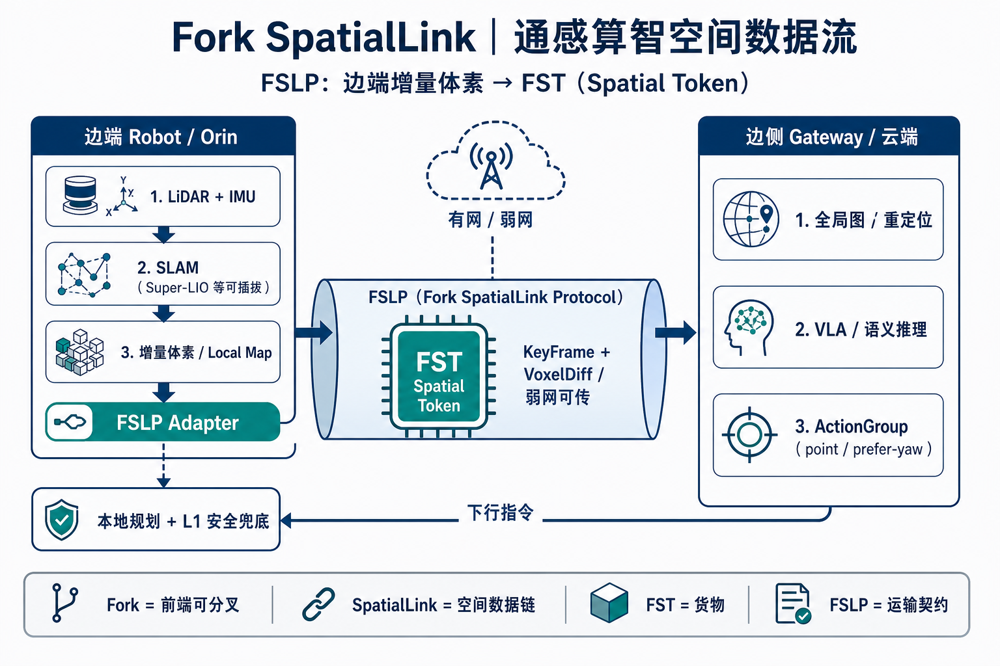
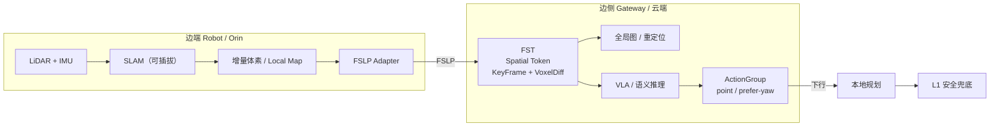

# Fork SpatialLink：FSLP → FST 概念图（报告用）

## 图件

路径：`06-产出/影响力/figures/ForkSpatialLink-FSLP-FST-概念图.png`（16:9，适合 PPT / 一页纸）

---

## 汇报口述（约 20 秒）

经 **FSLP（Fork SpatialLink Protocol）**，边端把 SLAM 产出的**增量体素**适配为可在有/弱网传输的 **FST（Spatial Token）**；边侧用 FST 做全局协同与 VLA 推理，再以 ActionGroup 下发，端侧本地规划 + L1 兜底执行。

| 缩写 | 全称 | 一句话 |
|------|------|--------|
| FSLP | Fork SpatialLink Protocol | 运输契约（怎么传） |
| FST | Fork Spatial Token / Spatial Token | 货物（传什么） |
| Fork | — | 前端可分叉 / Token 派生 / 生态 |
| SpatialLink | 佛科空间链 | 本地空间世界 ↔ 远程智能体的数据链 |

仓内技术材料亦可称 **SLAM-Token**（与 FST 同层契约，申请前对外优先用品牌名）。

---

## 可编辑版（Mermaid，粘贴到支持 Mermaid 的编辑器）

---

## 文档元数据

| 字段 | 值 |
|------|-----|
| id | FIG-FSLP-FST-001 |
| type | figure |
| stage | output |
| confidentiality | internal（可进脱敏汇报；不含独权伪码） |
| updated | 2026-07-20 |
| related | `01-工作计划/ForkSpatialLink-实现方向_含AsyncShield对齐.md` |
